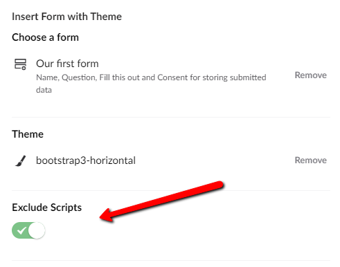

# Rendering Forms scripts where you want
Forms will output some JavaScript, and by default this is rendered just below the markup. 

In many cases you might prefer rendering your scripts at the bottom of the page, e.g. before the closing `</body>` tag, as this generally improves site performance.

In order to be able to render your scripts where you want, you need to add the following snippet to your template. Make sure you add it below your scripts, just before the closing `</body>` tag:

    @if (TempData["UmbracoForms"] != null)
    {
        foreach (var form in (List<Guid>)TempData["UmbracoForms"])
        {
            Html.RenderAction("RenderFormScripts", "UmbracoForms", new { formid = form, theme = "yourTheme" });
        }
    }

Whether you are inserting your form using a macro or adding it directly in your template, you need to make sure `ExcludeScripts` is checked/enabled.

When inserting forms using the **Insert Form with Theme** macro:

When **inserting forms directly in your template**:

    @Umbraco.RenderMacro("renderUmbracoForm", new {FormGuid="dfea5397-36cd-4596-8d3c-d210502b67de", FormTheme="bootstrap3-horizontal", ExcludeScripts="1"})

## When using Forms 4.x

### Change the Forms partial view macro
First we'll need to tell the Forms partial macro (that is used to render forms) to only render the markup and not the scripts. Navigate to the Developer section and open the Partial View Macro File > Insert Umbraco Form

It should have the following contents 

	@inherits Umbraco.Web.Macros.PartialViewMacroPage
		
	@if (Model.MacroParameters["FormGuid"] != null)
	{
		var s = Model.MacroParameters["FormGuid"].ToString();
		var g = new Guid(s);
		
		Html.RenderAction("Render", "UmbracoForms", new {formId = g});
	}

Here we'll make a small change: In the RenderAction call we'll provide an additional argument: `mode = "form"`

So change this:

	Html.RenderAction("Render", "UmbracoForms", new {formId = g});	

to this:
	
	Html.RenderAction("Render", "UmbracoForms", new {formId = g, mode = "form"});

### Place the Render Scripts macro on your template

Now we'll need to let Forms know where we want to output the script instead. So navigate to the Settings section and select the template that should contain the scripts. Insert the *Render Umbraco Forms Scripts* macro where you need the scripts rendered:

	@Umbraco.RenderMacro("FormsRenderScripts")

### Using RenderMacro in non umbraco controllers

Maybe you end up with an error like this "CS0234: The type or namespace name 'RenderMacro' does not exist in the namespace 'Umbraco' (are you missing an assembly reference?)". This is probably due to the fact that you're using custom controllers and viewmodels where the UmbracoContext is not exposed. The fix is to create your own UmbracoContext first:

    @{
        // create your own umbraco context
        var umbraco = new UmbracoHelper(UmbracoContext.Current);
    }
    @umbraco.RenderMacro("FormsRenderForm", new { FormGuid = "1203e391-30bb-4ffc-8fe6-1785d6093108" })

Please be aware, that is not the suggested way of inserting an Umbraco Form. We suggest you inherit from Umbraco Controllers. If you can not do that, you will need to create a new UmbracoContext. If you do so, please also read the Common Pitfalls.