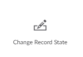
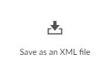
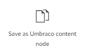
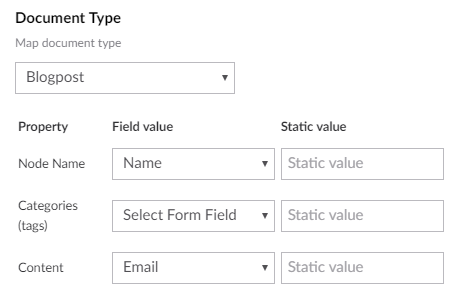
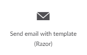

# Overview of the default workflow types

There are a couple of default workflow types that can be used to extend the functionality of your form, here is an overview:

## Change Record State

This workflow is used to automatically **approve** or **delete** a record once it is submitted.

You simply configure some words that you want to check for, and select whether these words should trigger a deletion or an approval.

## Post as XML

This workflow is used to post the form as XML to a specified URL.

Besides a name, the following configuration can be set:

* URL (required)
* Method
* Xsltfile - used to transform the XML
* Headers - map the needed files
* User and password

## Save as an XML file

This workflow will save the result of the form as an XML file by using XSLT.
In the configuration you can configure the following settings:

* Path - where to save the XML file (required)
* File extension (required)
* XsltFile - used to transform the XML 

## Save as Umbraco Content Node

This workflow gives you the option to save a forms submission as a new content node.

First of all, you need to choose a Document type and match the fields in the form with the properties on the selected Document Type. You can also choose to set a static value to fill in the properties.

In the example above, a Document Type called 'Blogpost' is selected to be used for creating the new content node. Furthermore, the value from the 'Name' field will be added as the 'Node Name' property in the new content node, and the value from the 'Email' field will be used for the 'Content' property.

Other configuration:

* Publish - choose whether to publish the node on submission
* Where to save - choose a section in the content tree where this new node should be added

## Send email

Send the result of the form to a specified email address.

The following settings can be configured:

* Email (required)
* SenderEmail - also configurable in `Config/umbracosettings.config`
* Subject of the email
* Message (required)
* Attachment - specify whether file uploads should be attached to the email

## Send email with template (Razor)

This workflow will use a template to send the results of the form to a specified email address. 

You can create your own custom Razor templates to be used to send out emails upon forms submission. Read more about how to create these templates in the [Email Templates](../../Developer/Email-Templates) article.

The following settings can be configured:

* Email (required)
* SenderEmail - also configurable in `Config/umbracosettings.config`
* Subject (required)
* Email Template - specify which template you want to use (required)
* Attachment - specify whether file uploads should be attached to the email

## Send form to URL
Sends the form to a url, either as a HTTP POST or GET

## Send xslt transformed email
Send the result of the form to an email address (full control over the email contents by supplying an xslt file)

## Slack
Posts the form data to a specific channel on Slack
