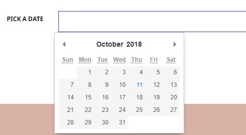

# Date

The date picker uses a front-end library called [PikaDay.js](https://github.com/dbushell/Pikaday) to display a UI to pick dates from.

As of Umbraco Forms 4.4.0 we have added the support for the Pikaday date picker to be localised based on the page the form is rendered on.

This displays the picked date in the correct locale, but using JavaScript we update a hidden field with a standard date format to send to the server for storing the record submission in a standard format, to avoid locale mixing up dates.

To achieve this, a Razor partial view is included - you can find it here: `/Views/Partials/Forms/DatePicker.cshtml`. 

This includes the MomentJS library to help with the date locale formatting & the appropiate changes to Pikaday.js to support the locales. If you wish to use a different DatePicker component this is the file that you would customize to your needs.

## Configure the Year range
The Date picker has a configuration setting to control the number of years shown in the picker. The default value is 10 years.

You can find the settings for changing this configuration in `~/App_Data/UmbracoForms/umbracoforms.config`:

    <setting key="DatePickerYearRange" value="10" />

Update `value` to a higher number (e.g. 100) to increase the numbers of years available in the Date picker.
