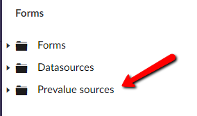
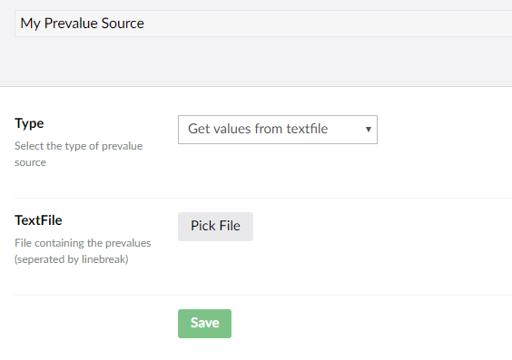
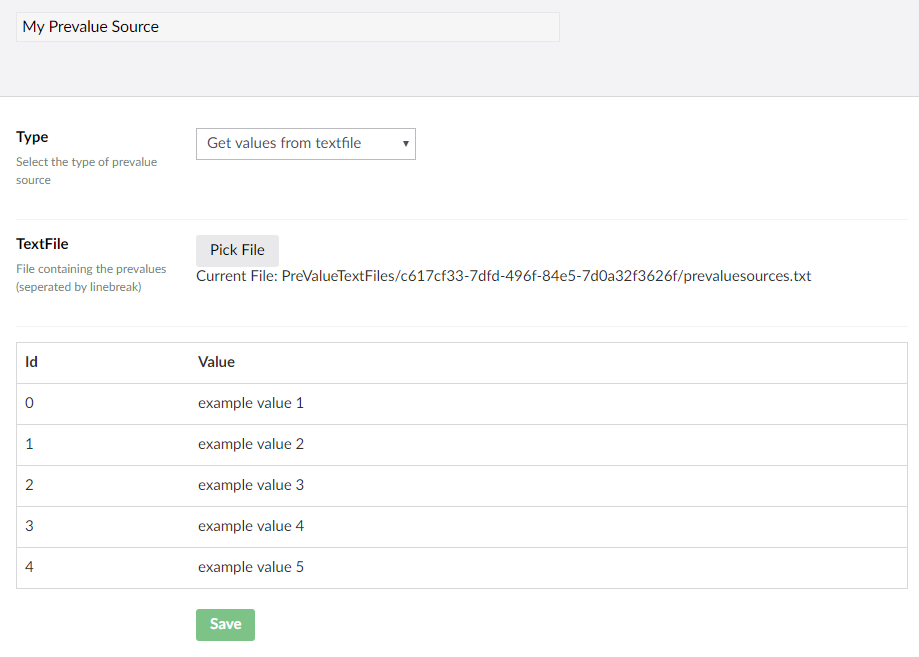
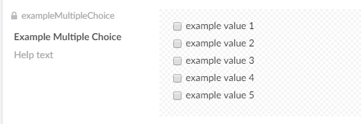
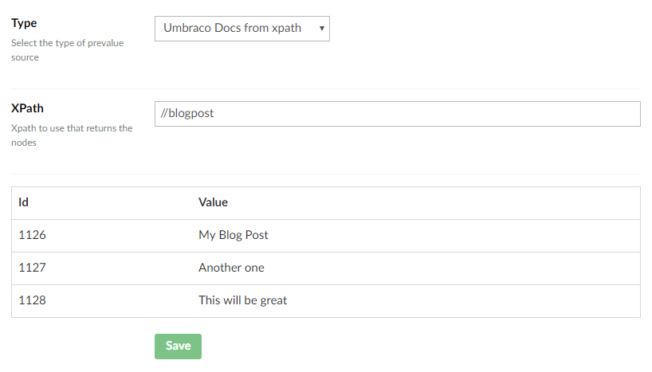

# Defining and attaching prevalue sources

Prevalue sources are a way to pre-define and/or retrieve a list of items from a certain source. They can be used in any fieldtypes that include some kind of list, like Dropdown and Multiple / Single Choice lists.

## Setting up a prevalue source

Prevalue sources can be managed in the corresponding part of the Umbraco Forms section

Right-click the prevalue source tree and select create. You will see a new page where you'll need to setup and configure your prevalue source.

After setting a name, you need to select the type of prevalue source you'll want to use. An overview of the different default types can be found [below](#overview-of-the-default-prevalue-source-types)

### Configure the prevalue source

Depending on the type you choose, you'll need to provide some additional settings.

In this walk-through we will choose `Get values from textfile`:

We need to provide a file containing the list we want to use as prevalues. This could be a `.txt` file containing the following:

	example value 1
	example value 2
	example value 3
	example value 4
	example value 5

Once the settings are populated, save the prevalue source by hitting the Save button. If the settings are successfully validated and they return results, you will be able to see an overview of the values.

## Attaching a prevalue source to a field

Once a prevalue source has been created, we can now use it when building forms in the Forms designer.

The example below is the settings for a Multiple Choice fieldtype. When there is at least one prevalue source defined in your project, the Prevalues section will contain a dropdown from where you can choose to use a prevalue source.

Once you have chosen the prevalue source you want, you will see a rander of the field in the Forms designer using the values from the attached source.

## Overview of the default prevalue source types
There are some default prevalue source types that can be used. For each prevalue source you setup, a `json` file will be generated in `~/App_Data/UmbracoForms/Data/prevaluesources`. 

Here is a quick overview of the default types:

### Get values from textfile

Upload a textfile that contains the prevalues. Each prevalue should have its own line in the file.

Once the file has been uploaded, you can find it in `~/App_Data/UmbracoForms/Data/PreValueTextFiles`.

### SQL Database

With this type you can connect to a OleDB compatible database table and construct a prevalue source from it. Once selected it will be editable from the forms UI.

For this type you will need to configure the following:

* Connection string (either choose one from your web.config or add another from a textfield)
* Table Name
* Key Column
* Value Column

### Umbraco data type Prevalues

Choose an Umbraco data type to use its configured prevalue collection.

In the example below I am using the prevalue collection from a data type called `Home - Font - Radio button`:

### Umbraco Documents

This type lets you use content nodes from a specific source as prevalues.

You can define the root node by either

* Choose a node directly from the Content tree or
* Using XPath

Additional settings can be applied:

* Choose to **Use current page as root** instead of selecting a specific root node - Note that preview isn't available with this enabled
* Select a specific **Document type**, if the selected root node contains different types
* Choose to include **Grand children** of the selected root node

### Umbraco Docs from xpath

This type lets you use XPath to define specific content nodes as prevalue sources.

Lets say I want to use all my blog posts as prevalue sources. I use the alias of the Document Type I use for the blog posts on my site to write the following XPath: `//blogpost`.

This will look for everything under `root` which uses the blogpost Document Type.

