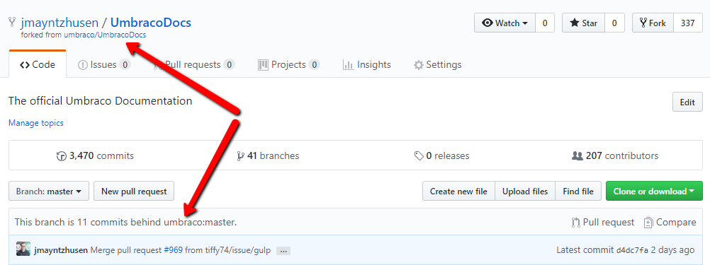

# Create a pull request using a fork

## Step 1: Creating a fork
Once you have setup Git you can create a fork of the [Umbraco Documentation repository](https://github.com/umbraco/UmbracoDocs/).

When you make a fork, you get a copy of the whole repository on your own Github profile. You can create a fork by clicking the fork button at the top of the screen:


Once the fork has been created you will have your own copy of the documentation. If you clone your fork, you will have all the files on your computer which means you can make changes to a lot of files and then push all the changes back up to your fork in one go.

When you are done and happy with the changes you've made, you can submit a pull request to sync your copy with the "real" repository:


## Step 2: Syncing your fork

Sometimes - like in the example above - you may end up forking and then not working on the documentation for a while. Once you do start, you may find that you no longer have the most recent version. If this happens, before making changes and making a pull request, you should do a rebase. For this you set the main repository as an upstream to sync from, fetch the updates and update your own fork to ensure you are in sync:

```cmd
git remote add upstream https://github.com/umbraco/UmbracoDocs/
git fetch upstream
git rebase upstream/master
```

## Step 3: Creating a PR

If you do this locally and then push it to your fork you will have a synced up fork to start working with! Once you have made some changes and you are happy with the result, you can create a pull request (you may have to rebase again and resolve merged conflicts if a lot of things has been merged in since your last sync).


And that is all you need to do to create a fork, sync it and make a pull request to the main repository! 

## Step 4: Wait from an action

Hopefully your work will be merged immediatly.  It might happen that your pull request receives a comment and a *request for changes*. We hope you are able to work with us to update your PR so we can merge it in!
Sometimes a label is added to a PR.  We have described a [list of different labels we often use](github-issues.md).
