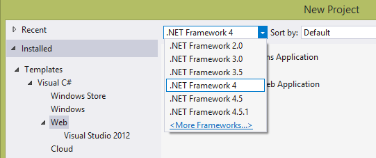

#Install Umbraco with NuGet

_Follow these steps to do a full install of Umbraco with NuGet._

##Install NuGet in Visual Studio
If you don't already have NuGet installed, you can read all about the installation process here: [http://docs.nuget.org/docs/start-here/installing-nuget](http://docs.nuget.org/docs/start-here/installing-nuget).

##New solution
To install Umbraco we need a Visual Studio solution to install it in. 

###Visual Studio 2012  
Go to **File > New Project** and pick an ASP.NET **Empty** Web Application.   
It's important to pick **empty** as other templates include incompatible versions of MVC and Json.NET.

###Visual Studio 2013
Go to **File > New Project** and pick ASP.NET Web Application. Click **OK** and then choose **Empty** (don't enable any of the checkboxes to add folders or core references, Umbraco will add them for you).  
It's important to pick **empty** as other templates include incompatible versions of MVC and Json.NET. It's important to pick **empty** as other templates include incompatible versions of MVC and Json.NET.

If you're installing Umbraco 7+ then you need to choose .NET Framework 4.5 or 4.5.1 here.  
For Umbraco 6 you can still choose .NET Framework 4 but 4.5 and 4.5.1 also work.

##Finding and installing the Umbraco package
The latest release of Umbraco is always available in the NuGet gallery. All you have to do is search for it and install.

To install Umbraco from the Visual Studio interface, right-click on the new project you just made and choose **Manage NuGet Packages**.

You can then use the search function to find the package called **Umbraco CMS**. You'll also find the Umbraco CMS Core Binaries package, which is going to be included automatically when you choose Umbraco CMS.
So make sure to pick Umbraco CMS (highlighted in the image below) and click **Install**.

NuGet will then download dependencies and will install all of Umbraco's files in your new solution.  
During this process it will ask if it is allowed to overwrite your web.config file. In this case, overwriting the file is safe because we just started a new project. If you're installing Umbraco in an existing project, however, you might want to create a backup of your existing web.config file before answering "Yes".

##Package manager console
You can do the exact same thing from the package manager console, which is a bit quicker as you don't have to click through the menus and search.

Enable the console by going to **Tools >  Library Package Manager >  Package Manager Console**.

Then simply type `Install-Package UmbracoCms` to start installing the latest version of Umbraco.

##Running the site
You can now run the site like you would normally in Visual Studio (using **F5** or the **Debug** button).

Follow the installation wizard and after a few easy steps and choices you should get a message saying the installation was a success.
