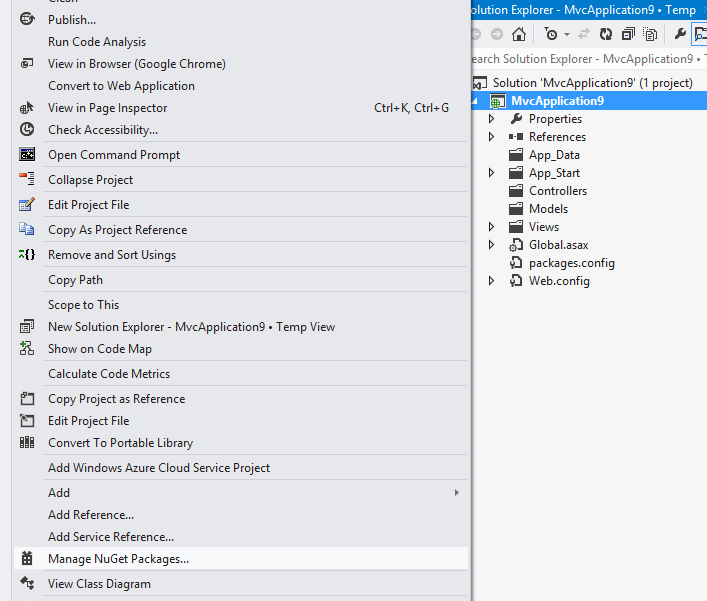
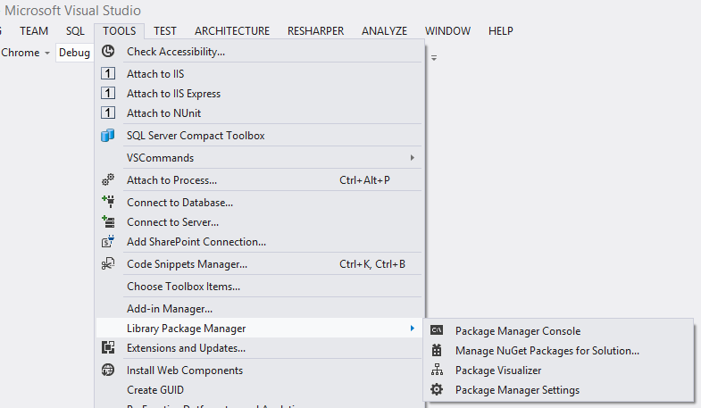

#Install Umbraco with NuGet

_Follow these steps to do a full install of Umbraco with NuGet._

##Install NuGet in Visual Studio
If you don't already have NuGet installed, you can read all about the installation process here: [http://docs.nuget.org/docs/start-here/installing-nuget](http://docs.nuget.org/docs/start-here/installing-nuget)

##New solution
In order to be able to install Umbraco we need to have a Visual Studio solution to install it in. So go to File > New Project and pick either a new WebForms or new MVC project.  

Make sure to start with a .NET Framework 4 project. The project templates for .NET 4.5.x include incompatible versions of MVC and Json.Net.  
If you need .NET 4.5+ functionality in your custom code then you can always add a class library project targeted at .NET 4.5.x.

##Finding and installing the Umbraco package
The latest release of Umbraco is always available in the NuGet gallery so all you have to do is search for it and install.
To do so from the Visual Studio interface, just right-click on the new project you just made and choose "Manage NuGet Packages".

You can then use the search function to find the package called Umbraco CMS. You'll also find the Umbraco CMS Core Binaries package, which is going to be included automatically when you choose Umbraco CMS.
So make sure to pick Umbraco CMS (highlighted in the image below) and click "Install".

NuGet will then download dependencies and will install all of Umbraco's files in your new solution.  
During this process it will ask if it is allowed to overwrite your web.config file. In this case that is safe, because we just started a new project but if you're installing Umbraco in an existing project you might want to create a backup of your existing web.config file before answering "Yes".

##Package manager console
You can do the exact same thing from the package manager console, which is a bit quicker as you don't have to click through the menus and search.

Enable the console by going to Tools >  Library Package Manager >  Package Manager Console

Then simply type `Install-Package UmbracoCms` to start installing the latest version of Umbraco.

##Running the site
You can now run the site like you would normally in Visual Studio (F5, or the Debug button).

Follow the installation wizard and after a few easy steps and choices you should get a message saying the installation was a success.