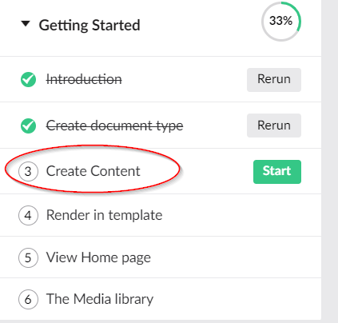
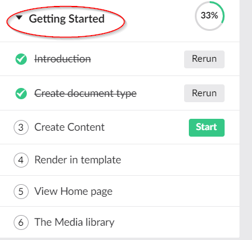

# Backoffice tours

Backoffice tours are managed in a JSON format and stored in files on disk. The filenames should end with the .json extension.

## Tour file locations

The tour functionality will load information from multiple locations.

### Core tours and custom tours

The tour file that ships with Umbraco are stored in /Config/BackofficeTours. This is also the recommended place for storing your own tour files.

### Plugin tours

If you want to include a tour with your custom plugin you can store the tour file in /App_Plugins/<YourPlugin>/backoffice/tours. It is recommend that you place the tour files here when you are creating a plugin.

## The JSON format

A tour file contains an array of tour JSON objects. So it's possible to have multiple, (un)related tours in one file.

	[
		{
			//tour object
		},
		{
			//tour object
		}
	]

## The tour object

A tour JSON object looks like this.

	{
		"name": "My Awesome tour",
		"alias": "myUniqueAlias",
		"group": "Get things done!!!",
		"groupOrder": 1,
		"allowDisable": true,
		"culture" : "en-US",
		"requiredSections": ["content","media"],
		"steps": []
	}

### name property

This is the name that is displayed in the help drawer for the tour.

### alias property

This is the unique alias of your tour. This is used to track the progress a user has made during taking a tour. The information of the tour progress is stored in the TourData column of the UmbracoUsers table in the database.

### group property

The group property is used to group related tours in the help drawer under a common subject (eg. Getting started). 

### groupOrder property

This is used to control the order of the groups in the help drawer. This must be a integer value.

### allowDisable

A boolean value that indicates if the "Don't show this tour again" should be shown on the tour steps. If the user clicks this link the tour will not be shown in the help drawer anymore.

