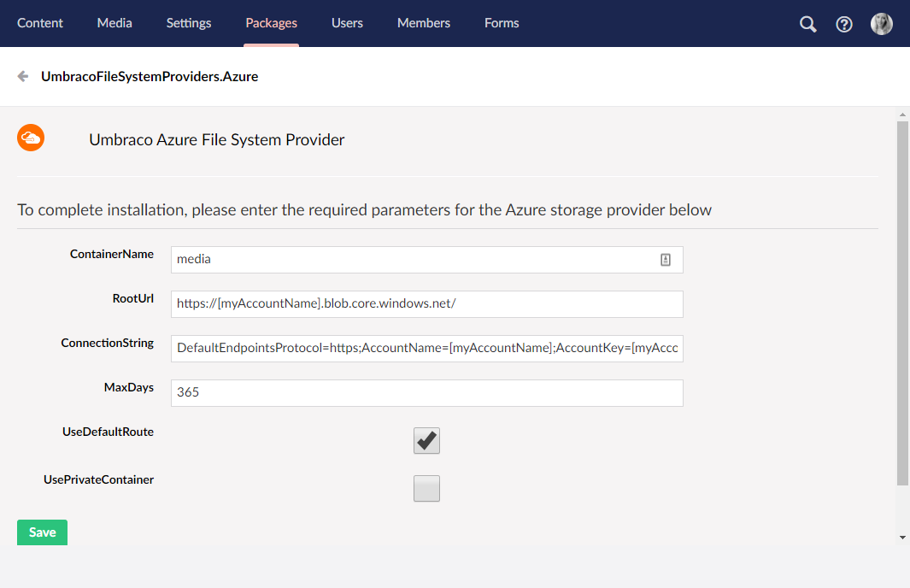

# Setup Your Site to use Azure Storage for Media and Image Processor Cache
For Umbraco Cloud sites there are some scenarios when you may want, or need, to consider using Azure Blob Storage for your media.  Particularly if your site contains large amounts of media - about 1GB or more.  Having your site’s media in Azure Storage can also help your deployments complete more quickly and has the potential to positively affect site performance as the Image Processor cache is moved to Azure Storage.  It also allows you to easily serve your media from the Azure CDN.

Setup consists of adding several packages to your site and setting the correct configuration.  Of course, before you begin you’ll need to create an Azure Storage Account and a container for your media and your ImageProcessor cache as well.  In this example we assume your media container is “media” and your cache is “cache”.  You can, optionally, enable an Azure CDN for this storage container and use it in the cache.config below.	

## Packages

These packages are only available via NuGet, so ideally you’ll have your site setup to use Visual Studio. You can copy/paste the `PM>` commands into the Package Manager Console. If you don't see the Package Manager Console window, you can open it from the menu View -> Other Windows -> Package Manager Console.

### Umbraco File System Provider

You'll need to install the `UmbracoFileSystemProviders.Azure` provider.  We recommend doing this first and verifying it behaves as expected before proceeding with the ImageProcessor setup.

Find instructions on how to install the package on the projects GitHub page: [UmbracoFileSystemProviders.Azure](https://github.com/JimBobSquarePants/UmbracoFileSystemProviders.Azure/tree/develop-umbraco-version-8). There are detailed instructions available on the project page, also summarized here.

The package is also available on Our Umbraco [https://our.umbraco.com/projects/collaboration/umbracofilesystemprovidersazure/](https://our.umbraco.com/projects/collaboration/umbracofilesystemprovidersazure/) - make sure you download the correct version for Umbraco 8, which is also specified on the page.

The following six keys will have been added to the `<appSettings>` your `web.config` file.

```xml
<?xml version="1.0"?>
<appSettings>
  <add key="AzureBlobFileSystem.ContainerName:media" value="media" />
  <add key="AzureBlobFileSystem.RootUrl:media" value="https://[myAccountName].blob.core.windows.net/" />
  <add key="AzureBlobFileSystem.ConnectionString:media" 
      value="DefaultEndpointsProtocol=https;AccountName=[myAccountName];AccountKey=[myAccountKey]" />
  <add key="AzureBlobFileSystem.MaxDays:media" value="365" />
  <add key="AzureBlobFileSystem.UseDefaultRoute:media" value="true" />
  <add key="AzureBlobFileSystem.UsePrivateContainer:media" value="false" />
</appSettings>
```

Make sure to udpate this configuration to match your own setup.

When you're installing the package from the **Package** section of the Umbraco Backoffice, you'll be able to fill in the configuration directly from the backoffice:



If you are using IISExpress (as with Visual Studio) you’ll need to add a static file handler mapping to `~web.config` - this should be added automatically, but you should check that it's there!

```xml
<?xml version="1.0"?>
<configuration>
  <location path="Media">
    <system.webServer>
      <handlers>
        <remove name="StaticFileHandler" />
        <add name="StaticFileHandler" path="*" verb="*" 
             preCondition="integratedMode" type="System.Web.StaticFileHandler" />
      </handlers>
    </system.webServer>
  </location>
</configuration>
```

### Image Processor
You’ll need to install the following ImageProcessor packages (latest versions recommended):

* ImageProcessor.Web.4.9.3.25 or later
* ImageProcessor.Web.Config.2.4.1.19 or later
* ImageProcessor.Web.Plugins.AzureBlobCache.1.4.2.19 or later

You can find more information about ImageProcessor and related packages here [https://imageprocessor.org/](https://imageprocessor.org/)

Install the following NuGet packages:

```PM> Install-Package ImageProcessor.Web```

```PM> Install-Package ImageProcessor.Web.Config```

Then install the ImageProcessor package that places the cached files in the Azure Blob storage:

```PM> Install-Package ImageProcessor.Web.Plugins.AzureBlobCache```


### Configuration
Once the packages have been installed you need to set your configuration as below. Some of these may have been set when you installed the ImageProcessor packages.

**Update `~web.config`**

```xml
<configuration>
  <configSections>  
    <sectionGroup name="imageProcessor">
      <section name="security" requirePermission="false" type="ImageProcessor.Web.Configuration.ImageSecuritySection, ImageProcessor.Web" />
      <section name="processing" requirePermission="false" type="ImageProcessor.Web.Configuration.ImageProcessingSection, ImageProcessor.Web" />
      <section name="caching" requirePermission="false" type="ImageProcessor.Web.Configuration.ImageCacheSection, ImageProcessor.Web" />
    </sectionGroup>
  </configSections>
  <imageProcessor>
      <security configSource="config\imageprocessor\security.config" />
      <caching configSource="config\imageprocessor\cache.config" />
      <processing configSource="config\imageprocessor\processing.config" />
    </imageProcessor>
</configuration>
```

**Update `~/config/imageprocessor/security.config`**

You have to manually add `prefix="media/"` to the service element, otherwise ImageProcessor will not run and the original image will be served.

```xml
<?xml version="1.0" encoding="utf-8"?>
<security>
  <services>
    <!--<service name="LocalFileImageService" type="ImageProcessor.Web.Services.LocalFileImageService, ImageProcessor.Web" />-->
    <service prefix="media/" name="CloudImageService" type="ImageProcessor.Web.Services.CloudImageService, ImageProcessor.Web">
      <settings>
        <setting key="MaxBytes" value="8194304"/>
        <setting key="Timeout" value="30000"/>
        <setting key="Host" value="https://[your blob account].blob.core.windows.net/media"/>
      </settings>
    </service>
    <service prefix="remote.axd" name="RemoteImageService" type="ImageProcessor.Web.Services.RemoteImageService, ImageProcessor.Web">
      <settings>
        <setting key="MaxBytes" value="4194304" />
        <setting key="Timeout" value="3000" />
        <setting key="Protocol" value="http" />
      </settings>
      <whitelist>
        <add url="https://[your Azure CDN].vo.msecnd.net/" />
        <add url="https://[your blob account].blob.core.windows.net/" />
        <add url="https://[your Umbraco cloud site].s1.umbraco.io" />
        <add url="http://localhost" />
        <add url="http://127.0.0.1" />
      </whitelist>
    </service>
  </services>
</security>
```

**Update `~/config/imageprocessor/cache.config` by removing the default “DiskCache” config entry**

```xml
<?xml version="1.0" encoding="utf-8"?>
<caching currentCache="AzureBlobCache">
  <caches>
    <cache name="AzureBlobCache" type="ImageProcessor.Web.Plugins.AzureBlobCache.AzureBlobCache, ImageProcessor.Web.Plugins.AzureBlobCache" maxDays="365" memoryMaxMinutes="60" browserMaxDays="7">
      <settings>
        <setting key="CachedStorageAccount" value="DefaultEndpointsProtocol=https;AccountName=[myAccountName];AccountKey=[myAccountKey]" />
        <setting key="CachedBlobContainer" value="cache" />
        <setting key="UseCachedContainerInUrl" value="true" />
        <setting key="CachedCDNRoot" value="[CdnRootUrl]" />
        <setting key="CachedCDNTimeout" value="2000" />
        <setting key="SourceStorageAccount" value="DefaultEndpointsProtocol=https;AccountName=[myAccountName];AccountKey=[myAccountKey]" />
        <setting key="SourceBlobContainer" value="media" />
        <setting key="StreamCachedImage" value="false" />
      </settings>
    </cache>
  </caches>
</caching>
```
The final note here is that setting this up will only make it so new media files are added to Blob Storage, if you already have some media files on your project you should copy the contents of the media folder and upload it all to the media blob you set up. Finally you can delete the media folder locally as it is no longer needed. 