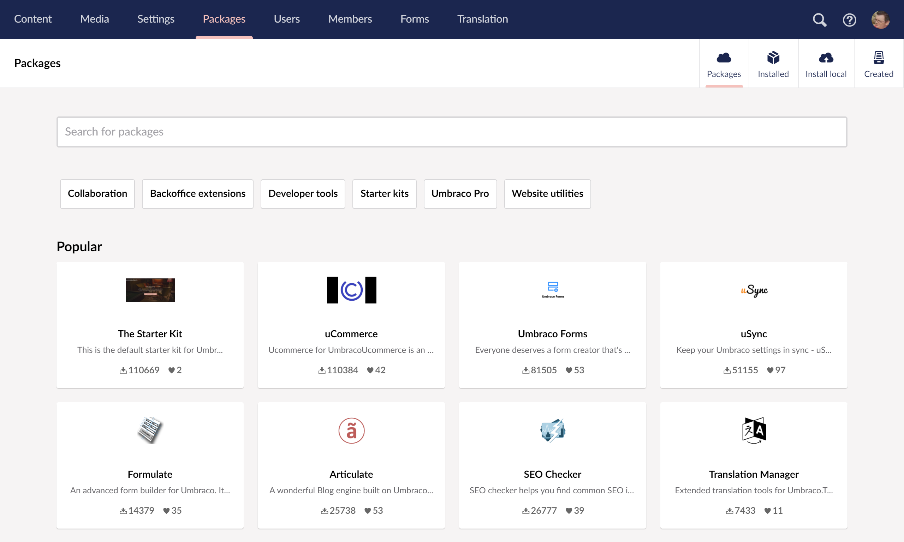

# Package Types
There are two main ways to install packages in Umbraco; Package zip files and NuGet packages.
Each of these has its own advantages. 

When developing a package you should attempt to provide both a zip file package and a NuGet package.

## Package zip

A package zip file can be installed through the Umbraco backoffice.



Packages zip files can contain: 

* Solutions files (dlls, App_plugins files, etc)
* Document Types
* Templates
* Stylesheets
* Macros
* Languages
* Dictionary Items
* Data Types

:::note
Currently you cannot include media items in a Package Zip file. You will need a custom [package action](package-actions.md) to install media as part of a package.
:::

A package zip file can also contain [Package Actions](package-actions.md) which run after installation and allow you to perform additional tasks against the Umbraco installation.

### Advantages of package zip files

Package Zip files have been developed for Umbraco and have a number of advantages.

Packages uploaded to our.umbraco.com are listed in the package directory and are accessible directly through the Umbraco backoffice

Package zip files can add items to Umbraco and you can change Umbraco config and settings via package actions.


## NuGet Packages

A NuGet package is a standard way of delivering Compiled Code and configuration to a .NET project. NuGet packages contain dlls, and files required for the solution. For more information on NuGet packages see Microsoft's [An introduction to NuGet](https://docs.microsoft.com/en-us/nuget/what-is-nuget) documentation.

NuGet packages can be installed using NuGet.exe via the a command line or through the [Package Manager Console](https://docs.microsoft.com/en-us/nuget/consume-packages/install-use-packages-powershell) within Visual Studio using a command similar to the one below: 

```
PM> Install-Package MyPackage -version 1.2
```

NuGet packages can include any solutions files, and can be configured to run powershell scripts after installation, 

As NuGet packages are installed outside of the Umbraco website they cannot directly manipulate any of the Umbraco settings or content during their installation. 

If you need to add items or change configuration of Umbraco as part of a NuGet package, then you will need to develop code to run as part of a [Migration](../database/index.md). The Migration would then run the first time the Umbraco site starts after the package is installed.

### Advantages of NuGet packages

NuGet packages are very useful when you wish to deploy your Umbraco site using standard CI/CD deployment tools.

NuGet manages package dependencies and references for you so you don't need to update your build process for each new package. 

NuGet maintains a reference list of packages used in a project and the ability to restore and update those packages from that list.
