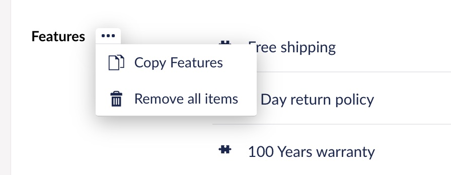

# Property Actions

Property Actions is a build-in feature that provides a generic place for secondary functionality for property editors.
Appearing as a small button next to the label of the property, that expands to show the available actions. Those actions are defined and implemented in the Property Editor, making it very open what a Property Action is.



## Data Structure of Property Actions
Property Editors are an array of objects defining each action. 
An action is defined by the following properties:

```json
{
    labelKey: 'clipboard_labelForRemoveAllEntries',
    labelTokens: [],
    icon: 'trash',
    method: removeAllEntries,
    isDisabled: true
}
```

We use `labelKey` and `labelTokens` to retrieve a localized string that is displayed as the Actions label. [See localization for more info.](../../Extending/Language-Files/)

`isDisabled` is used to disable an Action, which change the visual appearance and prevents interaction. Use this option when an action wouldn't provide any change. In the example above, the action `remove all entries` would not have any impact if there is no entries.

## Getting ready for Property Actions
A Property Editor needs to be implemented as a Component for it to perform the call to expose its Property Actions.
The Component must be configured to retrieve an optional reference to `umbProperty`. The requirement must be optional because property-editors are implemented in scenarios where it's not presented.

See the following example:

```js
angular.module('umbraco').component('myPropertyEditor', {
    controller: MyController,
    controllerAs: 'vm',
    require: {
        umbProperty: '?^umbProperty'
    }
    …
});
```

## Implementing a Property Action
The implementation of Property Actions consists of two parts. First a definition of the actions and secondly parsing the lists of actions to `umbProperty.setPropertyActions`.

```js
var myAction = {
    labelKey: 'general_labelForMyAction',
    labelTokens: [],
    icon: 'action',
    method: myActionExecutionMethod,
    isDisabled: false
}

var propertyActions = [
    myAction
];

this.$onInit = function () {
    if (this.umbProperty) {
        this.umbProperty.setPropertyActions(propertyActions);
    }
};
```

In this example the action is defined as a variable on its own. In this way you can refer to it, for switching the `isDisabled` state.
