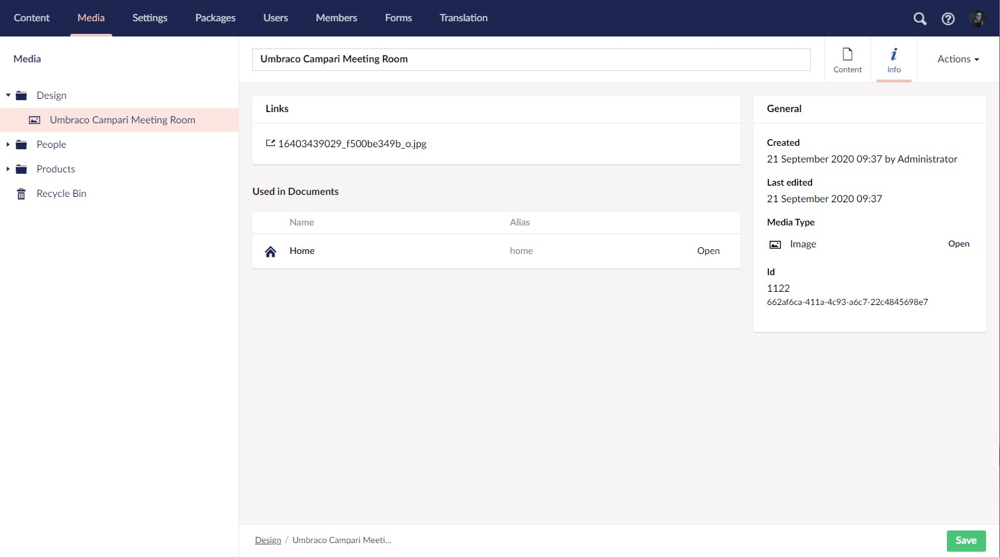
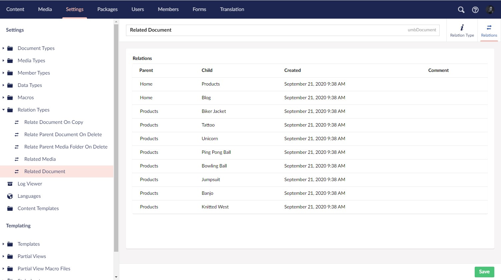

# Tracking References

Property editors can be extended further to track entity references that may be selected or referenced inside the property editor. For example in the core of the CMS we have added this to several property editors. 

A good example of this is the Media Picker where the CMS stores a reference to what media item was picked and thus allows to see what content nodes are using a media item. This avoids it being accidentally deleted if it is being used.

When a content node is saved it will save the entity references as relations.

## Viewing References

For media items you can view the list of references by clicking the Info content app on a specific media item.



For content nodes you can view the list of references as relations in the Settings section under the Relation Types folder and viewing the Related Document relations.



## Example

```csharp
using System;
using System.Collections.Generic;
using Umbraco.Core;
using Umbraco.Core.Models;
using Umbraco.Core.Models.Editors;
using Umbraco.Core.PropertyEditors;

namespace Umbraco.Web.PropertyEditors
{

    public class ExampleComposer : IUserComposer
    {
        public void Compose(Composition composition)
        {
            composition.DataValueReferenceFactories().Append<TrackingExample>();
        }
    }

    public class TrackingExample : IDataValueReferenceFactory, IDataValueReference
    {
        public IDataValueReference GetDataValueReference() => this;

        // Which Data Editor (Data Type) does this apply to
        public bool IsForEditor(IDataEditor dataEditor) => dataEditor.Alias.InvariantEquals(Constants.PropertyEditors.Aliases.ContentPicker);


        public IEnumerable<UmbracoEntityReference> GetReferences(object value)
        {
            // Value contains the raw data that is being saved for a property editor
            // You can then analyse this data be it a complex JSON structure or something more trivial
            // To add the chosen entities as references (as any UDI type including custom ones)

            // A very simple example
            // This will always ADD a specific media reference to the collection list
            // When it's a ContentPicker datatype
            var references = new List<UmbracoEntityReference>();
            var udiType = ObjectTypes.GetUdiType(UmbracoObjectTypes.Media);
            var udi = Udi.Create(udiType, Guid.Parse("fbbaa38d-bd93-48b9-b1d5-724c46b6693e"));
            var entityRef = new UmbracoEntityReference(udi);
            references.Add(entityRef);
            return references;
        }
    }
}
```
