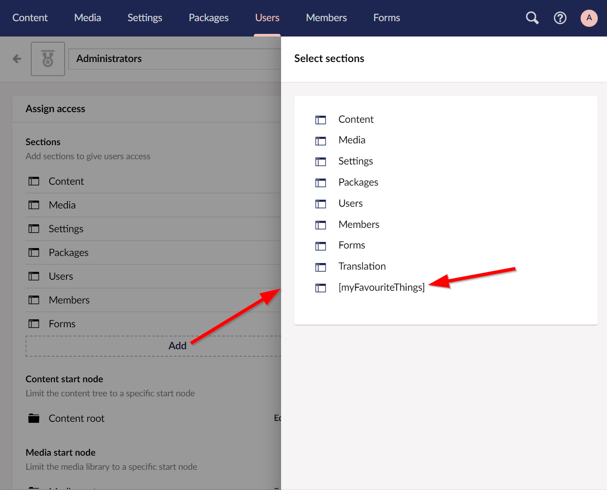

# Sections

The Umbraco backoffice consists of Sections, also referred to as Applications, which contain Trees.

Each section is identified by an icon in the top navigation ribbon of the Umbraco Backoffice.

## Create a Custom Section

To create a new custom section in your Umbraco backoffice, the first thing you have to do is create a new folder inside `/App_Plugins`. We will call it `MyFavouriteThings`.

Next we need to create a manifest where we'll include some basic configuration for our new section.

Create a new file in the `/App_Plugins/MyFavouriteThings/` folder and name it `package.manifest`. In this new file, copy the code snippet below and save it.

```json
{
    "sections": [
        {
            "alias": "myFavouriteThings",
            "name": "My Favourite Things"
        }
    ]
}
```

... would create a new Section in your Umbraco backoffice called 'My Favourite Things'.

### Why can't I see my new Custom Section?

You will also need to allow your current Umbraco User group access to this new Custom Section via the backoffice! (you will need to logout and back in again to see the change)



### Adding a Language Translation (get rid of the square brackets)


When your new custom section appears, you'll notice only the section 'Alias' is displayed inside square brackets. This is because Umbraco caters for Multiple Languages in the backoffice, and is looking for a translation file for the current backoffice culture, containing a translation key for your custom section alias.

Create a /lang folder in the folder where you are creating the implementation for your custom section. If not create one in the App_Plugins folder eg. */App_Plugins/MyFavouriteThings/lang/*.

It is worth knowing that the `/lang` folder does not have to be directly in the MyFavouriteThings folder, it can be nested deeper if you need it to be. The only requirement is that the folder is called lang. E.g. *~/App_Plugins/MyFavouriteThings/Some/Another/Lang/*.

Inside this folder create a file called **en-us.xml**. This is the 'default' fallback language translation file. Add the following definition:

```xml
<?xml version="1.0" encoding="utf-8" standalone="yes"?>
<language alias="en" intName="English (US)" localName="English (US)" lcid="" culture="en-US">
  <area alias="sections">
    <key alias="myFavouriteThings">My Favourite Things</key>
  </area>
</language>
```

Recycle the application pool, and the square brackets will be gone, and your section will have the title 'My Favourite Things'

You can add custom language translation keys in this file for providing translated versions of text used throughout your custom section/tree implementation.

To provide translations in other languages, duplicate the en-us.xml file in the /lang folder and rename it to match the lang/culture combination of your newly supported language. Update the contents of the language element attributes, and provide a translation for each 'language translation key'.

You will need to recycle the application pool, to see changes to the language translation files reflected in the backoffice.

[Now create a custom tree to load in your custom section!](../../Extending/Section-Trees/trees.md)

## Section Service API v7

The section API in v7+ is found in the interface `Umbraco.Core.Services.ISectionService` which is exposed on the ApplicationContext singleton. This API is used to control/query the storage for tree registrations in the ~/Config/applications.config file.

[See the section service API reference here](../../Reference/Management/Services/SectionService/index.md)

## Section (Application) API v6

The section API in v6/v4 is found in the class `umbraco.BusinessLogic.Application`. This API is used to control/query the storage for section registrations in the ~/Config/applications.config file.
