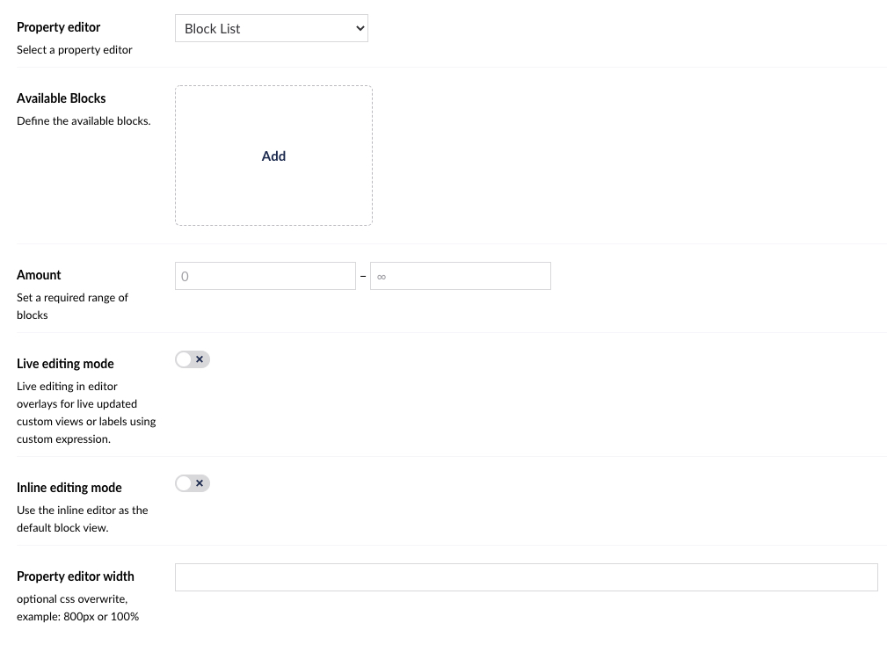
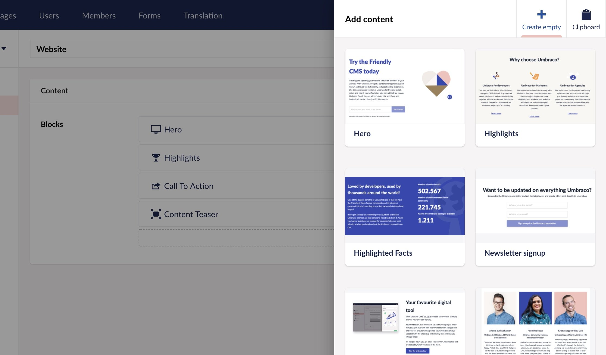

# Block List

`Alias: Umbraco.BlockList`

`Returns: IEnumerable<BlockListItem>`

**Block List** is a list editing property editor, using Element Types to define the list item schema.

:::note
A default Umbraco CMS installtion does not ship with a defined *Data Type* using the Block List editor. In order to start using the property, follow the steps outlined below.
:::

## Configure Block List

The Block List property editor is configured in the same way as any standard property editor, via the *Data Types* admin interface.

To set up your Block List Editor property, create a new *Data Type* and select **Block List** from the list of available property editors.

Then you will see the configuration options for a Block List as shown below.



The Data Type editor allows you to configure the following properties:

- **Available Blocks** - Here you will define the Block Types to be available for use in the propety. Read more on how to set up Block Types below.
- **Amount** - Sets the minimum and/or maximum number of blocks that should be allowed in the list.
- **Live editing mode** - Enabling this will make editing of a block happening directly to the document model, making changes appear as you type.
- **Inline editing mode** - Enabling this will change editing experience to inline, meaning that editing the data of blocks happens at sight as accordians.
- **Property editor width** - Overwrite the width of the property editor. This field takes any valid css value for "max-width".

## Setup Block Types

Block types are **Element Types** which needs to be created before you can start configure them as Block Types. This can be done either directly from the property editor setup process, or you can set them up before hand and add them to the block list after.

Once you have added an element type as a Block Type on your Block List Data Type you will have the option to configure it further.


Each Block has a set of properties that are optional to configure. They are described below.

### Editor apperance

By configuring the propertyes in the group you can customize the user experience for your content editors when they work with the blocks in the Content section.

- **Label** - Define a label for the apperance of the Block in the editor. The label can use angularJS template string syntax to display values of properties. Example: "My Block {{myPropertyAlias}}" will be shown as: "My Block FooBar"
- **Custom view** - Overwrite the angularJS view for the block presentation in the Content editor. Use this to make a more visual presentation of the block or even make your own editing experience by adding your own angularJS controller to the view.
- **Custom stylesheet** - Pick your own stylesheet to be used for this block in the Content editor. By adding a stylesheet the styling of this block will become scope. Meaning that backoffice styles are no longer present for the view of this block.
- **Overlay editor size** - Set the size for the Content editor overlay for editing this block.

### Data models

It is possible to use two separate Element Types for your Block Types. Choose one to use for Content and one to use for configuration options or Settings.

- **Content model** - This presents the Element Type used as model for the content section of this Block. This cannot be changed, but you can open the Element Type to perform edits or view the properties available. Usefull when writing your Label.
- **Settings model** - Add a Settings section to your Block based on a given Element Type. When picked you can open the Element Type or choose to remove the settings section again.

### Catalogue apperance

These properties refers to how the Block is presented in the Block catelogue, when editors choose which Blocks to use for their content.

- **Background color** - Define a background color to be displayed beneath the icon or thumbnail.  Eg. `#424242`.
- **Icon color** - Change the color of the Element Type icon. Eg. `#242424`.
- **Thumbnail** - Pick an image or SVG file to replace the icon of this Block in the catalogue.

### Advanced

These properties are relevant when you work with custom views.

- **Force hide content editor** - If you made a custom view that enables you to edit the content part of a block and you are using default editing mode(not inline) you might want to hide the content-editor from the block editor overlay.

## Editing Blocks

When viewing a **Block List** editor in the Content section for the first time, you will be presented with the option to Add content.


Clicking the Add content button brings up the Block Catalogue.


The Block Catalogue looks different depending on the amount of available Blocks and their catalogue apperance.



Click the Block type you wish to create and a new Block will appear in the list.

Depending on wether your Block List Editor is setup to use default or inline editing mode you will see one of the following things happening:

In default mode you will enter the editing overlay of that Block:


In inline editing mode the new Blocks inline editor will expand:


More Blocks can be added to the list by clicking the Add content button or using the inline Add content button that appears on hover between or above existing Blocks.


To reorder the Blocks, click and drag a Block up or down to place in the decirede order.

To delete a Block click the trash-bin icon appearing on hover.

## Rendering Block List Content

Rendering the stored value of your **Block List** property can be done in two ways.

### 1. Default rendering

You can choose to use the build-in rendering machinsm for rendering blocks via a Partial View for each block.

The default rendering method is named `GetBlockListHtml()` and comes with a few options to go with it. The typical use could be:

```csharp
@Html.GetBlockListHtml(Model, "Dates")
```

"Dates" above is the alias for the Block List editor.

To make this work you will need to create a Partial View for each block, named by the alias of the Element Type that is being used as Content Model.

These partial views must be placed in this folder: `Views/Partials/BlockList/Components/`.
Example: `Views/Partials/BlockList/Components/MyElementTypeAliasOfContent.cshtml`.

A Partial View will receive the model of `Umbraco.Core.Models.Blocks.BlockListItem`. This gives you the option to access properties of the Content and Settings section of your Block.

In the following example of a Partial view for a Block Type, please note that the `MyElementTypeAliasOfContent`and `MyElementTypeAliasOfSettings` should correspond with the selected Element Type Alias for the given model in your case.

Example:

```csharp
@inherits Umbraco.Web.Mvc.UmbracoViewPage<Umbraco.Core.Models.Blocks.BlockListItem>
@using ContentModels = Umbraco.Web.PublishedModels;
@{
    var content = (ContentModels.MyElementTypeAliasOfContent)Model.Content;
    var settings = (ContentModels.MyElementTypeAliasOfSettings)Model.Settings;
}

// Output the value of field with alias heading from the Element Type selected as Content section
<h1>@content.Value("heading")

```

### 2. Build your own rendering

A built-in value converter is available to use the data as you like. Call the `Value<T>` method with a generic type of `IEnumerable<BlockListItem>` and the stored value will be returned as a list of `BlockListLayoutReference` entities.

Example:

```csharp
@inherits Umbraco.Web.Mvc.UmbracoViewPage
@using Umbraco.Core.Models.Blocks;
@{
    var blocks = Model.Value<IEnumerable<BlockListItem>>("myBlocksProperty");
    foreach (var block in blocks)
    {
    
        var content = block.Content;

        @Html.Partial("MyFolderOfBlocks/" + content.ContentType.Alias, block)
    }
}
```

Each item is a `BlockListItem` entity that contains two main properties `Content` and `Settings`. Each of these is a `IPublishedElement` which means you can use all the value converters you are used to using.

Example:

```csharp
@inherits Umbraco.Web.Mvc.UmbracoViewPage
@using Umbraco.Core.Models.Blocks;
@using ContentModels = Umbraco.Web.PublishedModels;
@{
    var blocks = Model.Value<IEnumerable<BlockListItem>>("myBlocksProperty");
    foreach (var block in blocks)
    {
    
        var content = (ContentModels.MyAliasOfContentElementType)block.Content;
        var settings = (ContentModels.MyAliasOfSettingsElementType)block.Settings;

        <h1>@content.MyExampleHeadlinePropertyAlias</h1>
    }
}
```

## Build a custom backOffice view

You can choose to customize your editing experience by implementing a custom view for each Block.
By picking a custom view you overwrite the backoffice UI for the given block with your own. This enables you to define how a block should be presented, but can also include interactive elements and be a full custom solution to how data is manipulated.

### Write your own HTML view
Currently you can only pick HTML files for a custom view.
These views are powered by AngularJS and therefor you can write any AngularJS logic.
Your HTML can be anything, but if you like to just use it as a representation of the content. Then you propaly want the full view to be clickable, which when opens the default editor for editing of your content.
The following example displays the property with the alias `headline` together with the `description` inside a button to edit your block.

```html
<button type="button" ng-click="block.edit()">
	<h2 ng-bind="block.data.headline"></h2>
	<p ng-bind="block.data.description"></p>
</button>
```

If you like to display properties of `settings`, you can access these by `block.settingsData.myPropertyAlias`.