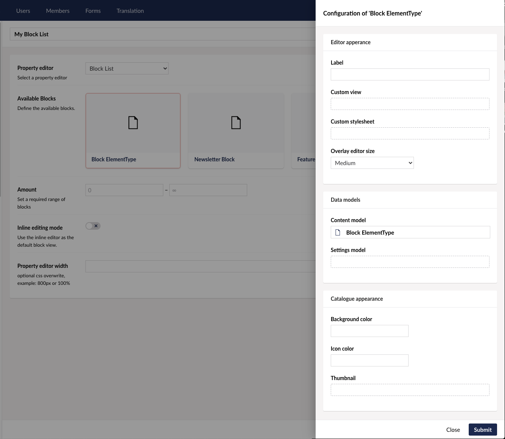
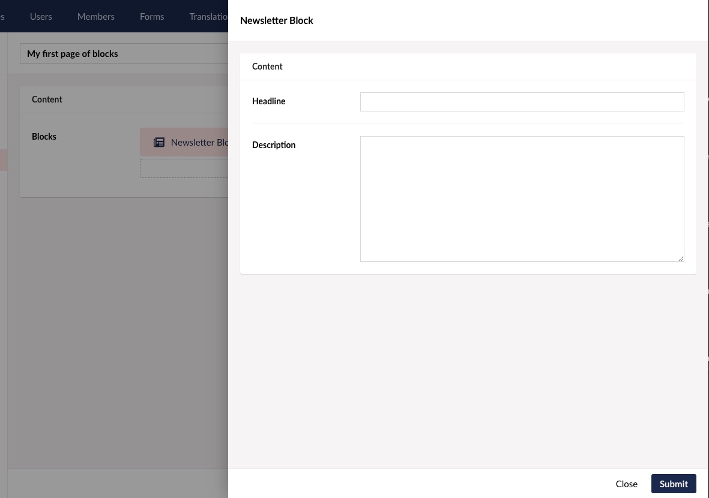
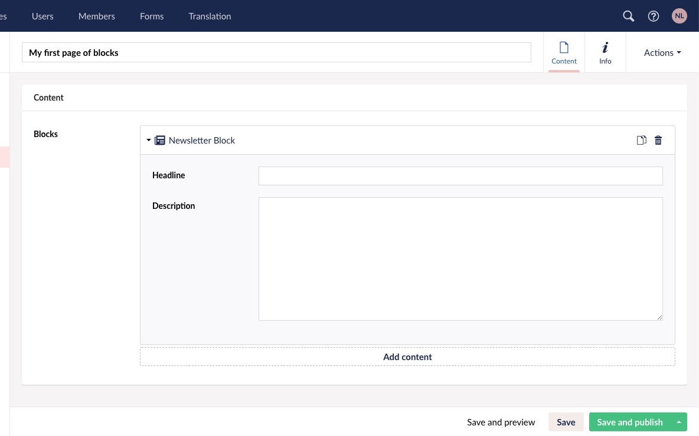

# Block List

`Alias: Umbraco.BlockList`

`Returns: TODO: Jet-To-Be-Written-`


**Block List** is a list editing property editor, using Element Types to define the list item schema.


## Configure Block List

The **Block List** property editor is configured in the same way as any standard property editor, via the *Data Types* admin interface. To set-up your Block List Editor property, create a new *Data Type* and select **Block List** from the list of available property editors.

Then you will see the configuration options for a **Block List** as shown below.


The data-type editor allows you to configure the following properties:

- **Available Blocks** - Here you will define the Block Types to be available for use in the propety, read more on setup block types below.
- **Amount** - Sets the minimum and/or maximum number of items that should be allowed in the list.
- **Inline editing mode** - Enabling this will change editing experience to inline, meaning that editing the data of blocks happens item deletions to require a confirmation before being deleted. Defaults to `true`.
- **Property editor width** - Overwrite the width of the property editor, this field takes any valid css value for "max-width".


## Setup Block Types



Each Block has a set of properties that are optional to configure:

**Editor apperance**

- **Label** - Define a label for the apperance of the Block in the editor. The label can use angularJS template string syntax to display values of properties. Example: "My Block {{myPropertyAlias}}" will be shown as: "My Block FooBar"
- **Custom view** - Overwrite the angularJS view for thing block presentation in the content editor. Use this to make a more visual presentation of the block or even make your own editing experience by adding your own angularJS controller to the view.
- **Custom stylesheet** - Pick your own stylesheet to be used for this block in the content editor. By adding a stylesheet the styling of this block will become scope. Meaning that BackOffice styles are no longer present for the view of this block.
- **Overlay editor size** - Set the size for the content editor overlay for editing this block.

**Data models**

- **Content model** - This presents the ElementType used as model for the content section of this Block. This cannot be changed, but you canopen the ElementType to performe edits or just view the properties available. Usefull when writting your Label.
- **Settings model** - Add a Settings section to your Block based on the given ElementType. When picked you can open the ElementType or choose to remove the settings section again.

**Catalogue apperance**
These properties referess to how the Block is presented in the Block catelogue, when editors choose which Blocks to create for their content.

- **Background color** - Define a background color to be displayed beneath the icon or thumbnail.
- **Icon color** - Change the color of the ElementType icon.
- **Thumbnail** - Pick an image or SVG file to replace the icon of this Block in the catalogue.

**Advanced**
These properties are relevant when you work with custom views.

- **Force hide content editor** - If you made a custom view that enables you to edit the content part of a block. And you are using default editing mode(not inline) you might want to hide the content-editor from the block editor overlay.


## Editing Blocks

When viewing a **Block List** editor for the first time, you'll be presented with the option to Add content


Clicking the Add content button brings up the Block Catalogue


The Block Catalogue looks different depending on the amount of avaiable Blocks and their catalogue apperance.


Click the Block type you wish to create and a new Block will appear in the list.

Depending on wether your Block List Editor is setup to use default or inline editing mode.
In default mode you will enter the editing overlay of that Block:



In inline editing mode the new Blocks inline editor will expand:




More Blocks can be added to the list by clicking the Add content button or using the inline Add content button that appears on hover between or above existing Blocks.


To reorder the Blocks, click and drag a Block up or down to place in the decirede order.

To delete a Block click the trash-bin icon appearing on hover.


## Rendering Block List Content

To render the stored value of your **Block List** property can be done in two ways.

### Default rendering
Use the build-in rendering machinsme for rendering block by a Partial View for each block.
To make this work you will need to create a Partial View for each block, named by the alias of the ElementType thats begin used as Content Model.
These partial views must be placed in this folder `Views/Partials/BlockList/Components/`

A Partial View will recive the model of `Umbraco.Core.Models.Blocks.BlockListLayoutReference` This gives you the option to access properties of the Content Section and Settings Section of your Block.

Example:

```csharp
@inherits Umbraco.Web.Mvc.UmbracoViewPage<Umbraco.Core.Models.Blocks.BlockListLayoutReference>
@using ContentModels = Umbraco.Web.PublishedModels;
@{
    var content = (ContentModels.BlockGallery)Model.Content;
    var settings = (ContentModels.BlockGallerySettings)Model.Settings;
}
```

### Build your own rendering
A built in value converter is available to use the data as you like. Call the `Value<T>` method with a generic type of `IEnumerable<BlockListLayoutReference>` and the stored value will be returned as a list of `BlockListLayoutReference` entities.

Example:

```csharp
@inherits Umbraco.Web.Mvc.UmbracoViewPage
@using Umbraco.Core.Models.Blocks;
@{
	// TODO: Someone check that this is right?
    var blocks = Model.Value<IEnumerable<BlockListLayoutReference>>("myBlocksProperty");
    foreach (var block in blocks)
    {
    
        var content = block.Content;

        @Html.Partial("MyFolderOfBlocks/" + content.ContentType.Alias, block)
    }
}
```

Each item is a `BlockListLayoutReference` entity that contains two properties: `Content` and `Settings`. Each of these is a `IPublishedElement` which means you can use all the value converters you are used to using.

Example:

```csharp
	
	
	
```