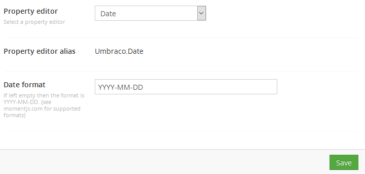

# Tags
`Alias: `
`Returns: String Array`

Allows you tag add multiple tags to a node.

## Data Type Definition Example

Data can be saved in either CSV format or in JSON format. By default data is saved in CSV format. The difference between using CSV and JSON is that with JSON you can save a tag, which includes comma seperated values.
*TODO - ADD MEANINGFUL JSON TAG EXAMPLE AND ACTUALLY TEST CSV VS. JSON ON THIS ONE!*

Whenever you add a new tag on a node the tag will also be available for use in other nodes, which will occur when you type using typeahead functionality. So if you need different tag groups you can create a new instance of the tags property editor and change the group name.
*TODO - ADD CONFIG EXAMPLE SCREENDUMP FOR THIS ONE?*

## Content Example

## MVC View Example - displays a datetime

### Typed:

	@(Model.Content.GetPropertyValue<DateTime>("datePicker").ToString("dd MM yyyy"))
