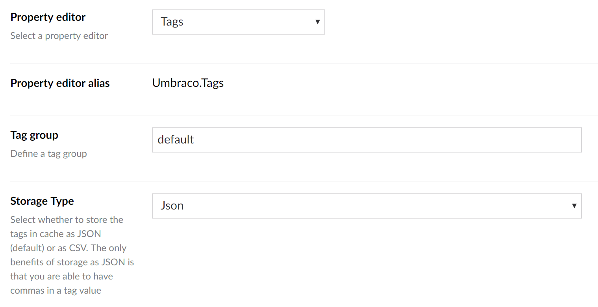

# Tags

`Alias: Umbraco.Tags`

`Returns: IEnumerable<string>`

The Tags property editor allows you to add multiple tags to a node.

## Data Type Definition Example



### Tag group

The **Tag group** setting provides a way to categorize your tags in groups. So for each category you will create a new instance of the Tags property editor and setup the unique category name for each instance. Whenever a tag is added to an instance of the tags property editor it's added to the tag group, which means it will appear in the Typeahead list when you start to add another tag. Only tags that belong to the specified group will be listed. If you have a "Frontend" group and a "Backend" group the tags from the "Frontend" group will only be listed if you're adding a tag to the Tags property editor configured with the "Frontend" group name and vice versa.

### Storage type

Data can be saved in either CSV format or in JSON format. By default data is saved in JSON format. The difference between using CSV and JSON is that with JSON you can save a tag, which includes comma separated values.

There are built-in property value converters, which means you don't need to worry about writing them yourself or parse the JSON output when choosing "JSON" in the storage type field. Therefore [the last code example](index.md#mvc-view-example---displays-a-list-of-tags) on this page will work out of the box without further ado.

## Content Examples

### CSV tags


### JSON tags


### Tags typeahead

Whenever a tag has been added it will be visible in the typeahead when you start typing on other pages.


## MVC View Example - displays a list of tags

### Typed using models builder

```csharp
@if(Model.Tags.Any()){
    <ul>
        @foreach(var tag in Model.Tags){
            <li>@tag</li>
        }
    </ul>
}
```

### using GetProperty and Value

```csharp
@if(Model.GetProperty("tags") !=null){
    <ul>
        @foreach(var tag in Model.GetProperty("tags").Value<IEnumerable<string>>()){
            <li>@tag</li>
        }
    </ul>
}
```

### Setting Tags Programatically

You can use the ContentService to create and update Umbraco content from c# code, when setting tags there is an extension method (SetTagsValue) on IContentBase that helps you set the value for a Tags property. Remember to add the using statement for `Umbraco.Core.Models` to take advantage of it.

```csharp
using System.Web.Mvc;
using Umbraco.Core.Models;
using Umbraco.Web.Mvc;

namespace Our.Documentation.Examples.Controllers
{
    public class TestController : SurfaceController
    {
        // GET: Test
        public ActionResult Index()
        {
            //get content item to update
            IContent content = this.Services.ContentService.GetById(1234);

            // list of tags
            string[] newTagsToSet = new string[] { "Umbraco", "Example", "Setting Tags", "Helper" };

            //make content persisted
            Services.ContentService.Save(content);
            // set the tags
            content.AssignTags("aliasOfTagProperty", newTagsToSet);

            return View();
        }
    }
}
```

### More on working with Tags

More on working with Tags (i.e. query all of them) can be found at the [UmbracoHelper reference page](../../../../../Reference/Querying/UmbracoHelper/#working-with-tags)
