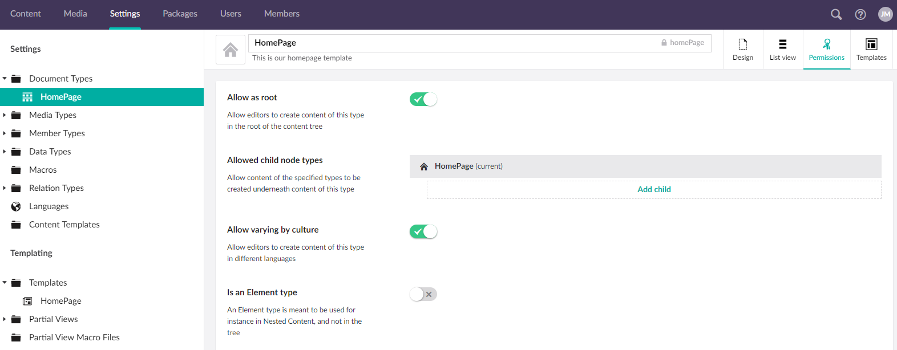
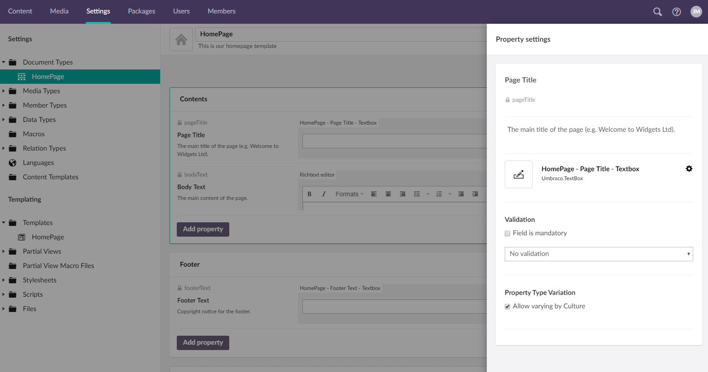
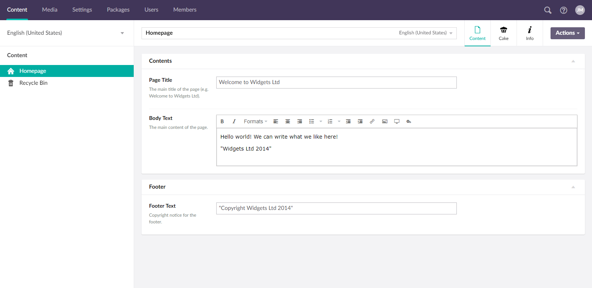

# Variants

Variants is a new feature included in Umbraco v8. It allows you to vary content by culture, so you can allow a content node to exist in several languages.

## How to enable variants

The first thing to ensure when you want to work with variants is that you have more than one language enabled, this can be done from the `Settings` section:

Note that you will always have one default language but each language can be set to mandatory if you want.

## Enabling variants on doctypes

Now that there are two languages to vary the content with, it needs to be enabled on the document types you wish to use it with. To do so head to a document type in the Settings section. In the top right corner you can go to permissions and then check the "Allow varying by culture" toggle:

Now to allow a property on the doctype to be varied it will have to be enabled for the property:

## Working with variants on content

When you return to your content node you will notice two things. 

1. At the top of the content tree there will now be a dropdown so you can show the content tree in the language of your choice. 
2. To the right of the content name there is now a dropdown where you can select a language. You can also open a split view so you can see two languages at once.

Each property editor that does not allow variants will be greyed out and have the content of the default language.

To read about how you render variant content in templates, check out the [rendering content section](../../Design/Rendering-Content/index-v8.md).
