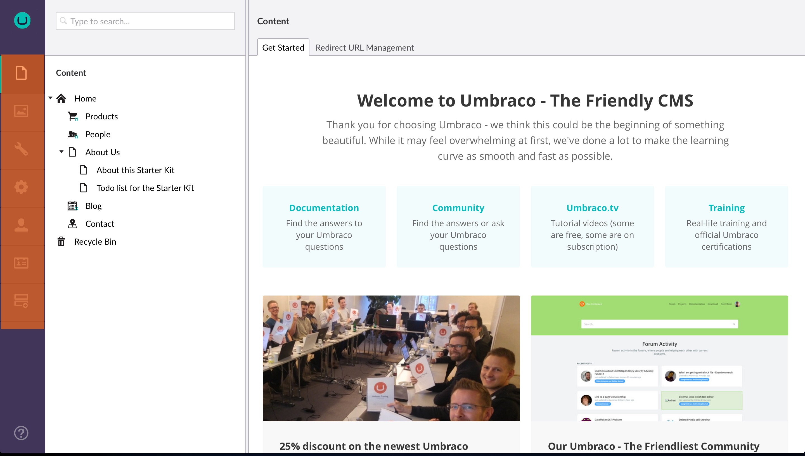
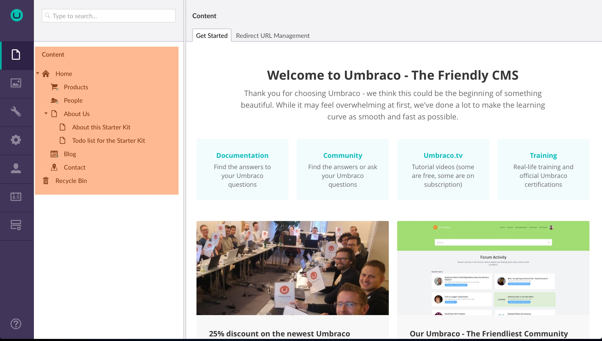
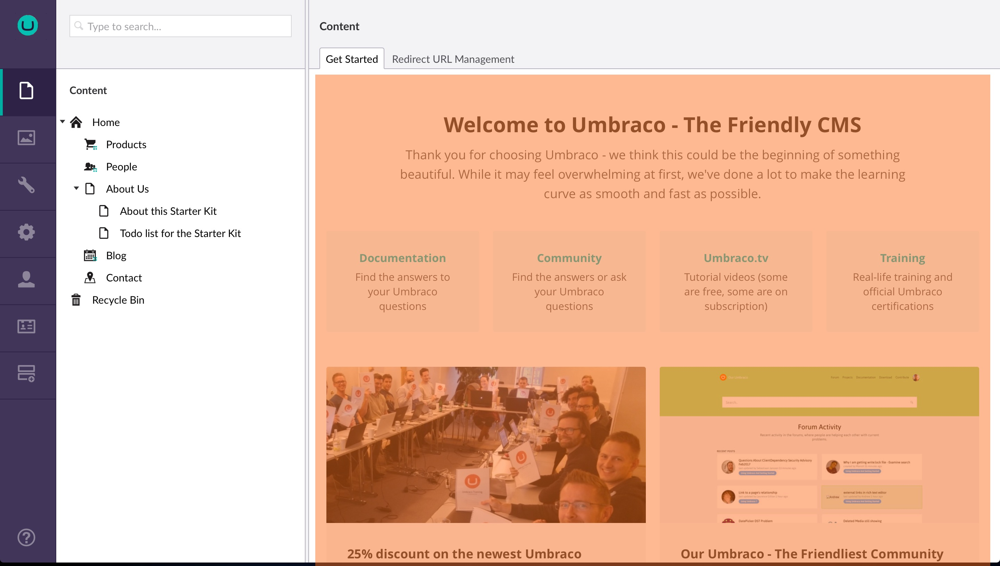

# Backoffice overview
These items are common terms and concepts that are used throughout the Umbraco backoffice.

### [Login screen](Login/)
When you go to the backoffice for the first time, you're presented with the login screen. [Read more about the login screen](Login/).

 

### [Section](Sections/)
A section in Umbraco is where you do specific tasks related to that section. For example content, settings, developer. You can navigate between the different sections of the backoffice by clicking the corresponding icon in the section menu. [Read more about the section menu](Sections/).

*The __Section menu__ is the vertical menu located on the left side of the backoffice.*

### [Tree](../../Extending/Section-Trees/index.md)
A tree is a hierarchical list of items related (and usually restricted) to a specific concept, which could be something like a content tree or a media tree. You can expand trees by clicking the down arrow  to the left of the node or by double-clicking the node.
[Read more about the Tree](../../Extending/Section-Trees/index.md)

*The content tree*

### Node
A node is an item in a tree. The images and folders in the Media section are shown as nodes in the Media tree, page and content in the Content tree and so forth.

### [Dashboards](../../Extending/Dashboards/index.md)
A dashboard is the main view you are presented with when entering a section within the backoffice, and can be used to show valuable information to the users of the system. [Read more about Dashboards](../../Extending/Dashboards/index.md)

*Default dashboard in the content section*

### Editor
An editor is what you use to edit different items within the backoffice. There are editors specific to editing stylesheets, there are editors for editing Macros and so forth.

### [Content](../Data/Defining-Content/)
Content are the pages and content in the Content section. Each item in the tree is called a Node.  Each node in the content tree exists out of different fields. Every content item (or Node) is defined by a Document Type.
[Read more about Content](../Data/Defining-Content/)

### Document Type
Document Types define the types of pages/nodes that backoffice users can create in the content tree. Each Document Type contains different properties or fields.
Each field has a specific Data Type e.g. text, number, ...

### Properties
Every Document Type has properties. These are the fields that the content editor is allowed to edit for the node.

### [Data Type](../Data/Data-Types/)
Each Document Type property has a Data Type which defines the type of input of that property. Data Types reference a Property Editor and are configured in the Umbraco backoffice in the developer section.  A Data Type can be something very simple (textstring, number, true/false,...) or more complex (multi-node tree picker, image cropper, ...)
[Read more about Data Types](../Data/Data-Types/)

### [Property Editors](Property-Editors/)
A property editor is a way to insert content into Umbraco. An example of a property editor is the Rich Text Editor. It may be confused with Data Types. It's possible to have many Rich Text Editor Data Types with different settings that all use the Rich Text Editor property editor. [Read more about Property Editors](Property-Editors/)

### [Media](../Data/Creating-Media/)
Media items are used to store assets like images and video within the Media section and can be referenced from your content.
[Read more about Media](../Data/Creating-Media/)

### Media Type
Media Types are very similar to Document Types in Umbraco except they are specifically for media items in the media section.

### [Member](../Data/Members/)
A member is someone who has access to signup, register and login into your **public website** and is not to be confused with User.
[Read more about Members](../Data/Members/)

### Member Type
Similar to a Document Type and a Media Type. You are able to define custom properties to store on a member such as twitter username or website URL for example.

### [Templates](../Design/Templates/)
A Template is where you define the HTML markup of your website. A layout is a common template that contains common markup such as the `<head>` section.
[Read more about Templates](../Design/Templates/)

### Package
A package is the Umbraco term for a module or plug-in used to extend Umbraco. Packages can be found in the [projects section of Our Umbraco](https://our.umbraco.com/projects/ "Projects on Our Umbraco").

### [Macros](../../Reference/Templating/Macros/)
A macro is a reusable piece of functionality that you can reuse throughout your site. Macros can be configured with parameters and be inserted into a Rich Text Editor. You can define what macros are available for your editors to insert in to the rich text editor. When an editor inserts a macro into the rich text editor it will prompt them to fill out any of the defined parameters for the macro.
[Read more about Macros](../../Reference/Templating/Macros/)

### [Macro Parameter Editor](../../Extending/Macro-Parameter-Editors/)
A parameter editor defines the usage of a property editor for use as a parameter for Macros.
[Read more about the Macro Parameter Editor](../../Extending/Macro-Parameter-Editors/)

### User
A user is someone who has access to the **Umbraco backoffice** and is not to be confused with Member. When Umbraco has been installed a user will automatically be generated with the login (email) and password entered during installing. Users can be created, edited and managed in the User section.

### [Content Templates](Content-Templates/)
Content Templates provide a blueprint for content nodes based on an existing node.
