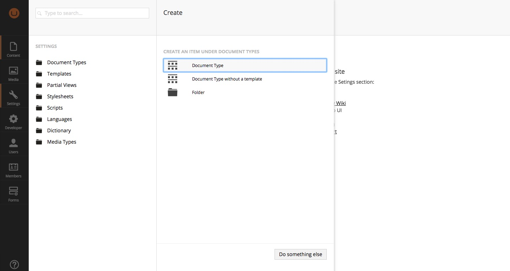
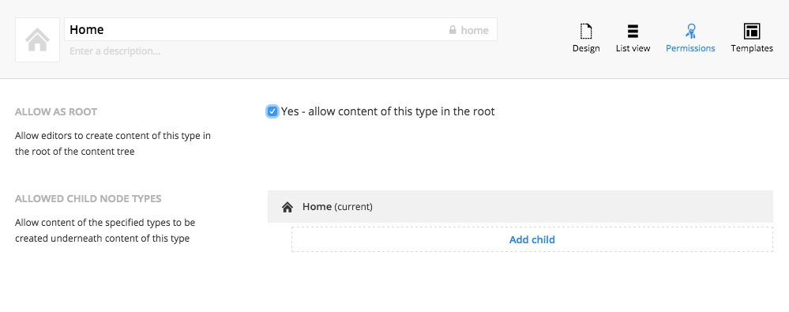
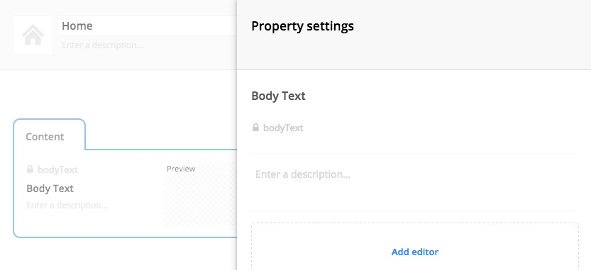
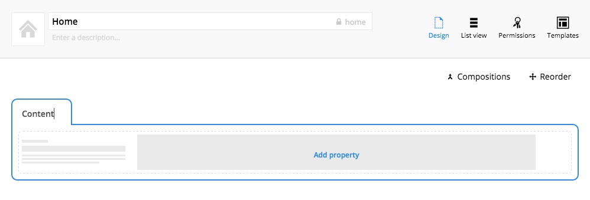

#Defining content
Before a piece of content can be created it needs to be defined. That is why, when opening a blank installation of Umbraco, it is not possible to create content in the __Content__ section.

All content needs a blueprint that holds information about what kind of data can be stored on the content node, which editors are used, how it is organized, where in the structure it is allowed and so forth. This blueprint or definition is called a Document Type.

##What is a Document Type?
In it's most basic form a document type is a form containing fieldsets (or tabs) where you can apply rules about where the content can be created, which template(s) are allowed, backoffice icon and so forth.

Document Types can define entire pages or more limited content that can be reused on other nodes ie. a SEO tab. This means that you are in complete control of what type of content can be created where.

####Properties
Each field on a Document Type is called a property. A property is given a name, an alias (used to output the properties content in a template) and a type. The type determines what type of data the property will store and the input method. There are a wide range of Data Types available out of the box (textstring, richtext, media picker and so forth) and you can customize and add additional Data Types in the __Developer__ section und __Data Types__.

##Creating a Document Type
A Document Type is created in the settings section using the Document Type editor.

Go to the __Settings__ section in the backoffice. On the __Document Types__ node click the menu icon (or rightclick the node) to bring up the context menu. Here choose __Create new Document Type__.

###Naming Document Types
Naming your Document Types is important in two ways. Good names make it easier to get an to find and edit your Document Types and the name will be displayed to the backoffice user when creating a piece of content based on this Document Type.

__Create matching template__ will automatically create a template (can be found under __Templates__ in the __Settings__ sections) that will be assigned as the default template for the document type.

Click the __Create__ button to add the Document Type to the Document Type tree.

##The Document Type editor
You are now taken to the Document Type editor that is used to define and edit the Document Type. It consists of four tabs: __Info__, __Structure__, __Generic Properties__ and __Tabs__.

###Info

On the __Info__ tab you can edit basic information about this Document Type and choose which templates are allowed.

* __Name:__ The name of the Document Type is shown in the Document Type tree and also when users create content based on this Document Type.
* __Alias:__ The alias is used to reference the Document Type in code. Be carefull editing this on existing sites as all references will need to be updated accordingly.
* __Icon:__ The icon displayed in the Content tree. Using descriptive icons is a great way to improve the overview in the content tree.
* __Description:__ The descripition is shown to backoffice users when creating content based on this Document Type.
* __Allowed templates__ will be available to the backoffice user on the Properties tab in the Content section.
* __Default template:__ When creating a content node this template will be used.

###Structure

The Structure tab is where you control the hierarchy of your site. Structure allows you to determine which content can be nested as children to the one you are creating.

* __Allow at root:__ If this is checked you can create content based on this Document Type at the root of the content tree. A root node usualy holds basic information about the site. You can uncheck this after a root node has been created to disable adding additional nodes at this level.
* __Enable list view:__ Child nodes under this Document Type will not be shown in the content tree but instead presented in a sortable list view complete with real time search. The *List view - Content* Data Type will be used as a default. When you save the Document Type you will have the option to edit this or create a custom list view. [configure the list view](#). //TODO: List view documentation.
* __Allowed child node type:__ Choose what content can be created under nodes based on the current Document Type. This is where you define the actual structure  of your content tree. *Remember to uncheck a child node type if you want to restrict editors from creating additional nodes*
* __Document Type Compositions__: Inherit tabs and properties from selected Document Types

###Generic Properties

Create. edit and organize properties for this Document Type. Inherited Properties can not be edited.

#####Adding properties
To add a property to the Document Type select __Click here to add new property__.

* __Name:__ The name  of the property will be shown in the Content section.
* __Alias:__ Used to reference the property in your templates.
* __Type:__ Selecting the type will decide the input method for this property. Ie *Richtext editor*, *Date Picker*, *checkbox* and so forth. You can edit or create new types in the __Developer Section__ under the __Data Type__ node.
* __Tab:__ Place the property on a tab. Additional tabs can be created on the __Tabs__ tab. If the property is placed on the Generic Properties tab it will show on the Properties tab in the content view.
* __Mandatory:__ Making the property mandatory means the content cannot be created/saved if the property has no value.
* __Validation:__ Add a regular expression to validate the property upon save.
* __Description:__ The description will be displayed below the property name in the Content section. A good description is important to the editing experience.

#####Organizing properties
Organize properties with drag and drop. If multiple tabs exists it is possible to drag properties between the different tabs. Inherited properties are not shown, re-ordering these must be done on the Document Type where they were created.

If an inherited tab has the same name as an existing tab they will be merged in the content section.

###Tabs

Create, edit and organize tabs to enhance the editing experience.

#####New Tab
A new tab is created by entering a name into the input field and pressing the __New tab__ button.

#####Name and sort order
Renaming a tab is done simply by changing the name in the input field and saving the Document Type. To change the order of tabs use the drag and drop handle to the left or enter a numeric value in the second input field. Tabs will be displayed from left (lowest value) to right (highest value) in the content section.

##More information
* [Data Types](../Data-Types/index.md)

##Tutorials
* [Creating a basic website with Umbraco](#)

##Umbraco.tv
* [Document Types chapter](http://umbraco.tv/videos/umbraco-v7/implementor/fundamentals/document-types/what-is-a-document-type/)
