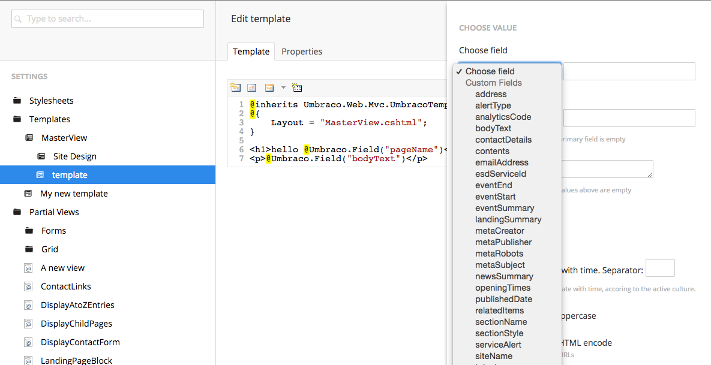
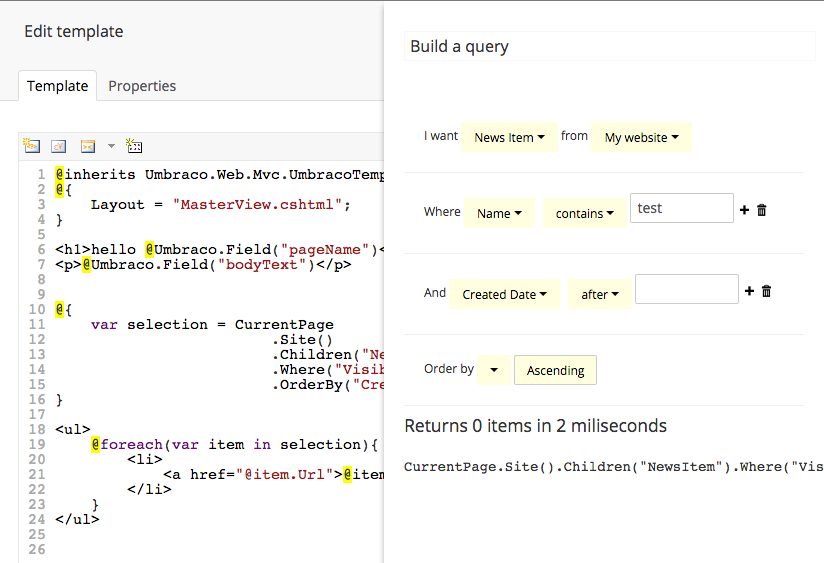

#Rendering content

_The primary task of any template in Umbraco is to render the values of the current page or the result of query against the content cache._

##Rendering values
Values of the current page can be rendered in 2 different ways, either by using the Umbraco html helper, which lets you access each field by its alias like so:

    <h1>Hello @Umbraco.field("pageName")</h1>
    
@Umbraco.Field("bodyText")

There is a dialog (click ) on the backoffice template editor which can help you pick values and select common modifications:

##Rendering a field with Model
The UmbracoHelper method provides many useful parameters to change how the value is rendered. If you however simply want to render value "as-is" you can use the `@Model.Content` property of the view. For example:

    @Model.Content.GetPropertyValue("bodyContent")

You can also specify the output type that you want from the property. If the property editor or value does not support the conversion then an exception will be thrown. Some examples:

    @Model.Content.GetPropertyValue<double>("amount")

##Query content
In many cases, you want to do more then just display values from the current page, like creating a list of pages in a navigation - or generate a sitemap. You can do this by querying content in your templates:

    <ul>
        @foreach(var child in Model.Content.Children())
        {
            <li><a href="@child.Url">@child.Name</a></li>
        }
    </ul>

You can use the query helper (click ) in the template editor to build more advanced queries:

###More information
- [Razor examples](../../../Reference/Templating/Mvc/examples.md)
- [Querying](../../..//Reference/Templating/Mvc/querying.md)

###Umbraco TV
- [Episode: Setting up our first template](http://umbraco.tv/videos/umbraco-v7/implementor/fundamentals/templating/alt-template/)
- [Episode: Insert Umbraco page field dialog](http://umbraco.tv/videos/umbraco-v7/implementor/fundamentals/templating/insert-umbraco-page-field-dialog/)
