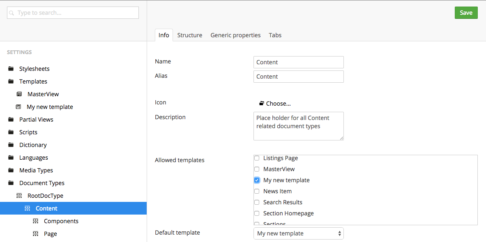
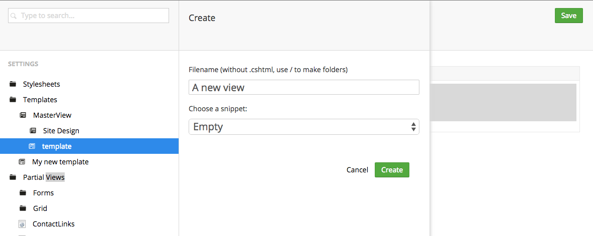

# Templates

_Templating in Umbraco builds on the concept of Razor Views from ASP.NET MVC - if you already know this, then you are ready to create your first template - if not, this is a quick and handy guide._

## Creating your first template
By default all document types should have a template attached - but in case you need an alternative template or a new one, you can create one:

Open the settings section inside the Umbraco backoffice and right-click the **templates** folder. then choose **create**. Enter a template name and click the create button. You will now see the default template markup in the backoffice template editor


## Allowing a template on a document type
To use a template on a document, you must first allow it on the content's type. Open the document type you want to use the template and check the template under "allowed templates"




## Inheriting a master template
A template can inherit content from a master template by using the ASP.NET views Layout feature. Lets say we have a template called **masterview**, containing the following html:

```csharp
@inherits Umbraco.Web.Mvc.UmbracoTemplatePage
@{
    Layout = null;
}
<!DOCTYPE html>
<html lang="en">
    <body>
        <h1>Hello world</h1>
        @RenderBody()
    </body>
</html>
```

We then create a new template called **textpage** and in the template editor, under the properties tab, sets its master template to the template called masterview:


This changes the `Layout`value in the template markup, so **textpage** looks like this:

```csharp
@inherits Umbraco.Web.Mvc.UmbracoTemplatePage
@{
    Layout = "MasterView.cshtml";
}
<p>My content</p>
```

When a page using the textpage template renders, the final html will be merged together replacing the `@renderBody()` placeholder and produce the following:

```csharp
@inherits Umbraco.Web.Mvc.UmbracoTemplatePage
@{
    Layout = null;
}
<!DOCTYPE html>
<html lang="en">
    <body>
        <h1>Hello world</h1>
        <p>My content</p>
    </body>
</html>
```

## Template Sections
What's good to know, is that you are not limited to a single section. Template sections allow child templates that inherit the master layout template to insert HTML code up into the main layout template. For example a child template inserting code into the `<head>` tag of the master template.

You can do this by using named sections. Add named sections to your master template with the following code:

```csharp
@RenderSection("SectionName")
```

For instance, if you want to be able to add HTML to your `<head>` tags write:

```csharp
@inherits Umbraco.Web.Mvc.UmbracoTemplatePage
@{
    Layout = null;
}

<html>
    <head>
        <title>Title</title>
        @RenderSection("Head")
    </head>

    <body>
    </body>
</html>
```

By default, when defining a section it is required. To make the section optional add  `required:false`.

```csharp
@RenderSection("Head", required: false)
```

On your child page template call `@section Head {}` and then type your markup that will be pushed into the Master Template:

```csharp
@section Head {
    <style>
        body {
            background: #ff0000;
        }
    </style>
}
```

## Injecting partial template
Another way to reuse html is to use partials - which are small reusable views which can be injected into another view.

Like templates, create a partial, by clicking "partial views" and selecting create - you can then optionally use a pre-made template.



the created partial can now be injected into any template by using the `@Html.Partial()` method like so:

```csharp
@inherits Umbraco.Web.Mvc.UmbracoTemplatePage
@{
    Layout = "MasterView.cshtml";
}

<h1>My new page</h1>
@Html.Partial("a-new-view")
```

### Find More information

- [Basic Razor syntax](basic-razor-syntax.md)
- [Rendering content](../Rendering-Content/)

### Tutorials
- [Creating a basic website with Umbraco](../../../Tutorials/Creating-Basic-Site/)

### [Umbraco.TV](https://umbraco.tv)
- [Chapter: Templating](https://umbraco.tv/videos/umbraco-v7/implementor/fundamentals/templating/introduction/)
