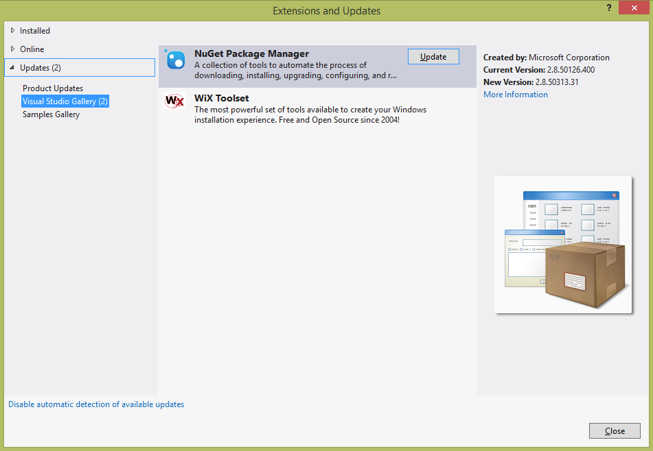
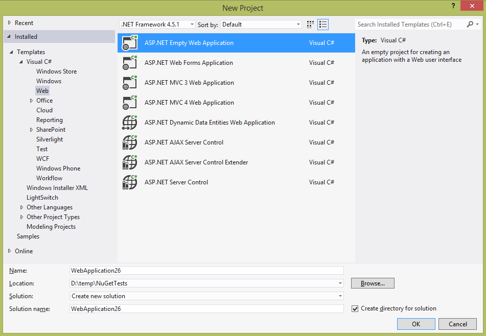
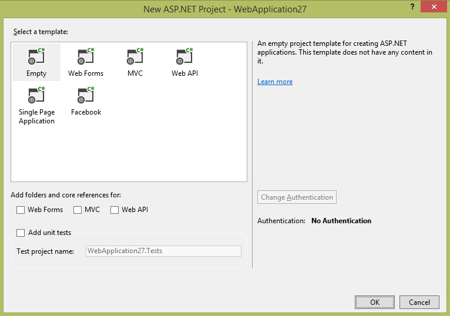
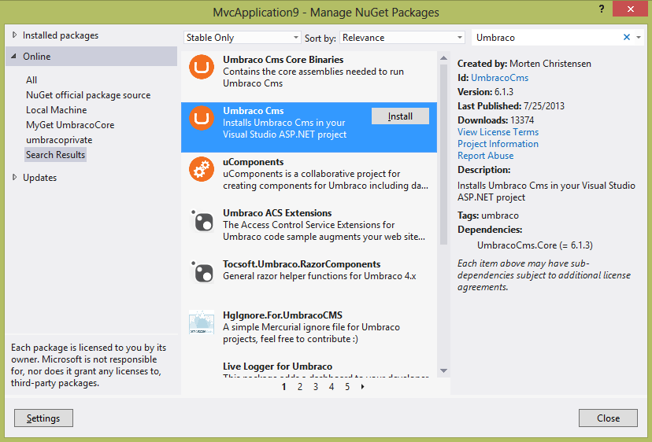

# Install Umbraco with NuGet

_Follow these steps to do a full install of Umbraco with NuGet._

## Abbreviated version
- You will get the best results if you install Umbraco in a **blank** C# web application Visual Studio project
 - In VS12: use ASP.NET Empty Web Application
 - In VS13/15/17: use ASP.NET Web Application with an Empty template
- Umbraco can in most cases **not** be installed in an existing MVC/Webforms project
- When asked if you want to overwrite config files, choose **"Yes"** to overwrite them
- ReSharper 8 (last released in 2014) might have problems, try suspending it or upgrading to ReSharper version 8.2.3

## Note for ReSharper users
We're aware of an ongoing issue with ReSharper 8 which interferes with the NuGet installation and causes it to fail (you can help getting this resolved by voting for [this issue][1]).  
The advise for now is when you're installing Umbraco: suspend ReSharper through Tools > Options > ReSharper > Suspend Now.   
After you're done installing or updating you can re-enable ReSharper in the same way.

## NuGet version
Before you start: make sure your NuGet version is up to date. We use the latest version while testing and can't guarantee that the install process works with older versions of NuGet.

In Visual Studio, go to Tools > Extensions and Updates, then Updates > Visual Studio Gallery. Check if there's a NuGet update available and install it.



Also make sure that the execution policy in the Package Manager Console is set to **RemoteSigned**. You can check this by going to Tools > NuGet Package Manager > Package Manager Console. Once that loads, type `Get-ExecutionPolicy` if it's set to "Restricted" then make sure to change that by typing the following command: `Set-ExecutionPolicy RemoteSigned`

## Install NuGet in Visual Studio
If you don't already have NuGet installed, you can read all about the installation process here: [https://docs.nuget.org/docs/start-here/installing-nuget](https://docs.nuget.org/docs/start-here/installing-nuget).

## New solution
To install Umbraco we first need a Visual Studio solution.

### Visual Studio 2012
Go to **File > New Project** and pick ASP.NET Web Application. Click **OK** and then choose one of the following:

* ASP.NET Empty Web Application
* ASP.NET Web Forms Application
* ASP.NET MVC 3 Web Application (will be upgraded to an MVC 4 application)
* ASP.NET MVC 4 Web Application

Some of these have a second step, pick the **Empty** template on that second step.  
It's important to pick only one of those as other templates cause errors beyond our control.



### Visual Studio 2013/2015/2017
Go to **File > New Project** and pick an ASP.NET Web Application.    


On the next step, select the **Empty** template. It's important to pick **empty** as other templates include incompatible versions of MVC and Json.NET. (Don't enable any of the checkboxes to add folders or core references. Umbraco will add them for you).  



Or you can use the VS2012/2013/2015 template:

* ASP.NET Empty Web Application

Again, if there's a next step, then choose **Empty** to prevent conflicts.


## Finding and installing the Umbraco package
The latest release of Umbraco is always available in the NuGet gallery. All you have to do is search for it and install.

To install Umbraco from the Visual Studio interface, right-click on the new project you just made and choose **Manage NuGet Packages**.


You can then use the search function to find the package called **Umbraco CMS**. You'll also find the Umbraco CMS Core Binaries package, which will be included automatically when you choose Umbraco CMS. So make sure to pick Umbraco CMS (highlighted in the image below) and click **Install**.



NuGet will then download dependencies and will install all of Umbraco's files in your new solution.

During this process it will ask if it is allowed to overwrite your web.config file. In this case, overwriting the file is safe because we just started a new project. If you're installing Umbraco in an existing project, however, you might want to create a backup of your existing web.config file before answering "Yes".


## Package manager console
You can do the exact same thing from the package manager console, which is a bit quicker as you don't have to click through the menus and search.

Enable the console by going to **Tools >  Library Package Manager >  Package Manager Console**.


Then simply type `Install-Package UmbracoCms` to start installing the latest version of Umbraco.


During this process it will ask if it is allowed to overwrite your web.config file. In this case, overwriting the file is safe because we just started a new project. However, if you're installing Umbraco into an existing project you might want to create a backup of your existing web.config file before answering "Yes".


## Running the site
You can now run the site like you would normally in Visual Studio (using **F5** or the **Debug** button).

Follow the installation wizard and after a few easy steps and choices you should get a message saying the installation was a success.

## Post installation
You should note that the Umbraco NuGet package adds a build step to always include the Umbraco folders when you deploy using Web One-Click Publish with Visual Studio.  
You can see these folders in `packages/UmbracoCms x.y.z/build/UmbracoCms.targets`  
Should you need to exclude any of these folders or content, you can add a target to your `.pubxml` files in the `properties/Publish` folder. For instance if you need to exclude json data a plugin generates during production.

```
  <Target Name="StopUmbracoFromPublishingAppPlugins" AfterTargets="AddUmbracoFilesToOutput">
    <ItemGroup>
      <FilesForPackagingFromProject Remove=".\App_Plugins\UmbracoForms\Data\**\*.*"/>
    </ItemGroup>
  </Target>
```

[1]: https://youtrack.jetbrains.com/issue/RSRP-419513
