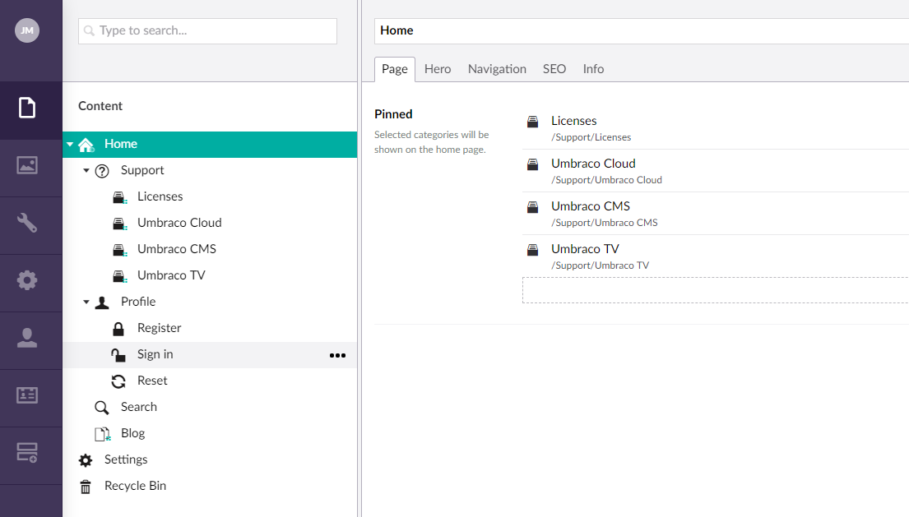
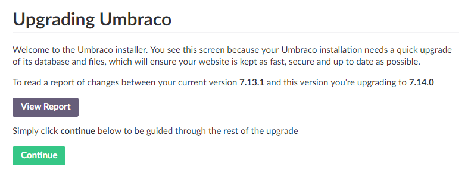
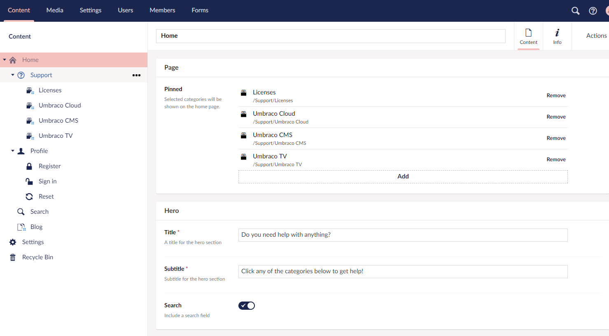

# Migrating content to v8

With the release of Umbraco v8 there has been a demand for a way to migrate a current v7 site to v8. With all the cleanup and changes being made between these two versions a simple upgrade is not possible.

To help with the transition a content migration has been implemented in the CMS from version 8.1.0, this means that if you have an Umbraco v7 site you will be able to atleast move all content over, then the rest of the site will have to be recreated in v8.

## Limitations

### Versions supported

This content migration is a database migration that is included from Umbraco 8.1+, it was made for the database schema of Umbraco 7.14+, so if you have an older site you wish to migrate to v8.1 or later you will have to update to 7.14 or higher first.

### Database types supported

As Umbraco 8 doesn't support MySQL databases the migration will not work when moving from an Umbraco 7 site using MySQL to Umbraco 8 on SQL server for example.
The database types that are supported are SQL Server and SQL CE.

### Third party property editors

The migration will transfer the data stored in third party editors as well, however it will simply be stored as it was in v7. If the structure has changed for v8 or the property editor doesn't exist you will still be able to find the data in the database, but you would not see it in the backoffice.

## How does it work?

In the following guide we will try to migrate the content of a v7.13.1 site to a v8.1.0 site.

### Step 1: Upgrading to 7.14

Before the content migration can start the site has to be 7.14+, so a good idea would be to **always take a database backup** before doing an upgrade, and then check the [version specific upgrade instructions](version-specific.md).

The site in this example is a v7.13.1 site, and we will use Nuget to update it.

It is a fairly simple site, with a bit of content:

Following the [general upgrade instructions](general.md) we will now upgrade via Nuget until we get to this point:

Once it is upgraded and you have verified everything is working we can move on to step 2.

### Step 2: Migrating content to Umbraco 8

:::note
Before migrating the content it is adviseable to create a backup of the database, so if anything goes wrong you can start over with the original data.
:::

First thing to do is spin up a fresh new Umbraco 8.1+ site. Make sure it all works and that no content is there (_hint:_ choose not to install starter kit).

Now you should go to the **v7.14 site**, and grab the connection string and add that to the **v8.1 site**. Do note that if you are running SQL CE, you will have to copy the database over to the new site as well.

Once the connection string is set the final step is to change the Umbraco version number in the web.config on the **8.1 site**, to say 7.14.0, this will mean that it thinks there is an upgrade as the Umbraco dlls are 8.1 but the config says 7.14 it needs to run the upgrade.

When you start the site it will ask you to login and then show you this screen:

That is all, now the automatic migration will take over, and after a little bit you can log in and see your content:

