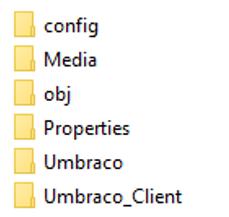
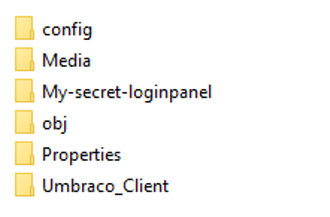

# Umbraco Security Hardening

Here you find some tips and trick for hardening the security of your Umbraco installation.

## Lock down access to your Umbraco-folders

By default there are some folders in your Umbraco installation that should be only used by authenticated users. It’s considered a good practice to lock down these folders to specific IP-addresses and/or IP-ranges to make sure not everyone can access these.
The folders we want to lock down are App_Plugins, Config and Umbraco.
The prerequisite of this to work is that you’re using [IISRewrite](../../Routing/IISRewriteRules/index.md)

If you’ve made sure that you’ve installed this on your server we can start locking down our Umbraco-folders. This can be down by following these three steps.

1. We are going to lock down /Umbraco/, but because API-controllers and Surface-controller will use the path /umbraco/api/ and /umbraco/surface/ these will also be locked down. Our first rule in the IISRewrite.config will be used to make sure that these are not locked by IP-address.

```xml
<rule name="Ignore" stopProcessing="true">
    <match url="^(?:umbraco/api|umbraco/surface)/" />
    <action type="None" />
</rule>
```

Some older versions of Umbraco also relied on /umbraco/webservices/ for loadbalancing purposes. If you're loadbalancing you should also add umbraco/webservices to the rule.

```xml
<rule name="Ignore" stopProcessing="true">
    <match url="^(?:umbraco/api|umbraco/surface|umbraco/webservices)/" />
    <action type="None" />
</rule>
```

2. Get the IP-addresses of your client and write these down like a regular expression. If the IP-addresses are for example 213.3.10.8 and 88.4.43.108 the regular expression would be "213.3.10.8|88.4.43.108".

3. Lock down the folders App_Plugins, Config and Umbraco (or the renamed version of this folder) by putting this rule into your IISRewrite-rules

```xml
<rule name="Allowed IPs" stopProcessing="true">
    <match url="^(?:app_plugins|config|umbraco)(?:/|$)" />
    <conditions>
        <add input="{REMOTE_ADDR}" negate="true" pattern="213.3.10.8|88.4.43.108" />
    </conditions>
    <action type="AbortRequest" />
</rule>
```

If your server is behind a load balancer, you should use `{HTTP_X_FORWARDED_FOR}` instead of `{REMOTE_ADDR}` as the input for the rule.

In some server configurations you will need to allow the server that is running the Umbraco backoffice to be able to make internal requests to the /umbraco folder. To do that, you will need to add the servers IP address to the rewrite rule as negations.

If you now go to /umbraco/ for example from a different IP-address the login screen will not be rendered.

## Rename your Umbraco-folder
*Important note*: Renaming your Umbraco folder is currently not supported on Umbraco Cloud.

*Important note 2*: Not all packages will keep working if you rename your Umbraco folder. Please be aware of this risk and test it at your local environment first.

By default the login page of Umbraco is available at the path /umbraco/. This page is the entrance to your installation and it’s considered a good practice to rename your path to a more secure path.
This can be done by following these two steps.

1. Rename you /umbraco/-folder on disk to another path (for example: /my-secret-loginpanel/)

Before:



After:



2. Change the two keys in your web.config “Umbraco.Core.ReservedUrls” and “Umbraco.Core.Path” to your new path.

```xml
<add key="Umbraco.Core.ReservedUrls" value="~/my-secret-loginpanel" />
<add key="Umbraco.Core.Path" value="~/my-secret-loginpanel" />
```

From now on, you can only get access to the login screen by going to this path and no longer by going to /umbraco/.
