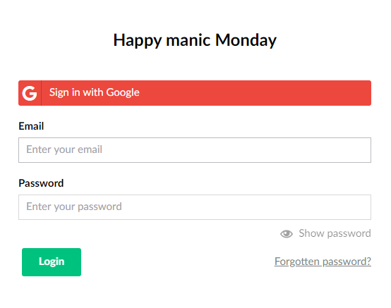

# Security

This section includes information on security within Umbraco, including its various security options and how authentication & authorization works.

## Umbraco Security overview

We have a dedicated security section on our main website which provides all the details you need to know about security within the Umbraco CMS. This includes how to report a vulnerability.

Find all this in [The Umbraco Trust Center](https://umbraco.com/about-us/trust-center/).

## SSL/HTTPS

We highly encourage the use of HTTPS on Umbraco websites especially in production environments. By using HTTPS you greatly improve the security of your website.

Learn more about HTTPS and how configure it in the [Use HTTPS](use-https.md) article.

## Backoffice users

Authentication for backoffice users in Umbraco uses [ASP.NET Identity](https://www.asp.net/identity) which is a very flexible and extendable framework for authentication.

Out of the box Umbraco ships with a custom ASP.NET Identity implementation which uses Umbraco's database data. Normally this is fine for most Umbraco developers, but in some cases the authentication process needs to be customized. 

ASP.NET Identity can be extended and it is also possible to override/replace any part of the process of authentication.

### Custom OAuth providers

The Umbraco backoffice supports custom OAuth providers for performing authentication of your users. This could be any OpenIDConnect provider such as Azure Active Directory, Identity Server, Google or Facebook.

To install and configure a custom OAuth provider, use the [Identity Extensions package](https://github.com/umbraco/UmbracoIdentityExtensions).

The installation of these packages will install snippets of code with "readme" files on how to get up and running. Depending on the provider you've configured and its caption/color, the end result will look similar to this:

#### Authenticating with Active Directory credentials

We have setup a guide on how to [connect the backoffice to Active Directory](authenticate-with-AD.md). It should be pretty straight forward with the `ActiveDirectoryBackOfficeUserPasswordChecker`.

#### Auto-linking accounts for custom OAuth providers

Traditionally a backoffice user will need to exist first and then that user can link their user account to an OAuth account in the backoffice. In many cases however, the identity server you choose will be the source of truth for all of your users.

In this case you would want to be able to create user accounts in your identity server and then have that user given access to the backoffice without having to create the user in the backoffice first. This is done via auto-linking.

Read more about [auto linking](auto-linking.md)

### Custom password check

You are able [check the username and password against your own credentials store](custom-password-checker.md) by implementing a new  `IBackOfficeUserPasswordChecker`.

### Sensitive data on members

Marking fields as [sensitive](sensitive-data.md) will hide the data in those fields for backoffice users that have no business viewing personal data of members.

### [Setup Umbraco for a FIPS Compliant Server](Setup-Umbraco-for-a-Fips-Server/index.md)

How to configure Umbraco to run on a FIPS compliant server.

### [Security settings](Security-settings/index.md)

Some security settings that can be used in Umbraco.
