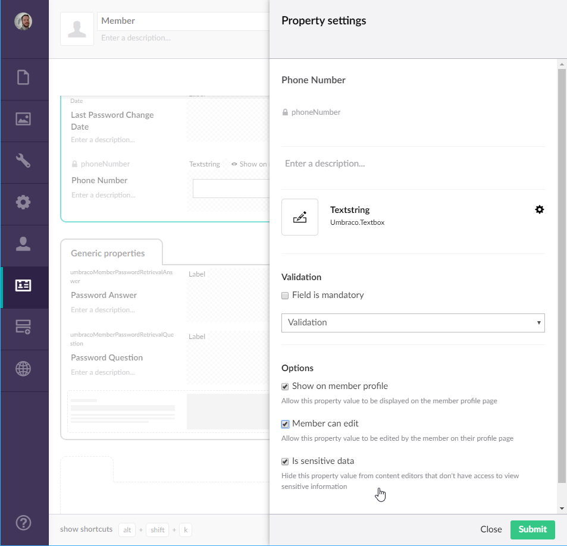
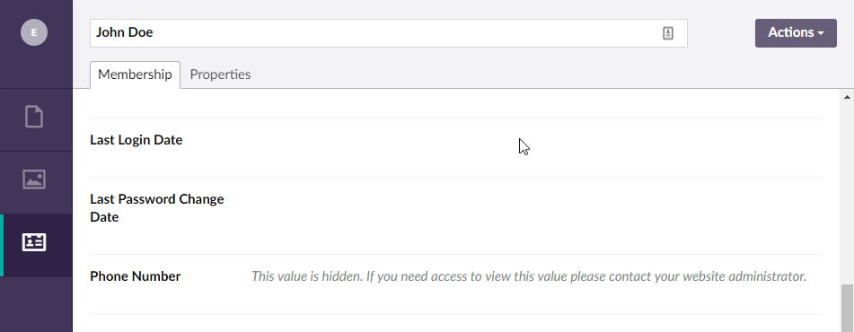

# Security

_This section includes information on Umbraco security, its various security options and configuring how authentication & authorization works in Umbraco_

## Umbraco Security overview

We have a dedicated security page on our main site which provides most of the details you may need to know about security within the Umbraco CMS including how to report a vulnerability: [https://umbraco.com/products/umbraco-cms/security/](https://umbraco.com/products/umbraco-cms/security/)

## SSL/HTTPS

We highly encourage the use of HTTPS on Umbraco websites especially in production environments. By using HTTPS you greatly improve the security of your website.

Don't forget to [configure your Umbraco when using HTTPS](use-https.md).

## Backoffice users

Authentication for backoffice users in Umbraco uses [ASP.NET Identity](https://www.asp.net/identity) which is a very flexible and extensible framework for authentication.

Out of the box Umbraco ships with a custom ASP.NET Identity implementation which uses Umbraco's database data. Normally this is fine for most Umbraco developers
but in some cases the authentication process needs to be customized. ASP.NET Identity can be easily extended by using custom OAuth providers which is helpful if you want
your users to authenticate with a custom OAuth provider like Azure Active Directory, or even Google accounts. ASP.NET identity is also flexible enough for you to override/replace
any part of the process of authentication.

### Custom OAuth providers

The Umbraco backoffice supports custom OAuth providers for performing authentication of your users. For example: Any OpenIDConnect provider such as Azure Active Directory or Identity Server, Google, Facebook, Microsoft Account, etc...

To install and configure a custom OAuth provider you should use the Identity Extensions package: [https://github.com/umbraco/UmbracoIdentityExtensions](https://github.com/umbraco/UmbracoIdentityExtensions)

The installation of these packages will install snippets of code with readme files on how to get up and running. Depending on the provider you've configured and its caption/color, the end result will look similar to:

#### Auto-linking accounts for custom OAuth providers

Traditionally a backoffice user will need to exist first and then that user can link their user account to an OAuth account in the backoffice, however in many cases the identity server you choose will be the source of truth for all of your users.

In this case you would want to be able to create user accounts in your identity server and then have that user given access to the backoffice without having to create the user in the backoffice first. This is done via auto-linking.

Read more about [auto linking](auto-linking.md)

### Custom password check

You are able [check the username and password against your own credentials](custom-password-checker.md) store by implementing a new  `IBackOfficeUserPasswordChecker`.

### Authenticating with Active Directory credentials

You want to [connect the backoffice to Active Directory](authenticate-with-AD.md)? Should be pretty straight forward with the `ActiveDirectoryBackOfficeUserPasswordChecker`.

### Sensitive data

Marking fields as sensitive will hide the data in those fields for backoffice users that have no business viewing personal data of members.

In order to start marking fields as sensitive, you can add the users who need access to this data to the "Sensitive data" user group. In the User management sections go to Groups and choose the Sensitive data group.

From there on, add the users who need access to this data to this group.

When a user in the backoffice does not have access to this data they get told so:

Users who don't have access to sensitive data also do not have access to the "Export member" functionality on each member.

### [Setup Umbraco for a FIPS Compliant Server](Setup-Umbraco-for-a-Fips-Server/index.md)

How to configure Umbraco to run on a FIPS compliant server.

### [Security settings](Security-settings/index.md)

Some security settings that can be used in Umbraco.
