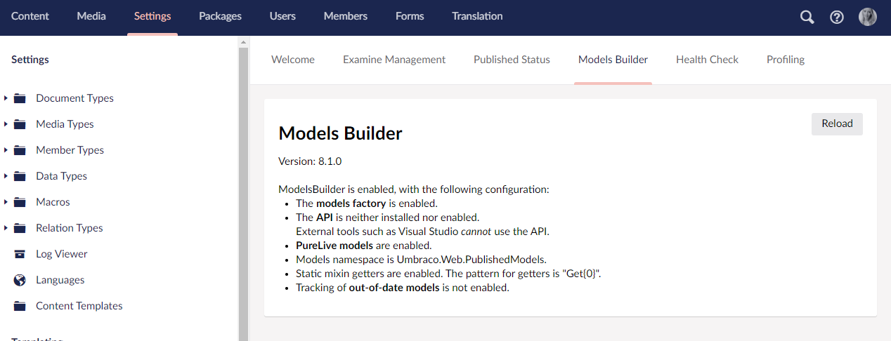

# Umbraco Models Builder Introduction

Models Builder is a tool that can generate a complete set of strongly-typed published content models for Umbraco. By default a slimmed down version of Models Builder is embedded with the main Umbraco distribution. 

Models can be used anywhere that content is retrieved from the content cache, i.e. in MVC views, controllers, etc. In other words, when using the Models Builder, the content cache does not return `IPublishedContent` objects anymore, but strongly typed models.

For each content, media and member type in the Umbraco setup, the generator creates a `*.generated.cs` file, corresponding to the type. It will look like this:

```csharp
namespace MyModels
{
    public partial class NewsItem : PublishedContentModel
    {
        public string Title { get { return this.GetPropertyValue<string>("title"); } }
        public IHtmlString BodyText { get { return this.GetPropertyValue<IHtmlString>("bodyText"); } }
    }
}
```

Umbraco's content cache returns these objects _natively_: No need to map, convert or anything; the following code runs:

```csharp
@inherits UmbracoViewPage<NewsItem>
@using MyModels
<h1>@Model.Title</h1>
@Model.BodyText
```

:::note
If your view inherits from `UmbracoViewPage<NewsItem>` then the model is the content item itself and the syntax is `@Model.Title`.
:::

Models Builder respects the content types' inheritance tree, i.e. models inherit from each other if required, and mixins (content type compositions) are represented by interfaces.

Models Builder is a "*code-after*" solution. It only generates code from content types that already exist in Umbraco. It is not a "*code-first*" solution - code-first is a much more complex question.

And once you are using strongly typed models, there are some [cool things](CoolThingsWithModels.md) that you can do.

## Installing

The Models Builder is by default embedded in Umbraco. If you need any complex features, you still need to add the full package.
Check [the official releases on the Models Builder GitHub repository](https://github.com/zpqrtbnk/Zbu.ModelsBuilder/releases) for more details.

## Documentation

At the core of the strongly typed models "experience" is the `IPublishedModelFactory` interface. This interface is part of the Umbraco core codebase. It is responsible for mapping the internal `IPublishedContent` implementations returned by the content cache, to strongly typed models. There is a default factory shipped with Umbraco and it is possible to replace this by custom implementations. When using the default factory, models do *not* necessarily need to be generated by Models Builder. See the [IPublishedModelFactory](IPublishedModelFactory.md) article for more details on this.

Models Builder is one way to generate models for the default, built-in factory. Models can be generated straight from the Settings section of the Umbraco backoffice. 

