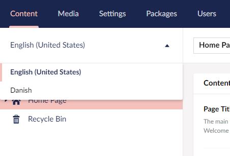
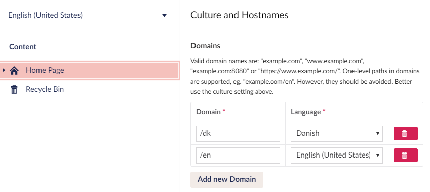

# Adding Language Variants

Now that we have a basic site set up, let's make the site multilingual by making variations of our content in one more language. For this we will make a Danish version of the `Contact Us` page. At this point your page should look like this:

## Adding a new language

So the first thing we should do is go to the **_Settings > Language_** and then click the `Add Language` button at the top. In the dropdown you can select a long list of languages, in this tutorial we will pick Danish.

As you can see there are several options, to add a fallback language, make it mandatory and so on. We will leave it default for now but if you want to ensure all content has a language varied version then make them mandatory.

## Enabling Language Variants on Document Types and Properties

Now head on over to **_Document Types > Simple Content Page > Permissions_** and check the `Allow varying by culture` checkbox, now click save and go to the **_Design_** tab.

We will now edit the settings of our property editors, so click on the little gear icon ⚙ for the **_Page Title_** editor and again check the `Allow varying by culture` checkbox.

For now we will leave the **_Body Text_** property editor unchanged, so click save in the bottom right corner and head on over to **_Content section_**.

You will now find a language dropdown above your content tree - if it's not there, you might need to refresh the page:

In the dropdown, you will find all the languages that you have installed on your site, and you can switch between them, to update the content variations for each language.

Now, before we go ahead and start creating the Danish content variation, we need to add hostnames to each language on the *root node* (in our case, the "Home Page").

Right-click the **Home Page** content node, and choose **Culture and Hostnames...**, and let's add a domain for each hostname, like it's done here:

Click **Save** and we are ready to start working on the Danish content variations.

Go to the **Home Page** node and you will find a language dropdown next to the title at the top:

When you click the dropdown you will get a list of all the languages you have enabled - much like we saw in the content tree. When you mouseover a language an `Open in Splitview` box will appear, click this to open it.

In this splitview we will be able to see the content node with each language side by side. You may notice that the bodytext is greyed out - this is because we haven't checked the `Allow varying by culture` checkbox for that property editor.

You can now click publish at the bottom of the page and it will give you the option to publish one or more languages.

Now if you head on over to your contact page you will see it looks the same. If you then access /kontakt-os or whatever you have called the new Language Varied node, then you will see the headline change to what you put in.

## Next - [Conclusions and Where Next?](Conclusions-Where-Next)
By this point you'll have a basic working site - where next?  You've barely scratched the surface of the power of Umbraco!
