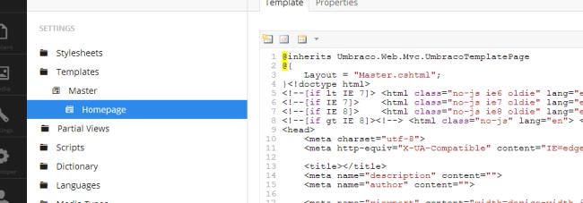
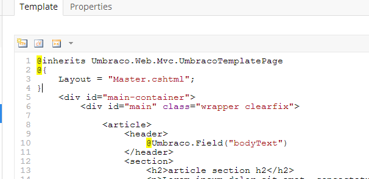
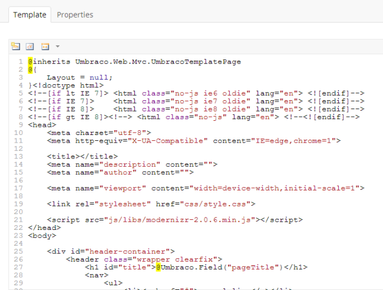
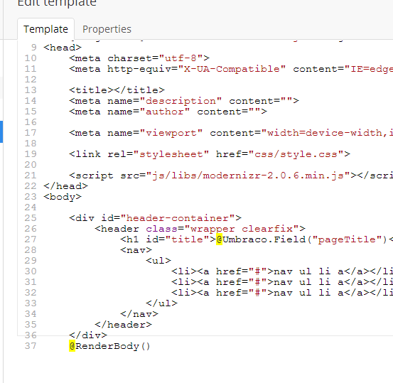
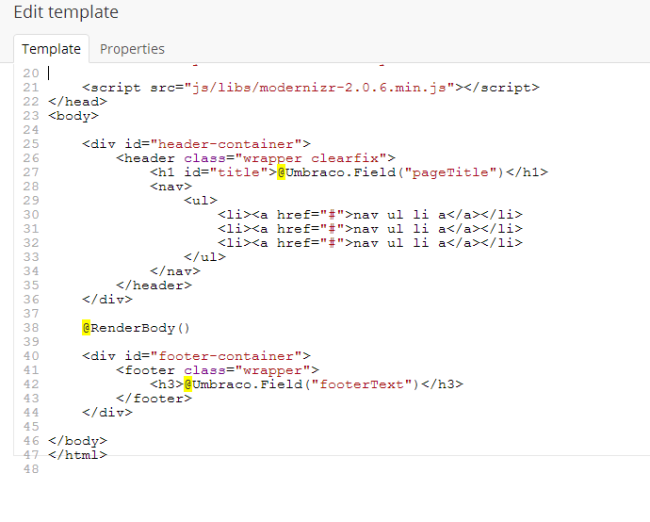

# Creating More Pages

## Using a Maintainable Template Structure

We've seen how to create a **_Document Type_**. If we wanted to create a simple three page site containing; Home, News and Contact Us pages we could easily just create a **_Document Type_** with a corresponding template for each and copy the same HTML code into each template and make the custom changes to each separate template for these pages.  

Though this would work (and on a very simple site it actually has some merits) but once a site starts to grow this would lead to problems - for instance changing anything in the header or footer would need to be done on each template - it also means we'd need the user to enter the same content for the footer on each page for example. 

Umbraco provides us with an elegant solution for a consistent base template - those familiar with MVC will recognise it. 

To start we're going to unpick a little bit of what we did in creating the homepage to sit the homepage template under a master. 


# Create a Master Template 


Go to the **_Settings > Templates_** and open up the tree.  At the moment we just have our **_Homepage_** template.  Hover over the **_Templates_** menu and click the menu **_..._** button. Create a new template called Master, click **_+ Create_** and then give it the name "_Master_" . Remember to click **_Save_**. 


*Figure 22 - Master Template*


Now we're going to move the **_Homepage_** template under the **_Master_** template. To do this select the **_Settings > Homepage node_** and from the **_Properties tab > Master template dropdown_**, select _"Master"_ and then click **_Save_**.  This will update the Razor code section to change `Layout = null;` to `Layout = "Master.cshtml";` 

:::note
Due to a bug in older versions of Umbraco you may need to click off the **_Homepage node_** and back on to see this update. 
:::




*Figure 23 - Homepage Template now sits under the Master*


Now we need to move the parts of our HTML template that are common across all pages into the **_Master_**. This is where as a developer you might need to use your brain as it will be slightly different for different websites - e.g. do all pages contain a `<div id="main">` section so can we put this in the master or does this belong to only certain pages? For this site, we'll assume this is part of the child page. In the template edit screen cut everything from the closing curly brace to line 37 `<div id="main-container">` - we're going to move the header and nav of the site to the master template. Cut this and click **_Save_**. 





*Figure 24 - Homepage Template After Cutting the Header*


Now click on your **_Master_** template and paste this HTML markup after the closing curly brace and remember to click **_Save_**.




*Figure 25 - Master Template after Pasting the Header*


At the end of this markup we need to tell Umbraco to insert the child template's content - this is done by adding the code **_@RenderBody()_** at the end (around line 37). Click **_Save_**. 





*Figure 26 - Adding RenderBody() to the Master Template*


Now we'll do the same with the footer content. Cut everything from the opening of the **_footer-container _** div (approximately line 35) from the **_Settings > Templates > Homepage > template tab_**, click **_Save_** and then paste this into the **_Master_** template under the **_@RenderBody_** field we've just added. Remember to click **_Save_**. 





*Figure 27 - Completed Master Template*


Now we've done a lot of work - and what we should see if we refresh our localhost page is nothing has changed!  If you have a compilation error you've perhaps mistyped **_@RenderBody()_**. If you're missing any content (header or footer) check that what you have in the templates matches the following:

```csharp
@inherits Umbraco.Web.Mvc.UmbracoTemplatePage
@{
    Layout = null;
}<!doctype html>
<!--[if lt IE 7]> <html class="no-js ie6 oldie" lang="en"> <![endif]-->
<!--[if IE 7]>    <html class="no-js ie7 oldie" lang="en"> <![endif]-->
<!--[if IE 8]>    <html class="no-js ie8 oldie" lang="en"> <![endif]-->
<!--[if gt IE 8]><!--> <html class="no-js" lang="en"> <!--<![endif]-->
<head>
    <meta charset="utf-8">
    <meta http-equiv="X-UA-Compatible" content="IE=edge,chrome=1">

    <title></title>
    <meta name="description" content="">
    <meta name="author" content="">

    <meta name="viewport" content="width=device-width,initial-scale=1">

    <link rel="stylesheet" href="css/style.css">

    <script src="js/libs/modernizr-2.0.6.min.js"></script>
</head>
<body>

    <div id="header-container">
        <header class="wrapper clearfix">
            <h1 id="title">@Umbraco.Field("pageTitle")</h1>
            <nav>
                <ul>
                    <li><a href="#">nav ul li a</a></li>
                    <li><a href="#">nav ul li a</a></li>
                    <li><a href="#">nav ul li a</a></li>
                </ul>
            </nav>
        </header>
    </div>

    @RenderBody()

    <div id="footer-container">
        <footer class="wrapper">
            <h3>@Umbraco.Field("footerText")</h3>
        </footer>
    </div>

</body>
</html>
```

*Figure 28 - Complete Master Template*

```csharp
@inherits Umbraco.Web.Mvc.UmbracoTemplatePage
@{
    Layout = "Master.cshtml";
}
<div id="main-container">
    <div id="main" class="wrapper clearfix">

        <article>
            <header>
                @Umbraco.Field("bodyText")
            </header>
            <section>
                <h2>article section h2</h2>
                <p>Lorem ipsum dolor sit amet, consectetur adipiscing elit. Aliquam sodales urna non odio egestas tempor. Nunc vel vehicula ante. Etiam bibendum iaculis libero, eget molestie nisl pharetra in. In semper consequat est, eu porta velit mollis nec. Curabitur posuere enim eget turpis feugiat tempor. Etiam ullamcorper lorem dapibus velit suscipit ultrices. Proin in est sed erat facilisis pharetra.</p>
            </section>
            <section>
                <h2>article section h2</h2>
                <p>Lorem ipsum dolor sit amet, consectetur adipiscing elit. Aliquam sodales urna non odio egestas tempor. Nunc vel vehicula ante. Etiam bibendum iaculis libero, eget molestie nisl pharetra in. In semper consequat est, eu porta velit mollis nec. Curabitur posuere enim eget turpis feugiat tempor. Etiam ullamcorper lorem dapibus velit suscipit ultrices. Proin in est sed erat facilisis pharetra.</p>
            </section>
            <footer>
                <h3>article footer h3</h3>
                <p>Lorem ipsum dolor sit amet, consectetur adipiscing elit. Aliquam sodales urna non odio egestas tempor. Nunc vel vehicula ante. Etiam bibendum iaculis libero, eget molestie nisl pharetra in. In semper consequat est, eu porta velit mollis nec. Curabitur posuere enim eget turpis feugiat tempor.</p>
            </footer>
        </article>

        <aside>
            <h3>aside</h3>
            <p>Lorem ipsum dolor sit amet, consectetur adipiscing elit. Aliquam sodales urna non odio egestas tempor. Nunc vel vehicula ante. Etiam bibendum iaculis libero, eget molestie nisl pharetra in. In semper consequat est, eu porta velit mollis nec. Curabitur posuere enim eget turpis feugiat tempor. Etiam ullamcorper lorem dapibus velit suscipit ultrices.</p>
        </aside>

    </div> <!-- #main -->
</div> <!-- #main-container -->
```

*Figure 29 - Complete Homepage Template*


>If you're new to these concepts then I don't think what we've just done is going to make much sense until we make our next page. 


---
## Next - [Creating Master Template Part 2](Creating-Master-Template-Part-2.md)
Part 2 - using the Master template to create new page types. 
