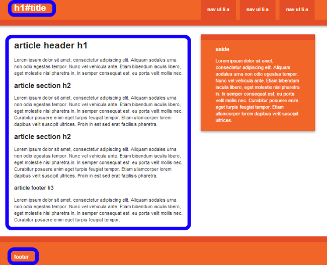
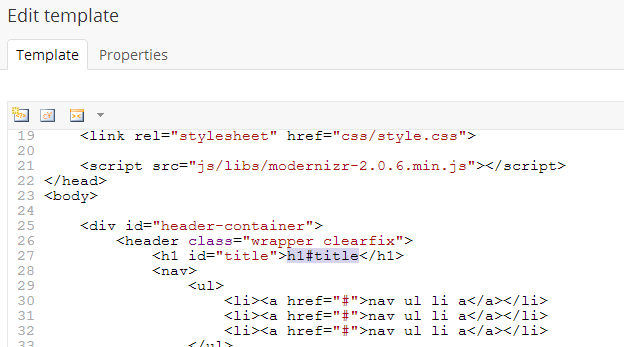
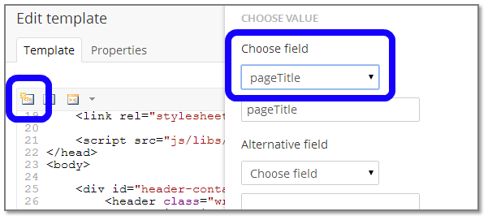
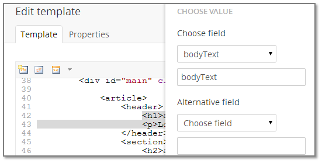
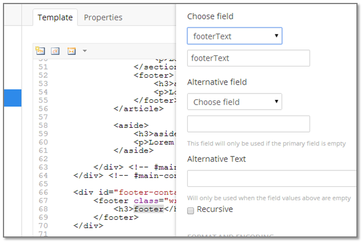

# Outputting the Document Type Properties

What you’ll notice is that the content we've added to the homepage isn’t being output. We need to wire up the data type properties (the data fields we've created in Umbraco that the editors can edit) to the template.  Let’s look at our template and identify where the content from the data properties we created before should go.  

*Figure 17 - Where our Data Property Content Should be Output*

We’ve marked in blue where we want our data property content to be output. Now we need to wire up the relevant properties. 

Go to the **_Settings > Templates > Homepage_**. Scroll down and highlight the text `“h1#title”` around line 27. 

*Figure 18 - Preparing to replace the hardcoded text with an Umbraco Data Property*

Click the button **_Insert Umbraco Page Field_** and under the **_Choose field_** dropdown select **_pageTitle_** from the **_Custom Fields_** section. 

*Figure 19 - Umbraco Page Field / Property*

Click the green **_Insert_** button then the **_Save_** button.  

Next do the same for the content between the `<header></header>` tags (around lines 42 -43) using field **_bodyText_**.  Again click the **_Insert_** and then **_Save_** buttons. 

*Figure 20 - Replacing the bodyText with the Umbraco Page Field*

Finally we do the footer – between the `<h3></h3>` tags in the footer div (line 68). 

*Figure 21 - Footer Text*

Now go and reload your homepage... voilà! We have content! Now, we could go back and add two tabs called Article 1, Article 2, Article Footer each containing a title and content field and wire these to the relevant places in the template. If there is only going to be two sections on the homepage this would work or we could use child nodes instead to provide flexibility – we’ll learn about those later. 

---
## Next - [Creating Master Template Part 1](../Creating-Master-Template-Part-1)
How to create a Master Template and use this to create more pages whilst minimising duplicate HTML code from your flat source files.

