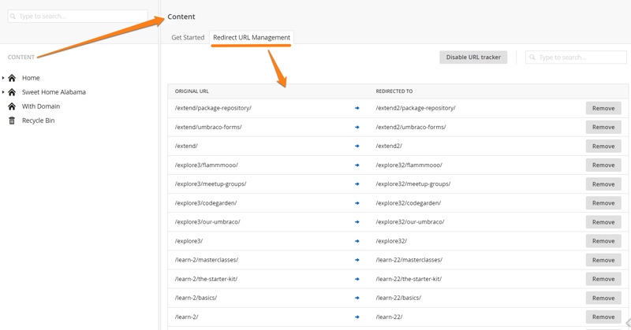
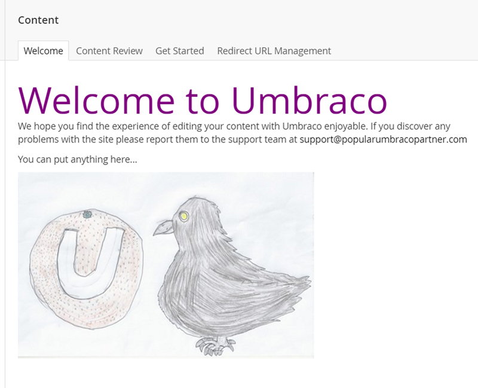
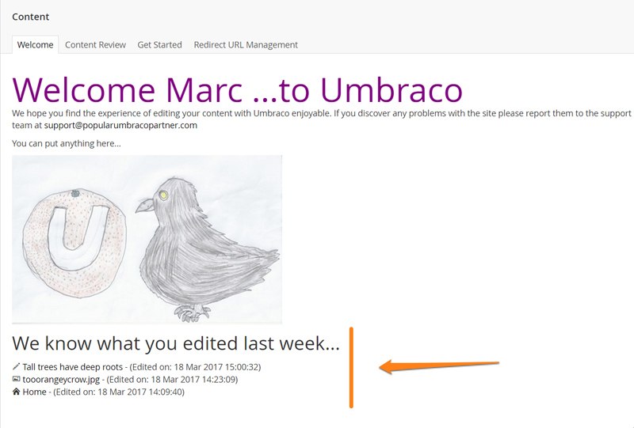
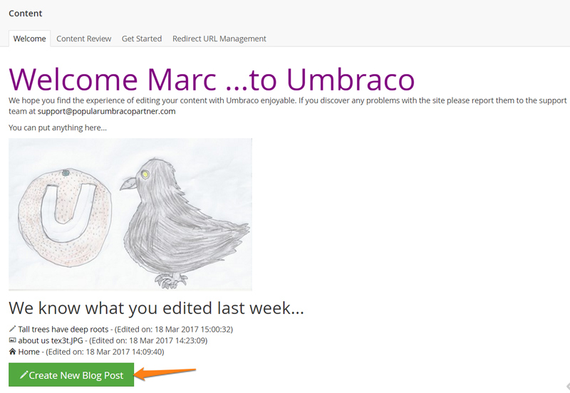
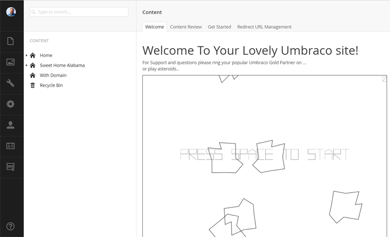

# Tutorial - Creating a Custom Dashboard

## Overview

This guide takes you through the steps to setup a simple Custom Dashboard in Umbraco. 

### What is a Dashboard?

A Dashboard is a tab on the right-hand side of a section eg. the Redirect Url Management dashboard in the Content section:



### Why provide a Custom Dashboard for your editors?

It is generally considered good practice when you build an Umbraco site to provide a custom dashboard to welcome your editors and provide information about the site and/or provide a helpful gateway to common functionality the editors will use.
This guide will show the basics of creating a custom 'Welcome Message' dashboard and then show how you can go a little further to provide interaction using AngularJS...

So all the steps we will go through:

- Setting up the dashboard plugin
- Writing a basic Welcome Message view
- Configure the Custom Welcome Dashboard to be displayed
- Adding styles
- Adding an AngularJS controller
- Display the current user's name in our welcome message
- Display the current user's recent updates
- Create a shortcut button to add a new blog post
- You can do anything...

### Prerequisites
This tutorial uses AngularJS with Umbraco, so it does not cover AngularJS itself, there are tons of resources on that already here:

- [egghead.io](https://egghead.io/courses/angularjs-fundamentals)
- [angularjs.org/tutorial](https://docs.angularjs.org/tutorial)
- [Pluralsight](https://www.pluralsight.com/paths/angular-js)

There are a lot of parallels with Creating a Property Editor, the tutorial '[Creating a Property Editor Tutorial](../../Tutorials/creating-a-property-editor/index.md)' is very much worth a read through too.

### The end result

At the end of this guide, we should have a friendly welcoming dashboard displaying a list of the editor's recent site updates.

## Setting up a plugin

The first thing we must do is create a new folder inside our site's '/App_Plugins' folder. We will call it
'CustomWelcomeDashboard'

## Creating the dashboard view

Next we will create a HTML file inside this folder called 'WelcomeDashboard.html' the html file will contain a fragment of a html document and so does not need &lt;html&gt;&lt;head&gt;&lt;body&gt; entities.

Add the following html to the WelcomeDashboard.html

```html
<div class="welcome-dashboard">
    <h1>Welcome to Umbraco</h1>
    <p>We hope you find the experience of editing your content with Umbraco enjoyable and delightful. If you discover any problems with the site please report them to the support team at <a href="mailto:">support@popularumbracopartner.com</a></p>
    <p>You can put anything here...</p>
</div>
```

## Configuring the dashboard to appear

Open up your dashboard.config file from the /config folder of your site. [Explanation of the Dashboard Config settings are here...](../../Reference/Config/dashboard/index.md)

Add the following section:

```xml
<section alias="Custom Welcome Dashboard">
    <access>
        <deny>translator</deny>
    </access>
    <areas>
        <area>content</area>
    </areas>
    <tab caption="Welcome">
        <control>
            /app_plugins/CustomWelcomeDashboard/WelcomeDashboard.html
        </control>
    </tab>
</section>
```

So the terminology here gets a bit muddled but we're creating a 'Section' (but this is not the same 'Section' as the 'Content Section' - which inside this config file is referred to as an 'Area'), this is specifically a 'Dashboard Section' that you can use to group your dashboard tabs and controls together.

The above configuration is effectively saying:

> "Add a tab called 'Welcome' to the 'Content' area/section of the Umbraco site, use the WelcomeDashboard.html as the content (view) of the dashboard and don't allow 'translators' to see it!"

:::note
The order in which the tab will appear in the Umbraco Backoffice depends on its position in the dashboard.config file, so to make our Custom Welcome message the first Tab the editors see in the content section, make sure the above configuration is the 'first' section configuration in the dashboard.config file.
:::

:::note
You can specify multiple controls to appear on a particular tab, and multiple tabs in a particular section.
:::

:::note
You can remove existing dashboards, and control who gets to see them by updating the other configuration sections in the Dashboard.config file.
:::

### The Result


## Adding a bit of style

Congratulations! job done - no actually no, this is just the starting point. The dashboard can be styled as you want it to be with CSS, but there are a couple of further steps to undertake be able to apply a custom stylesheet to the dashboard:

We need to add something called a package.manifest file to our CustomWelcomeDashboard folder

:::note
This file allows Umbraco to load other resources to use with your HTML view - it is just a file - named by convention 'package.manifest' and will contain the configuration of the resources to load in JSON format.
:::

When Umbraco loads the dashboard it will look for this file in the same folder as your HTML view (remember the dashboard config points to the html view) and use the manifest to load the additional resources, eg CSS and JavaScript files.

This manifest file is simpler to the one you would create for a [custom property editor](../../Extending/Property-Editors/package-manifest.md)

Inside this package manifest we add a bit of JSON to describe the dashboard's required JavaScript and stylesheet resources:

```json
{
    "javascript":[
        /*javascript files listed here*/
    ],
    "css": [
        /*list of stylesheets appear here:*/
        "~/app_plugins/CustomWelcomeDashboard/customwelcomedashboard.css"
    ]
}
```

Now create a stylesheet in our CustomWelcomeDashboard folder called 'customwelcomedashboard.css', and add some styles, I don't know perhaps a bit of purple:

```css
.welcome-dashboard h1 {
    font-size:4em;
    color:purple;
}
```

This stylesheet will now be loaded and applied to your dashboard. Add images and html markup as required:



:::note
One caveat is the package.manifest file is loaded into memory when Umbraco starts up, so if you are adding a new stylesheet or JavaScript file you will need to start and stop your application for it to be loaded.
:::

If the title doesn't change colour, you may be running the site without debugging and therefore [ClientDependency Framework](https://github.com/Shazwazza/ClientDependency) (CDF) will be caching the CSS and JavaScript. To clear the CDF cache and get it to load in the new JavaScript and CSS, you need to increment the the version number in the [ClientDependency.config file](https://github.com/Shazwazza/ClientDependency/wiki/Configuration#complete-config) and press save. Now you can reload the page and see the colourful title.

Hopefully, now you can see the potential of what you could provide to an editor as a basic welcome dashboard when they log in to Umbraco.

## Adding functionality

We can add functionality to the dashboard by associating an AngularJS controller with the HTML view.

Let's add a new file to the CustomWelcomeDashboard folder called 'customwelcomedashboard.controller.js' where our controller code will live.

We register this AngularJS controller to the Umbraco Angular module: 

```js
angular.module("umbraco").controller("CustomWelcomeDashboardController", function ($scope) {
    var vm = this;
    alert('hello world');
});
```

In our html view, we update the outer div to wire up the controller to the view:

```html
<div class="welcome-dashboard" ng-controller="CustomWelcomeDashboardController as vm">
```

:::note
The use of vm (short for view model) to enable communication between the view and the controller.
:::

Finally, we need to update the package.manifest file to load the additional controller JavaScript file when the dashboard is displayed:

```json
{
    "javascript":[
        /*any comma delimited list of JavaScript files appear here*/
        "~/app_plugins/CustomWelcomeDashboard/customwelcomedashboard.controller.js"
    ],
    "css": [
        /*a comma delimited list of stylesheets appear here:*/
        "~/app_plugins/CustomWelcomeDashboard/customwelcomedashboard.css"
    ]
}
```

If all is setup fine we should now receive the 'Hello world' alert every time the dashboard is reloaded in the content section of Umbraco, not very helpful, yet.

### Going further - Umbraco Angular Services and Directives

Umbraco has a fine selection of angular directives, resources and services that you can use in your custom property editors and dashboards, the details are here: https://our.umbraco.com/apidocs/ui/#/api

For this example it would be nice to welcome the editor by name (Umbraco is a place where everybody knows your name...), to achieve this we can use the **userService** here to customise our dashboard welcome message and increase friendliness:

We inject the **userService** into our AngularJS controller like so:

```js
angular.module("umbraco").controller("CustomWelcomeDashboardController", function ($scope,userService) {
```

and then we can use the userService's promise based **getCurrentUser()** method to get the details of the current logged in user:

```js
var user = userService.getCurrentUser().then(function (user) {
    console.log(user);
    vm.UserName = user.name;
});
```

*__Tip:__ Notice you can use console.log to write out to the browser console window what is being returned by the promise, it helps to debug, but also understand what properties are available to use.*

Finally we can now update our view to incorporate the current user's name in our Welcome Message:

```html
<h1>Welcome {{vm.UserName}} ...to Umbraco</h1>
```


and for reference the full contents of /customwelcomedashboard.controller.js at this stage of the tutorial should look like this:

```js
angular.module("umbraco").controller("CustomWelcomeDashboardController", function ($scope,userService) {
    var vm = this;
    vm.UserName = 'guest';

    var user = userService.getCurrentUser().then(function (user) {
        console.log(user);
        vm.UserName = user.name;
    });
});
```

## I know what you did last Tuesday...

A returning editor may find it useful to see a list of the last few articles they have been editing, with a handy link to load and continue editing (instead of having to remember, and find the item again in the Umbraco Content Tree).

We can make use of Umbraco's Angular resource for retrieving audit log information, the **logResource** using the **getPagedUserLog** method to return a list of activities the current user has performed recently.

We inject the logResource into our controller:

```js
angular.module("umbraco").controller("CustomWelcomeDashboardController", function ($scope, userService, logResource) {
```

Add a property on our ViewModel to store the log information:

```js
vm.UserLogHistory = [];
```

Add to our WelcomeDashboard.html view some markup using angular's *ng-repeat* to display a list of these log entries:

```html
<h2>We know what you edited last week...</h2>
<ul>
    <li ng-repeat="logEntry in vm.UserLogHistory.items">{{logEntry.nodeId}} - {{logEntry.comment}} - {{logEntry.timestamp  | date:'medium'}}</li>
</ul>
```

Back in our controller we'll populate the array of entries using the **logResource**, the getPagedUserLog method expects to receive a JSON object containing information to filter the log by:

```js
var userLogOptions = {
    pageSize: 10,
    pageNumber: 1,
    orderDirection: "Descending",
    sinceDate: new Date(2018, 0, 1)
};
```

These options should retrieve the last ten activities for the current user in descending order since the start of 2018, we pass the options into the **getPagedUserLog** like so:

```js
logResource.getPagedUserLog(userLogOptions)
    .then(function (response) {
        console.log(response)
        vm.UserLogHistory = response;
    });
```

Take a look at the output of console.log of the response in your browser to see the kind of information retrieved  from the log:

```js
{pageNumber: 2, pageSize: 10, totalPages: 6, totalItems: 60, items: Array(10)}
    items: Array(10)
        0:
            $$hashKey: "03L"
            comment: "Save and Publish performed by user"
            logType: "Publish"
            nodeId: 1101
            timestamp: "2018-11-25T13:40:11.137Z"
            userAvatars: (5) ["https://www.gravatar.com/avatar/1da605eb2601035122149d0bc1edb5ea?d=404&s=30", "https://www.gravatar.com/avatar/1da605eb2601035122149d0bc1edb5ea?d=404&s=60", "https://www.gravatar.com/avatar/1da605eb2601035122149d0bc1edb5ea?d=404&s=90", "https://www.gravatar.com/avatar/1da605eb2601035122149d0bc1edb5ea?d=404&s=150", "https://www.gravatar.com/avatar/1da605eb2601035122149d0bc1edb5ea?d=404&s=300"]
            userId: 0
            userName: "marc"
```

It's nearly all we need but missing information about the item that was saved and published!

We can use the **entityResource**, another Umbraco Angular resource to enables us to retrieve more information about an entity given its id.

Inject this into our angular controller:

```js
angular.module("umbraco").controller("CustomWelcomeDashboardController", function ($scope, userService, logResource, entityResource) {
```

We need to loop through the log items from the **logResource**, and since this includes everything, we need to filter out activities we're not interested in eg, Macro Saves, or DocType Saves, generally we need the entry in the log to have a nodeId, have a 'logType' of 'save' and have an entity type of Media or Content. 

The **entityResource** then has a **getById** method that accepts the Id of the item and the entity 'type' to retrieve useful information about the entity, ie its name and icon.

Putting this together:

```js
logResource.getPagedUserLog(userLogoptions)
.then(function (response) {
    console.log(response)
    vm.UserLogHistory = response;
    var filteredLogEntries = [];
    // loop through the response, and filter out save log entries we are not interested in
    angular.forEach(response.items, function (item) {
        // if no entity exists -1 is returned for the nodeId (eg saving a macro would create a log entry without a nodeid)
        if (item.nodeId > 0) {
           if (item.logType == "Save") {
                if (item.entityType == "Media") {
                    // log entry is a media item
                    item.editUrl = "media/media/edit/" + item.nodeId;
                }
                if (item.entityType == "Document") {
                    // log entry is a media item
                    item.editUrl = "content/content/edit/" + item.nodeId;
                }
                // use entityResource to retrieve details of the content/media item
                entityResource.getById(item.nodeId, item.entityType).then(function (ent) {
                    console.log(ent);
                    item.Content = ent;
                });
                filteredLogEntries.push(item);
            }
        }
    });
    vm.UserLogHistory.items = filteredLogEntries;
});
```
 
Finally update our view to use the additional retrieved entity information:

```js
<h2>We know what you edited last week...</h2>
<ul class="unstyled">
    <li ng-repeat="logEntry in vm.UserLogHistory.items"><i class="{{logEntry.Content.icon}}"></i> <a href="/Umbraco/#/{{logEntry.editUrl}}">{{logEntry.Content.name}}</a> - <span class="text-muted">(Edited on: {{logEntry.timestamp  | date:'medium'}})</span></li>
</ul>
```

and we should have a list of recently saved content and media:



:::note
The url /Umbraco/#/content/content/edit/1234 is the path to open up a particular entity (with id 1234) ready for editing.
:::

:::note
The logResource has unfortunately undergone a few breaking changes, (including problems with SQLCE dbs), prior to 7.6.4 the resource will 404 - from 7.6.4 to 7.13 - you can use logResource.getUserLog("save", new Date()).then(function (response) - after 7.13 you can use getPagedUserLog detailed above, which should work on SQLCE too
:::

## I know what you want to do today

One of the key user journeys an editor will make in the backoffice is to create a new thing of some sort, and if it is a person's job to create new blog entries in the same section two or three times a day, why not create them some handy shortcuts to achieve these common tasks:

We can use the knowledge that by convention a link to 'edit a page' (as used above) when passed the additional querystring parameters doctype=alias and create=true, can be made to present the user with a brand new content item of the alias type to create within the section.

Add the following to our view:

```html
<div>
    <a class="btn btn-primary btn-large" href="/umbraco/#/content/content/edit/1075?doctype=BlogPost&create=true">
        <i class="icon-edit"></i>
        Create New Blog Post
    </a>
</div>
```

Where 1075, is the id of our blog section, and BlogPost is the alias of the type of document we want to create.



## Custom External Data - creating your own angular resource

You can create your own custom angular services/resources, to interact with your own serverside data (using UmbracoAuthorizedJsonController), The property editor tutorial has a step explaining how to do this [part 4 - Adding server-side data to a property editor](../../Tutorials/creating-a-property-editor/part-4.md).

## What else? What are you waiting for?

Perhaps the Dashboard is a gateway to a third party system or a tool to search specific content, or tools to help clean up existing content. extend extend extend

Asteroids... ?


