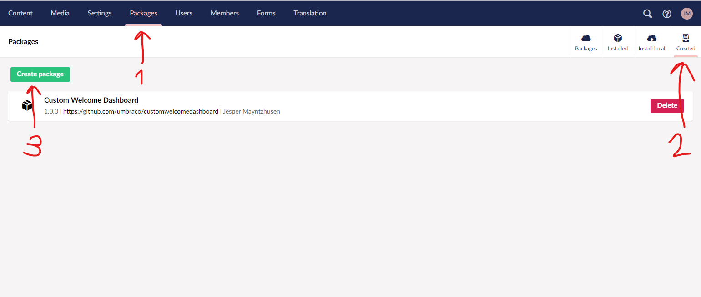
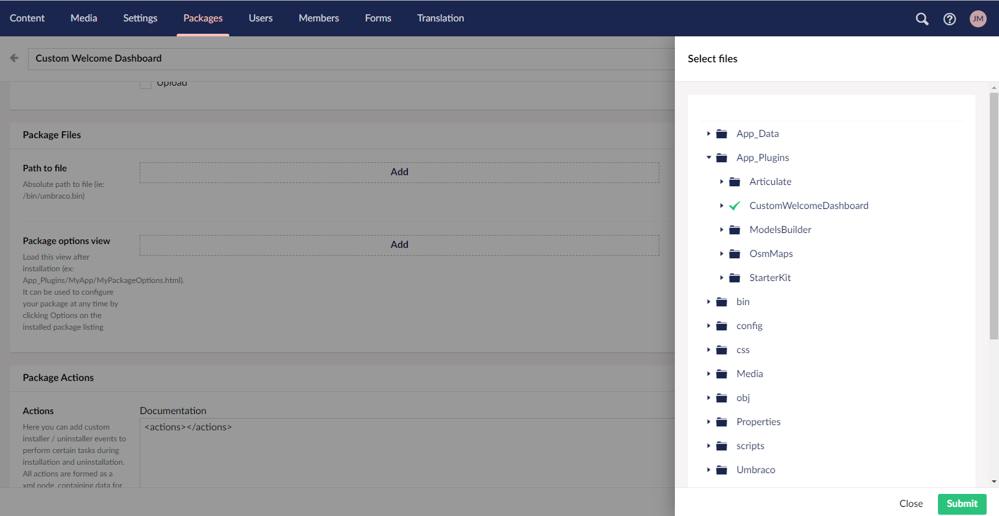
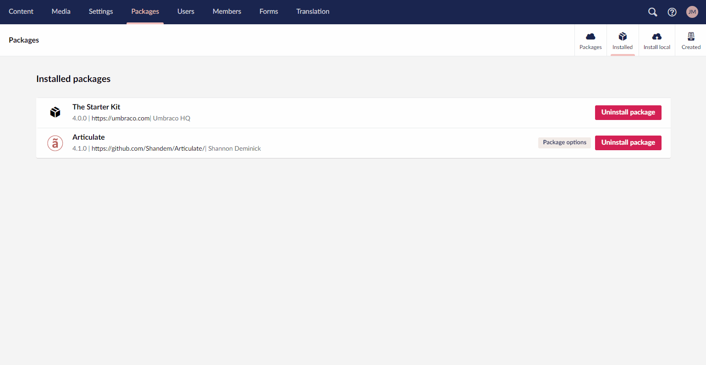

# Creating a Package

:::note
This tutorial is for Umbraco 8 - however a lot of the things covered here will be the same or similar in Umbraco 7.
:::

The goal of this tutorial will be to take something that extends Umbraco and create it as a package. Finally we will publish that package on the [Our Umbraco package repository](https://our.umbraco.com/packages). The tutorials starting point will be creating a package out of the dashboard from the [Creating a Custom Dashboard tutorial](../Creating-a-Custom-Dashboard/index.md), however, the process will be the same for most packages so feel free to follow along with something else!

## Creating a package in the backoffice

If you have something you want to make into a package, you can do so through the backoffice of Umbraco. First go to the `Packages` section and then click `Created` in the top right corner. Next you can click the `Create package` button.



On the `Create package` page there are 4 sections with different info to fill out. Some of the info is mandatory, most of it is not. First of all you should give the package a name at the top - we will call our dashboard the same as in the [tutorial](../Creating-a-Custom-Dashboard/index.md): `Custom Welcome Dashboard`.

### The Package Properties section

This section contains mostly meta data about the package and the creator. We will fill in the following things:

| Property | Value | Note |
| -------- | ----- | ---- |
| Url | https://umbraco.com | This url will be shown as the "packages url" when others install it. Will mostly be a Github repo or similar |
| Version | 1.0.0 | This is automatically set to 1.0.0 but can be changed or increased manually if needed |
| Icon Url | _Blank_ | Not a mandatory value, but will appear as the package icon different places in the backoffice if set |
| Umbraco version | 8.2.0 | It will automatically select the version your Umbraco is currently on. This is then set as the compatible version for the package |
| Author | Your name | Here you get to take credit for your awesome work! |
| Author URL | Your website or maybe Twitter tag | Will link to this from the author name certain places in the backoffice |
| Contributors | _Blank_ | Here you can add the names of other contributors if you want |
| License | MIT License | Will be set to MIT by default. If you are planning on selling your package you can change the license here |
| License URL | http://opensource.org/licenses/MIT | Will be set to the URL for the MIT license |
| Package readme | This will add a dashboard to your content section. <br> <br>The dashboard will show each user the most recent nodes they have saved. | This will be shown when someone looks at the package in the package dashboard |

### The Package Content section

This section is used to determine which things the package should contain. We will fill in the following things:

| Property | Value | Note |
| -------- | ----- | ---- |
| Content | _Empty_ | Here you can include content - fx if you want to create a starter kit. Not relevant for this package though |
| Document Types | _Empty_ | Similar to the Content picker above. Important to note that if you include content you will need to also pick all its dependencies in this and the next steps for it to be packaged together! |
| Templates | _Empty_ | See `Document Types` above |
| Stylesheets | _Empty_ | This will come from the ~/css folder. If you have stylesheets you want to include from other locations you can do so at a later step |
| Macros | _Empty_ | See `Document Types` above |
| Languages | _Empty_ | See `Document Types` above - we will assume the user hasn't deleted the default language (en-US) |
| Dictionary | _Empty_ | See `Document Types` above |
| Data Types | _Empty_ | See `Document Types` above |

### The Package Files section

In this section you will be able to select all of your own custom files. Under the `Path to file` option. since everything in our Dashboard is from the same folder in App_Plugins, we can select the folder and it will include all items inside that folder:



We will leave the `Package options view` selector empty, but in case you were wondering you can select an html file here that will show up as package options. Here is an example from the package [Articulate](https://github.com/Shazwazza/Articulate/tree/master/src/Articulate.Web/App_Plugins/Articulate/BackOffice/PackageOptions):



### The Package Actions section

Here you can add package actions. You can read more about the default package actions [here](../../Reference/Packaging/index.md). You can also create your own package action and reference it here, to do so you will need to implement the IPackageAction interface, you can see an example [here](https://github.com/Shazwazza/Articulate/blob/master/src/Articulate/Packaging/ArticulateInstallPackageAction.cs).

Finally after filling out all the info we can either `Save` or `Download` the package. We will download it, in order to take a closer look at what it contains in the zip.

## Inspecting a package zip

When you download and then open the zip package you will find that it looks like this:


The 5 highlighted files were the ones the package contained that we created in the [Creating a Custom Dashboard tutorial](../Creating-a-Custom-Dashboard/index.md), however there is another file here called `package.xml` - so let's take a look at that - it looks like this:

```xml
<?xml version="1.0" encoding="utf-8"?>
<umbPackage>
  <files>
    <file>
      <guid>customwelcomedashboard.controller.js</guid>
      <orgPath>~/App_Plugins/CustomWelcomeDashboard</orgPath>
      <orgName>customwelcomedashboard.controller.js</orgName>
    </file>
    <file>
      <guid>customwelcomedashboard.css</guid>
      <orgPath>~/App_Plugins/CustomWelcomeDashboard</orgPath>
      <orgName>customwelcomedashboard.css</orgName>
    </file>
    <file>
      <guid>package.manifest</guid>
      <orgPath>~/App_Plugins/CustomWelcomeDashboard</orgPath>
      <orgName>package.manifest</orgName>
    </file>
    <file>
      <guid>WelcomeDashboard.html</guid>
      <orgPath>~/App_Plugins/CustomWelcomeDashboard</orgPath>
      <orgName>WelcomeDashboard.html</orgName>
    </file>
    <file>
      <guid>en-US.xml</guid>
      <orgPath>~/App_Plugins/CustomWelcomeDashboard/lang</orgPath>
      <orgName>en-US.xml</orgName>
    </file>
  </files>
  <info>
    <package>
      <name>Custom Welcome Dashboard</name>
      <version>1.0.0</version>
      <iconUrl></iconUrl>
      <license url="http://opensource.org/licenses/MIT">MIT License</license>
      <url>https://github.com/umbraco/customwelcomedashboard</url>
      <requirements type="Strict">
        <major>8</major>
        <minor>2</minor>
        <patch>0</patch>
      </requirements>
    </package>
    <author>
      <name>Jesper Mayntzhusen</name>
      <website>https://jesper.com</website>
    </author>
    <contributors></contributors>
    <readme><![CDATA[This will add a dashboard to your content section. 

The dashboard will show each user the most recent nodes they have saved.]]></readme>
  </info>
  <DocumentTypes />
  <Templates />
  <Stylesheets />
  <Macros />
  <DictionaryItems />
  <Languages />
  <DataTypes />
  <Actions />
</umbPackage>
```

You will notice that each of the fields we just created is inside this XML file. And all files have an `orgPath` attached to it that it will try to move the file to when installing it - so don't worry if you organized your package in folders and they are not so in the zip.

## Uploading the package to Our Umbraco

//todo
