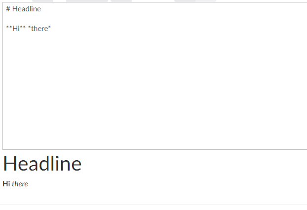

# Creating a property editor

## Overview

This guide explains how to set up a property editor, how to hook it into Umbraco's data types, how to hook it into Angular's modules and its injector, and finally how you can test your property editor.

So all the steps we will go through in part 1 are:

- [Setting up a plugin](#setting-up-a-plugin)
- [Write some basic "Hello World" HTML + JavaScript](#writing-some-basic-html-and-javascript)
- [Register the data type in Umbraco](#register-the-data-type-in-umbraco)
- [Add external dependencies](#add-external-dependencies)

## Prerequisites

This is about how to use AngularJS with Umbraco, so it does not cover AngularJS itself, as there are tons of resources on that already here:

- [Egghead.io](https://egghead.io/courses/angularjs-fundamentals)
- [Angularjs.org/tutorial](https://docs.angularjs.org/tutorial)
- [Pluralsight](https://www.pluralsight.com/paths/angular-js)

## The end result

By the end of this guide, we will have a markdown editor running inside of Umbraco
registered as a data type in the backoffice, assigned to a document type, and the editor can
create and modify data.

## Setting up a plugin

The first thing we must do is create a new folder inside `/App_Plugins` folder. We will call it
`MarkDownEditor`

Next, we will create a manifest file to describe what this plugin does. This manifest will tell Umbraco about our new property editor and allows us to inject any needed files into the application, so we create the file `/App_Plugins/MarkDownEditor/package.manifest`
[For full package.manifest JSON documentation see here](../../Extending/Property-Editors/package-manifest.md)

Inside this package manifest, we add a bit of JSON to describe the property editor. Have a look at the inline comments in the JSON below for details on each bit:

```javascript
{
    // you can define multiple editors
    propertyEditors: [
        {
            /*this must be a unique alias*/
            alias: "My.MarkdownEditor",
            /*the name*/
            name: "My markdown editor",
            /*the icon*/
            icon: "icon-code",
            /*grouping for "Select editor" dialog*/
            group: "Rich Content",
            /*the HTML file we will load for the editor*/
            editor: {
                view: "~/App_Plugins/MarkDownEditor/markdowneditor.html"
            }
        }
    ]
    ,
    // array of files we want to inject into the application on app_start
    javascript: [
        '~/App_Plugins/MarkDownEditor/markdowneditor.controller.js'
    ]
}
```

## Writing some basic HTML and JavaScript
Then we add 2 files to the /app_plugins/markdowneditor/ folder:
- `markdowneditor.html`
- `markdowneditor.controller.js`

These will be our main files for the editor, with the .html file handling the view and the .js
part handling the functionality.

In the .js file, I will add a basic AngularJS controller declaration

```javascript
angular.module("umbraco")
    .controller("My.MarkdownEditorController",
    function () {
        alert("The controller has landed");
    });
```

And in the .html file I'll add:

```html
<div ng-controller="My.MarkdownEditorController">
    <textarea ng-model="model.value"></textarea>
</div>
```

Now our basic parts of the editor are done, namely:

- The package manifest, telling Umbraco what to load
- The HTML view for the editor
- The controller for wiring up the editor with angular.

## Register the data type in Umbraco
After the above edits are done, restart your application. Go to the Developer section, click the 3 dots next to the data types folder and create a new data type called "markdown". In the editor, you can now select a property editor, where your newly added "My markdown editor" will appear.

Save the data type, and add it to a document type of your choice. Open a document of that type, and you will be greeted with an alert message saying "The controller has landed", which means all is well. You can now edit the assigned property's value with your editor.


## Add external dependencies
Let's go a bit further, and load in a markdown editor JavaScript library, I've chosen [pagedown][PagedownBootstrap], but you can use whatever you want.

First of, I'll add some external files to our package folder, in /app_plugins/markdowneditor/lib folder. These files come from the pagedown editor project found here:

[Pagedown-bootstrap on github.com][PagedownBootstrap]

[PagedownBootstrap]: https://github.com/samwillis/pagedown-bootstrap

Then open the `markdowneditor.controller.js` file and edit it so it looks like this:

```javascript
angular.module("umbraco")
.controller("My.MarkdownEditorController",
// inject umbracos assetsService
function ($scope,assetsService) {

    // tell the assetsService to load the markdown.editor libs from the markdown editors
    // plugin folder
    assetsService
        .load([
            "~/App_Plugins/MarkDownEditor/lib/markdown.converter.js",
            "~/App_Plugins/MarkDownEditor/lib/markdown.sanitizer.js",
            "~/App_Plugins/MarkDownEditor/lib/markdown.editor.js"
        ])
        .then(function () {
            // this function will execute when all dependencies have loaded
            alert("editor dependencies loaded");
        });

    // load the separate css for the editor to avoid it blocking our JavaScript loading
    assetsService.loadCss("~/App_Plugins/MarkDownEditor/lib/markdown.editor.less");
});
```

This loads in our external dependency, but only when it's needed by the editor.

Now let's replace that `alert()` with some code that can instantiate the pagedown editor:

```javascript
var converter2 = new Markdown.Converter();
var editor2 = new Markdown.Editor(converter2, "-" + $scope.model.alias);
editor2.run();
```

and add that id to the textarea in the HTML. For more info on the HTML structure, see the pagedown demo [here](https://github.com/samwillis/pagedown-bootstrap/blob/master/demo/browser/demo.html):

```html
<div ng-controller="My.MarkdownEditorController" class="wmd-panel">
    <div id="wmd-button-bar-{{model.alias}}"></div>

        <textarea ng-model="model.value" class="wmd-input" id="wmd-input-{{model.alias}}">
            your content
        </textarea>

    <div id="wmd-preview-{{model.alias}}" class="wmd-panel wmd-preview"></div>
</div>
```

Now, clear the cache, reload the document, and see the pagedown editor running:



When you save or publish, the value of the editor is automatically synced to the current content object and sent to the server, all through the power of angular and the `ng-model` attribute.

[Next - Adding configuration to a property editor](part-2.md)
