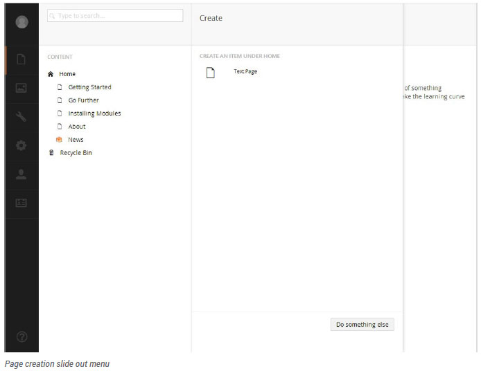
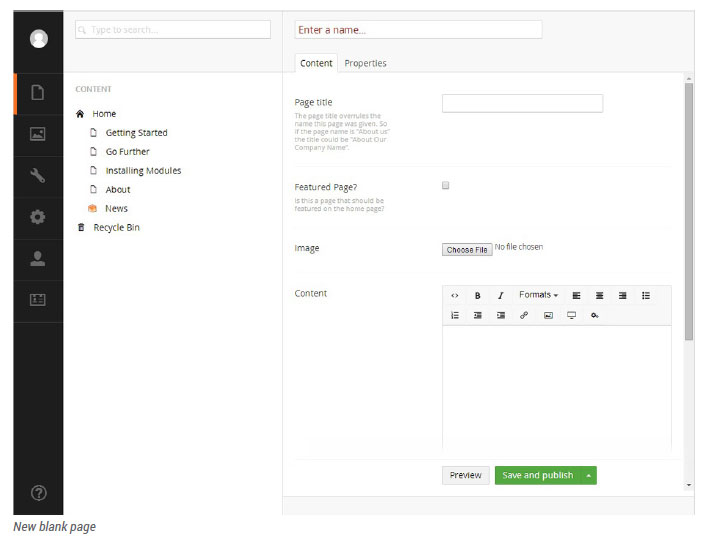

# Creating, Saving and Publishing Content

## Creating a New Page

Firstly you will need to select the parent page for your new page. This could be the home page or any of the sub-pages of the site. If the parent page allows sub-pages underneath it, the following process can be followed:

1. Hover over the name of the parent page and then click on the options icon (•••) to reveal the types of pages you can create.
2. Click on the type of page you wish to create which will then load the new page into the content area on the right-hand side.
3. Enter a name for the page in the text field at the top of the content area. See sections 2.3.2 and 2.5 for more information on saving and editing the new page.

## Various Saving and Publishing Options

There are four different options you have for saving and publishing pages. Each have their own benefits for different occasions depending on whether you’re still in the process of editing the page or have completed and wish to publish your changes.

### Save

The ***Save*** option (found by clicking the arrow on the ***Save and publish*** button) is used for saving the page without publishing the changes to the live site. This is especially useful if you are working on changes over a period of time as you can save frequently to prevent losing any data or if you wish to save the current state and return to edit the page at a later date. Using the ***Preview*** button will show you how the page will look once published.

### Save and Publish

The ***Save and publish*** button is ideal for when you want to publish a previously saved page to the live website, or to publish a page without previewing it. This will save and publish the page to your live website.

### Publish

Clicking the actions menu in the top right of the page or right clicking on the name of the page you wish to publish from the context menu will reveal the slide out menu. On this menu you will see an option to ***Publish***. You can now choose to ***Publish*** all sub-pages excluding any with unpublished changes. You can also select to include all unpublished sub-pages pages too. This is especially useful if you have many pages you wish to publish at the same time. 

### Scheduled Publishing

Scheduled publishing is ideal when you need a page to go live at a specific date and time when it is not convenient to do so manually. To schedule publishing you need to navigate to the ***Properties*** tab and click on the Calendar icon within the Publish at field which will then open up a ***Calendar***. Select the date and then click the ***Clock*** icon at the bottom of the calendar to select the time you wish for the page to be published. After you have done this, click anywhere outside of the date and time picker pop-up to close it. Now all you need to do is save your changes by clicking the arrow on the ***Save and publish*** button and click ***Save***.
Umbraco will automatically publish the page at the date the time you chose.

## Unpublishing

Along with the various options for saving and publishing, you also have the ability to unpublish a page. This is useful if you no longer wish for the page to be publicly visible but do not want to delete it.

### Manually Unpublish

1. Find the page you wish to unpublish and click on the name to select it.
2. Click the arrow on the ***Save and publish*** button which is found within the content area.
3. Select ***Unpublish***.

### Scheduled Unpublishing

Scheduled unpublish is ideal when you require a page to be removed from the website at a specific date and time, but are unable to do so manually, for example at the end of a promotion. To schedule the unpublishing of a page you need to navigate to the ***Properties*** tab for the desired page and click on the ***Calendar*** icon within the ***Unpublish*** at field which will then open up a calendar. Select the date and then click the Clock icon at the bottom of the calendar to select the time you wish for the page to be unpublished. After you have done this, click anywhere outside of the date and time picker pop-up to close it. Now all you need to do is save your changes by clicking the ***Save and publish*** button.