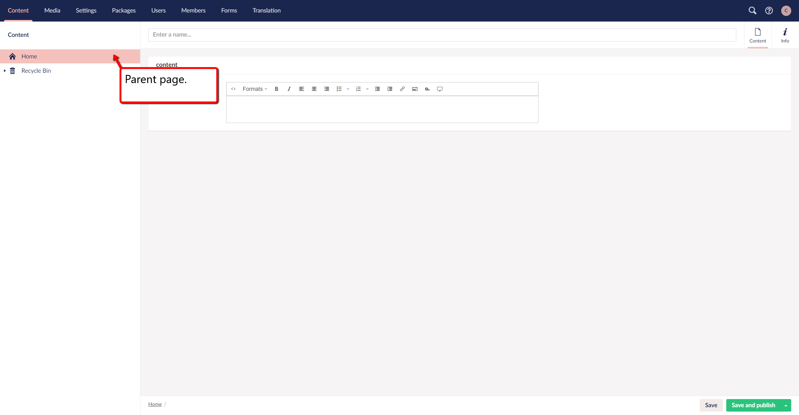
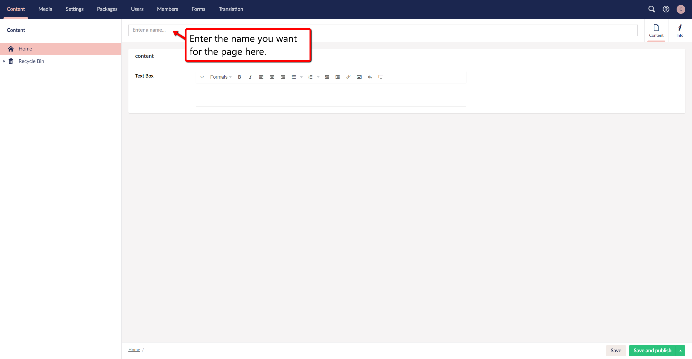
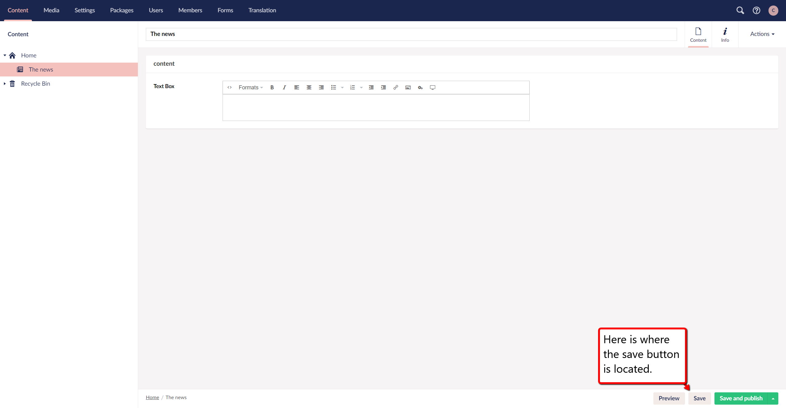
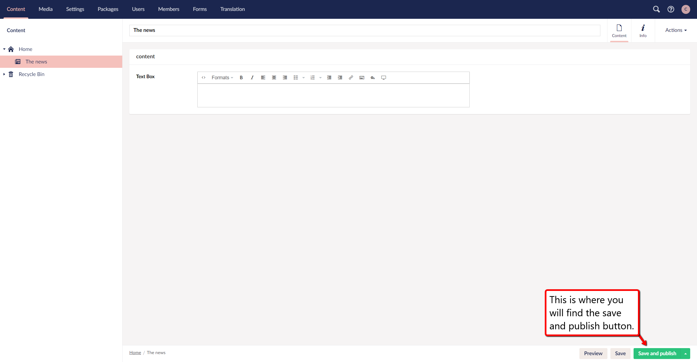
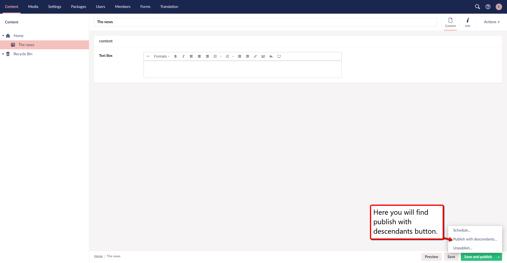
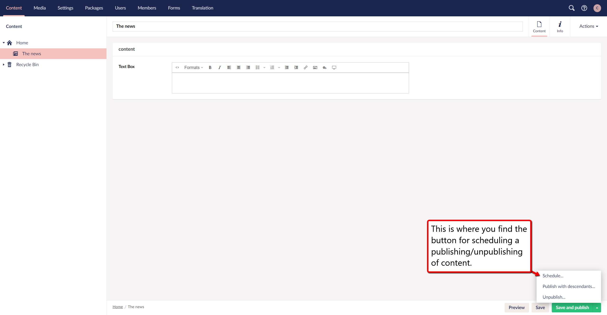
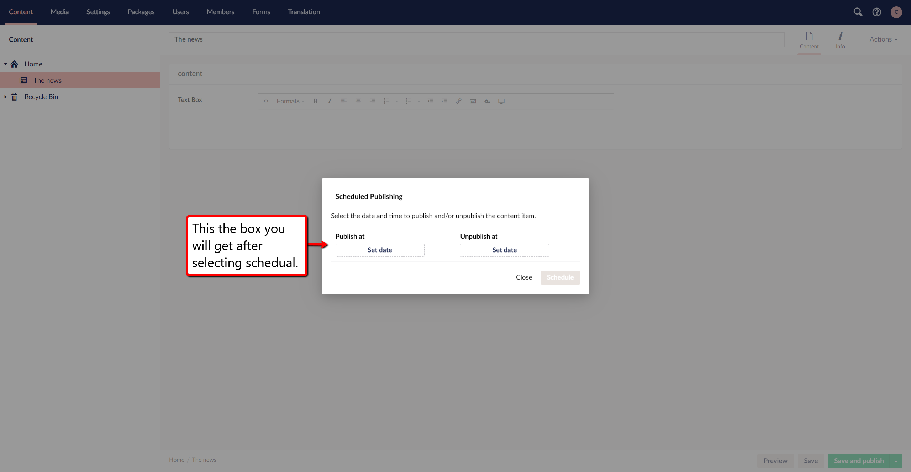
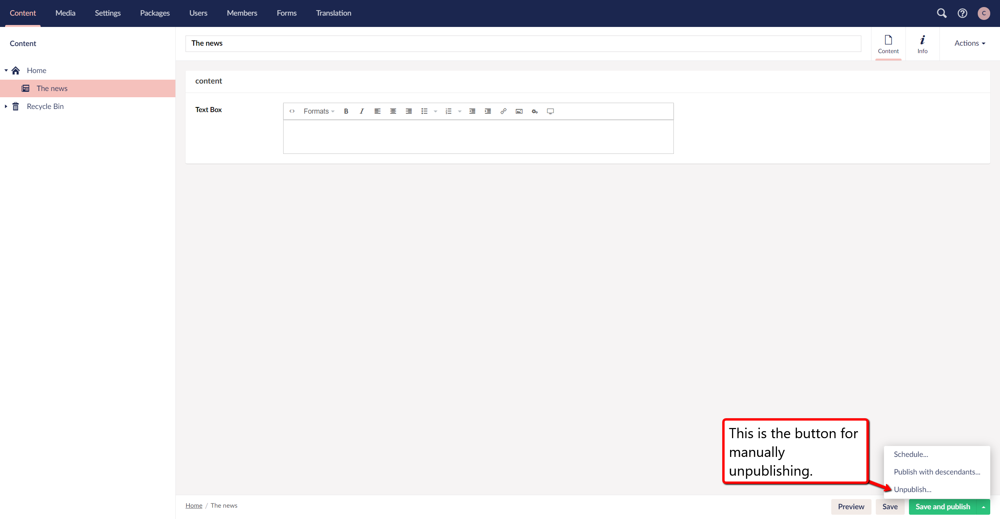

# Creating, Saving and Publishing Content

## Creating a New Page

Firstly you will need to select the parent page for your new page. This could be the home page or any of the sub-pages of the site. If the parent page allows sub-pages underneath it, the following process can be followed:

1. Hover over the name of the parent page and then click on the options icon (•••) to reveal the types of pages you can create.
2. Click on the type of page you wish to create which will then load the new page into the content area on the right-hand side.
3. Enter a name for the page in the text field at the top of the content area. 

## Various Saving and Publishing Options

There are four different options you have for saving and publishing pages. Each have their own benefits for different occasions depending on whether you’re still in the process of editing the page or have completed and wish to publish your changes.

### Save

The ***Save*** option (Located next to the ***Save and publish*** button) is used for saving the page without publishing the changes to the live site. This is especially useful if you are working on changes over a period of time as you can save frequently to prevent losing any data. Saving the content page will also enable you to use the ***Preview*** feature, which will show you how the page will look once published. The Preview feature is accessed next to the Save button.

### Save and Publish

The ***Save and publish*** button is ideal for when you want to publish a previously saved page to the live website, or to publish a page without previewing it. This will save and publish the page to your live website.

### Publish with descendants

Clicking the arrow next to the ***Save and publish*** button will present you with two options(three if you have published before).
Here you can pick ***Publish with descendants***, which will allow you to publish the current page and all content that is linked to this page.
You will get the option to include drafts. This means that you also include all unpublished content items for this page and all linked pages.

### Scheduled Publishing and Unpublishing

Scheduled publishing is ideal when you need a page to go live at a specific date and time when it is not convenient to do so manually. 
- To schedule publishing/unpublishing you need to navigate to the arrow next to the ***Save and publish*** button and select the ***Schedule*** button then a box will pop up, that ask for a date for the schedualed publishing or unpublishing. 
- Select the date and then click the ***Clock*** at the bottom of the calendar to select the time you wish for the page to be published/unpublished. 
- After you have done this, click anywhere outside of the date and time picker pop-up to close it. 
- Now all you need to do is save your changes by clicking The ***Schedule*** button.
Umbraco will automatically publish/unpublish the page at the date the time you chose.

## Unpublishing

Along with the various options for saving and publishing, you also have the ability to unpublish a page. This is useful if you no longer wish for the page to be publicly visible but do not want to delete it.

### Manually Unpublish

1. Find the page you wish to unpublish and click on the name to select it.
2. Click the arrow on the ***Save and publish*** button which is found within the content area.
3. Select ***Unpublish***.

