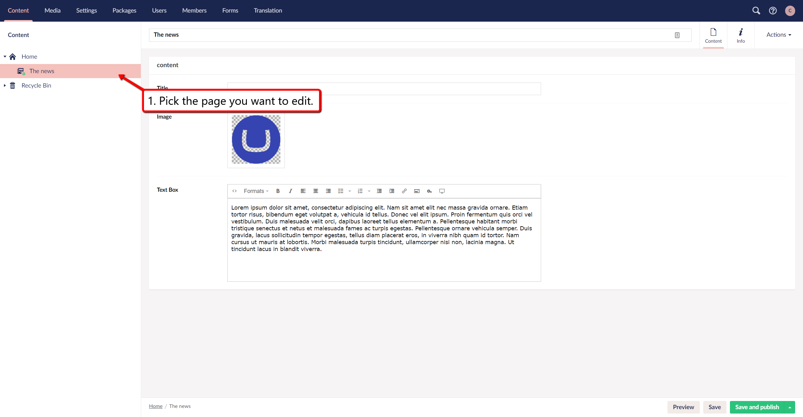
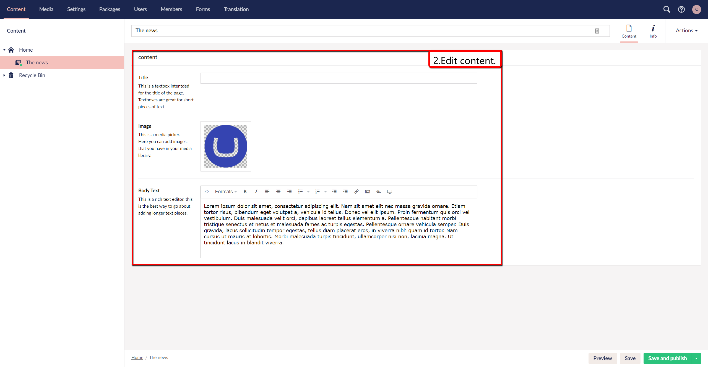
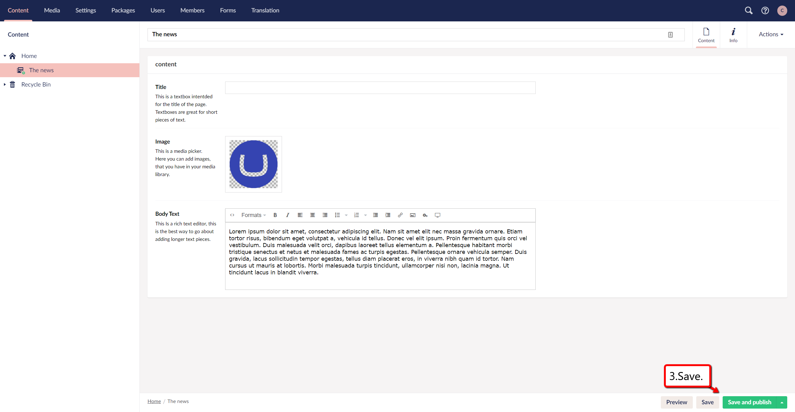
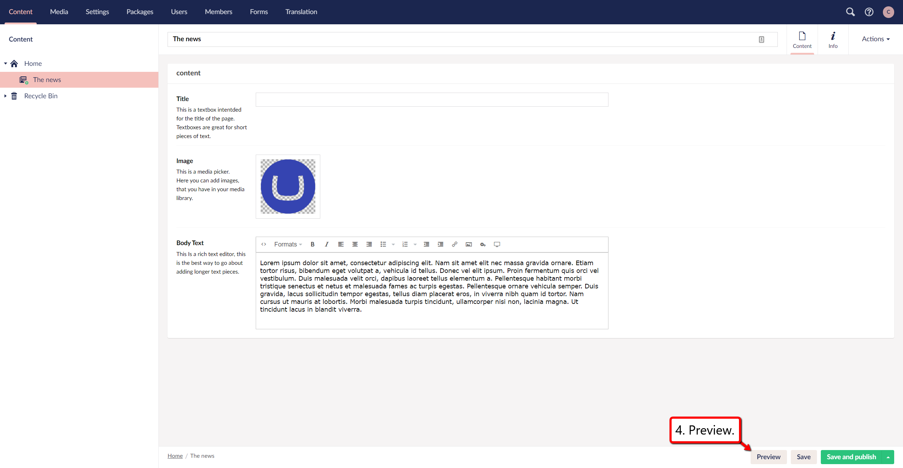
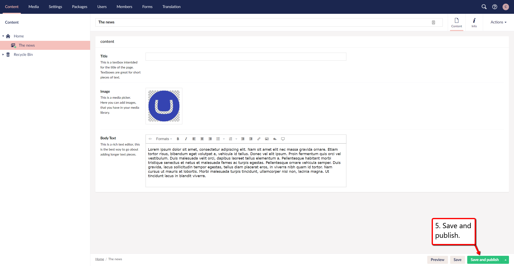
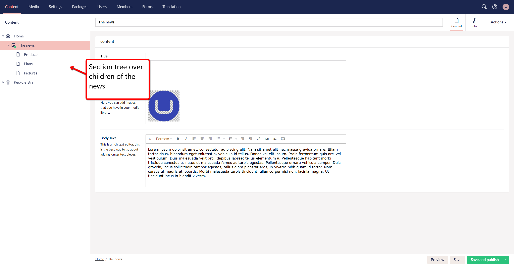
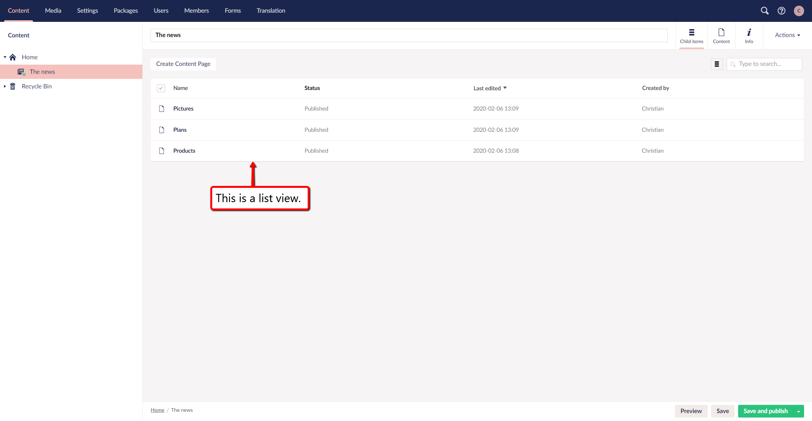
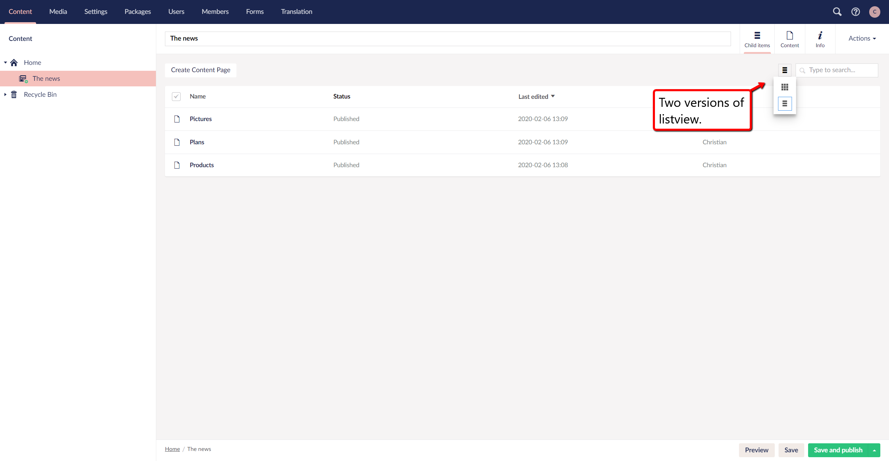
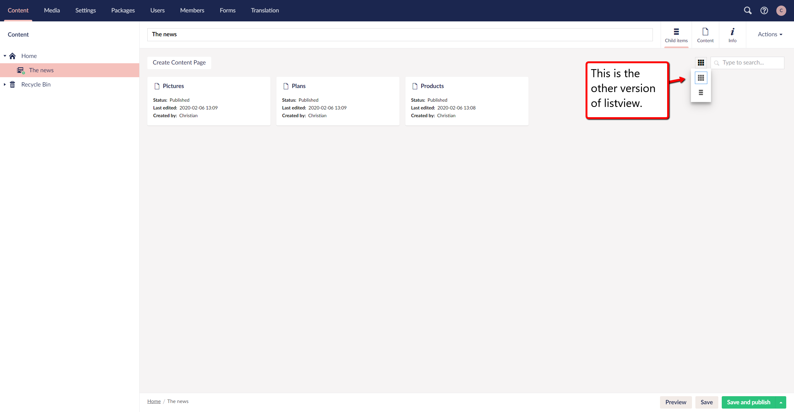

# Editing Existing Content

## Content Within the Tree View

This documentation is intended as a guide that will be helping you gain an overview of how you edit existing content.

1.	When you are looking to edit content, the first thing you should do is locate the ***page*** you want to edit content on. This can be done in the section tree on the left side of the screen.

2.	When you have located the page, you want to ***edit*** and clicked onto it.

You will be presented with the content of the page (if there is any). 
This content will be in the middle of the page (see image). The content is everything inside the red box. On this page there are three kinds of fields for content.
- A text box for the title.
- A media picker for the image.
- A rich text editor.

Which fields you see in this area and what type of content you will be able to fill in, is dependent on how the developers has built the site.

3.	After you have edited the content, you can click the save button to ***save*** the edits you did without publishing it.

4.	At this point it is recommended that you ***preview*** the changes that you did, which you can do by pressing the preview button located to the left of the save button.

5.	Finally, after you have done the preview and confirmed that the changes are how you like it.
You can click ***save and publish***, to publish the changes you did.

You can learn more about that in the [Save and publish](../Creating-Saving-and-Publishing-Content) article.

## List View Pages

Some of the pages in your website may use a list view style which shows child pages in a table format rather than the standard tree view.

The first screenshot below shows three child items below the **The news** page in the tree view. If the website were to have tens or even hundreds more content pages, the tree view would become very large and unmanageable.

The screenshot below shows what a page with a listview could look like.
When a page uses listview, there will be no standard tree for that page, insted there will be a table list when you click into the page.

If you want another type of list view, there are another option if you click the button shown in the screenshot below.

Selectiong this option will present you with boxes rather then a tabel.
This can be a good way to keep track of your pages if you need a quick overlook.

The table will show a maximum of ten child pages at any one time. Pagination controls allow you to navigate to additional pages should you have more than ten. In the top right of the table there is a search facility which enables you search for specific pages. This enables you to quickly locate pages without having to use the pagination. You can click the column titles to sort the list items. For example clicking the name column title will sort the list items alphbetically.
