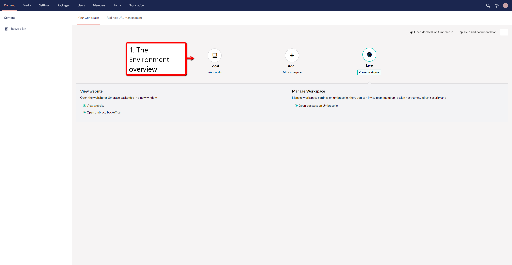
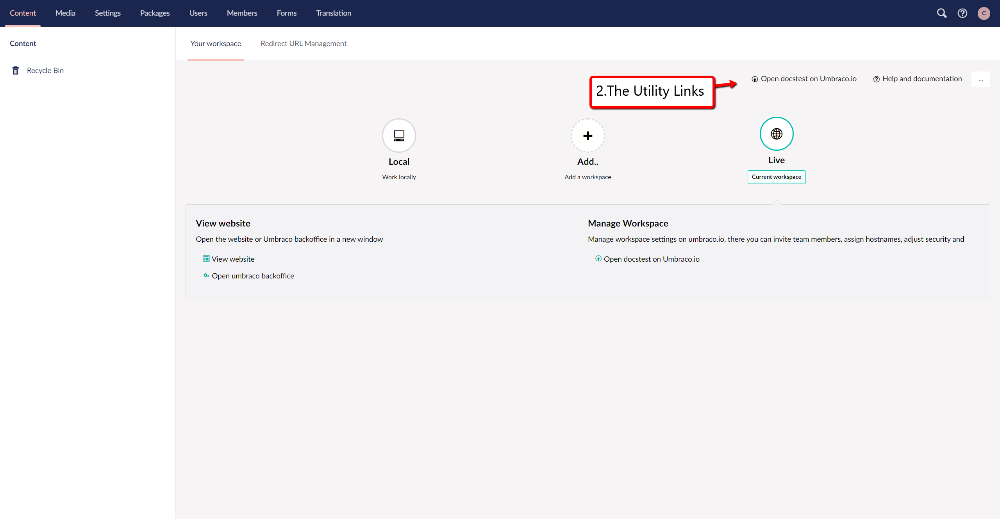
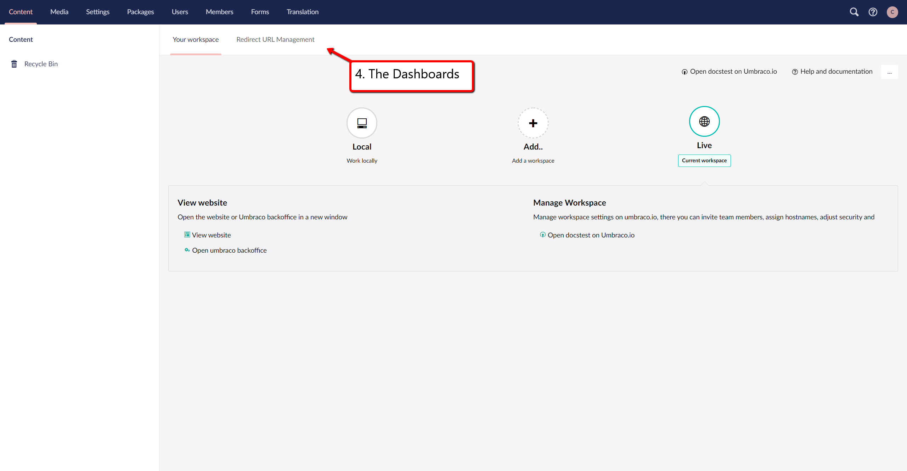
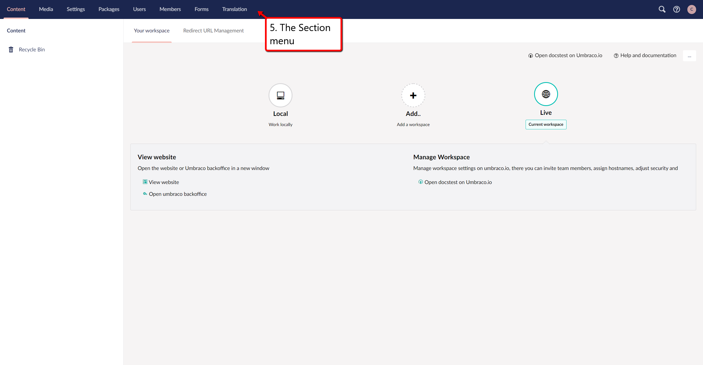
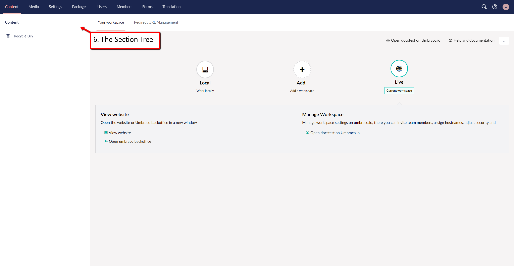

# Umbraco Interface

## Initial View

After logging in to an Umbraco 8 project you will be presented with a screen with a lot of different buttons. In this guide you will gain a quick overview of what each button does.

### 1. The Environment overview
These circles represent the environments avalible on the project. the first one in the row is **Local** environment, the next one on the right from local is the option to **add new** environments and the last one in the line is your **Live** environment.
clicking these circles will present you with a box below that gives you different options.

### 2. The Utility links
The first button in this row opens the overview of the environments on the project in the Umbraco Cloud portal. The second button takes you to the [Umbraco Cloud documentation](https://our.umbraco.com/Documentation/Umbraco-Cloud/).
The last button has three dots, and gives you the following links: 
- Getting Started
- Set up a Project
- Deployment
- Troubleshooting

### 3. Search and help
 The first button is a search field here you can search for the content that you are looking for.
The second button is the help button if you click this you will get options for **help**.
The third button is your **profile**, this will give you the option to edit your profile and password.

### 4. The Dashboards
The first tab is **Your Workspace** which takes you to the dashboard with the environments overview.
The second tab is **Redirect URL Management** which is for redirects on your project.

### 5. The Sections menu
The menu at the top, contains links to each section in the backoffice. 
- The first button is **Content** this is where you manage your content.
- The next button is **Media**, under this tab you can manage images and other media files.
- The third button is **Settings**, in this tab you handle your meta data such as document types.
- Button number four is **Packages**, this tab lets you manage and install packages.
- The fifth button is **Users**, this tab lets you manage the users on the project.
- Button six is the **Members** tab, and here you can handle the members of the project.
- The seventh button in the row is **Forms** tab, here you can create and manage your forms.
- The final and eight button is **Translation**, this tab is for managing languages.  

This menu list will differ depending on your rights for the project, meaning that if you are an editor for example. Then you will only have access to Content, Media and forms per default settings.

### 6. The Section tree
The section tree will be different depending on what section you are on.
The section will allow you an overview of the nodes that is contained in the tree.
In the this case you are looking at the content section.
The first field is **Content** this allows you to create content nodes, and manage your content tree. When you hover over the sections, it will highlight with a darker color indicating that you are hovering over it. A button with three dots will show up, clicking this will present you with additional options. There will be other option if you right click the field.
The **Recycle bin**, this is where your deleted content ends up. This will be on the Content section and the media section only.
