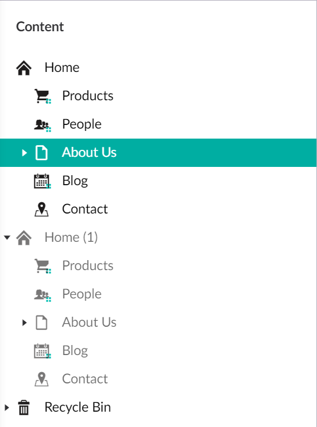
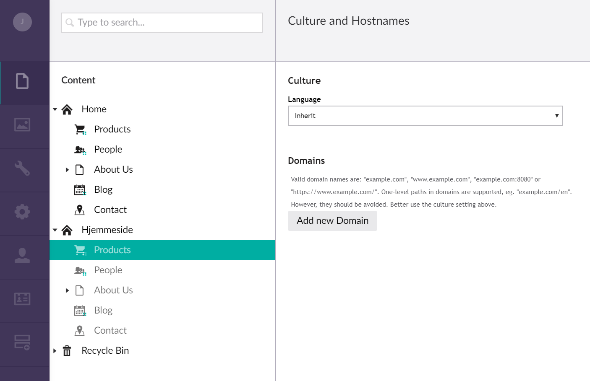
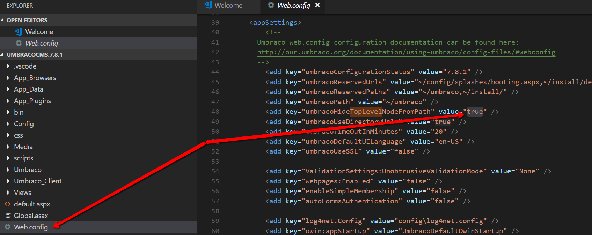
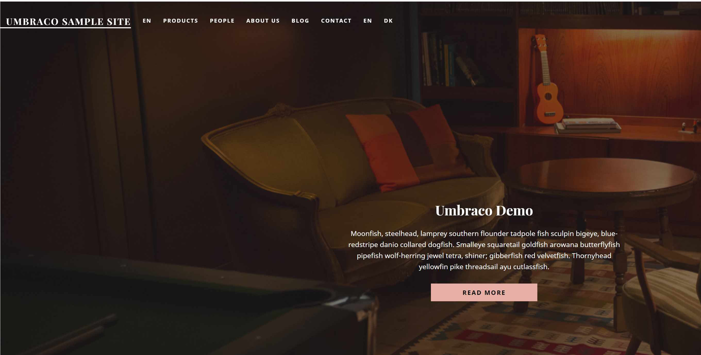

# Multilanguage sites

## Multilingual frontend

:::note
This will be shown on Umbraco 7.8.1, newer and older versions may differ. Also this assumes you already have a site with content in one language ready to work with.
:::

### Behaviour of '/'
Note that if domains are not set on the top level site nodes, then navigating to '/' will take you to the first "language/territory" site in the content tree. This behaviour is by design.

### First step
When setting up a multilingual site, the first step is to copy the content you have in the original language. To do this, chose the node you want to copy - in this example everything is copied at once by copying the Home node, left click Home and click copy in the menu.

Choose the parent of your new copied node. In this example it is Content meaning that the copied Home node will be a sibling to the current home node. If you want all child nodes to be copied as well check the 'Include descendants' box.

This will give you a full copy of all content pages as seen below:

Now you can go to all the copied content nodes and update your text to whatever language you want.

### Second step
The second step is to create the new language in the settings. To do this, go to the settings menu and under languages, click add new and chose your language.

Now we go to our content nodes and assign a language to them. You do this by right clicking on the home node and picking 'Culture and Hostnames', then choose the language associated with the page. (NOTE: As you can see it is defaulting to 'Inherit', so if you set the top node all child nodes will inherit it)

### Third step
Depending on how your site is set up, not all content is edited through the content section. Some of it may be written in the template and dictionary items are useful for that. Here is an example of some button text that will be added to the dictionary (templates are found under the menu point Settings).

Right click on dictionary in the menu and add new, give it a unique alias, then write the text that is relevant for each language.

Go back to your template and replace the text with @Umbraco.GetDictionaryValue("ReadMore") to show the dictionary item instead.

### Fourth step
To add languages to the url of your site, you first need to enable the full url. You do this by going to the Web.config file and changing the umbracoHideTopLevelNodeFromPath value from 'true' to 'false'.

Next you can go and change the name of the homepages to their language name, if you change the English homepage to 'en' and the Danish homepage to 'dk' the links would look like this:

### Fifth and final step
To make a language menu to switch between the languages you can go into your menu template file and add something like this:

Final result:

There is of course a lot more you can do to customize this, but here are the fundamentals.

## Multilanguage backoffice
To be able to translate the labels of tabs, names and descriptions on your document types you can use the dictionary in Umbraco. You can also translate the name of your documents.

Consider the following text on a document type:

**Tab**: Content 
**Name**: Header 
**Description**: This is the header of the page.

The name of document type is "Document".

If you create dictionary items for these fields with translations to other languages you can reference these, and then have these labels translated so the text appears in the language of the editor logged into Umbraco.
You use a special syntax to reference the name of the dictionary items as shown below:

**Tab**: #Content 
**Name**: #Header 
**Description**: #HeaderDescription

Likewise, the name of the document type can be referenced with #Document.

So it's the "hashtag" (#) symbol + the alias of dictionary item which will make Umbraco look in the Dictionary for the actual text content.

### Important
At the time of writing the default language of Umbraco is set to "en-us" and the default language of the administrator account is set to "en-uk". This can create some confusion if you try to do the above since it will display as [#Header] on the name label for instance. Therefore you should change the language of the administrator account to "en-us".
This is currently necessary for all version including and below Umbraco 6.1.1.
