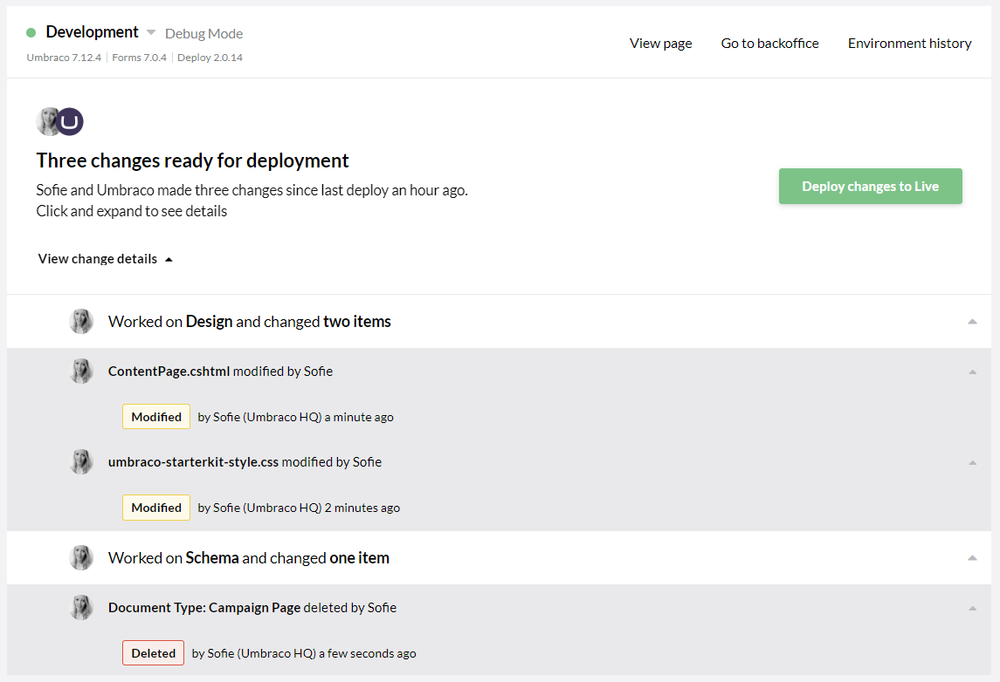

# Deploying deletions

On Umbraco Cloud deletions are environment specific. This means that in order to delete something entirely from your project, you need to delete it on all environments.

In this article you can read about the correct way of deleting files, schema and content from your Umbraco Cloud project.

When you have an Umbraco Cloud project, you might have several environments - including a local clone of the project. These environments each have their own database. The databases will contain references to all of your content and media, as well as to all of your schema files (e.g. Document Types, Templates etc). 

The databases are environment specific. When you deploy from one environment to another, the engine behind Umbraco Cloud will compare incoming schema files with references to these in the databases using both *alias* and *GUID*. If something doesn't add up - e.g. there is a mismatch between the database references and the files deployed - you will see an error. Learn more about this in the [Troubleshooting section](../../../Troubleshooting/Deployments).

The workflow described above does not pick up deletions of content and schema from the database, which is why you'll need to delete the content and / or schema on all your environments, in order to fully complete the deletion.

REASONS WHY

## Example scenario

Let's say you've deleted a Document Type on your Development environment, and now you want to deploy this deletion to the Live environment, along with some other changes you've made.

Before you deploy the changes, the Development environment will show that the following changes are ready to be deployed:



Following the **Activity log** in the browser, you'll see that the UDA file for the Document Type is deleted, and that other files containing changes are copied into the new environment.

```
Remote: Copying file: 'css\umbraco-starterkit-style.css'
Remote: Deleting file: 'data\revision\document-type__79f0600e71ab45eba3ebc2e44f216a05.uda'
Remote: Copying file: 'Views\ContentPage.cshtml'
```

Once the deployment is complete, you will notice the following:

* The css file is correctly updated
* The template is correctly updated
* The Document Type you deleted on Development is still present in the backoffice on the Live environment

You might wonder why the Document Type that you've just deleted, is still there. The reason is, that we only delete the associated UDA file, and not the database entry that references the Document Type. 

In order to completely delete the Document Type from your project, you need to delete it from the backoffice of the Live environment as well. This will delete the reference to the Document Type in the Live database, and you will be rid of it completely.

## Which deletions are deployed?

Every **file** that's deleted, will also be deleted on the next environment when you deploy. However, there are some differences depending on what you have deleted.

Here's an overview of what happens when you deploy various deletions to the next environment.

### Deleting Schema (Document Types, Datatypes etc.)

Deleted:
* The associated `.UDA` file

Not deleted:
* The entry in the database
* The item will still be visible in the backoffice

### Deleting a Template

Deleted:
* The associated `.UDA` file
* The associated `.cshtml` file (the view file)

Not deleted:
* The entry in the database
* The template file will be empty, but still be visible in the backoffice

### Deleting files (css files, config files etc.)

As these are **only** files, everything will be deleted on the next environment upon deployment.

### Deleting content and / or media

Content and media deletions will not be picked up by deployments and will have to be deleted on each environment you wish to delete the content or media on.


