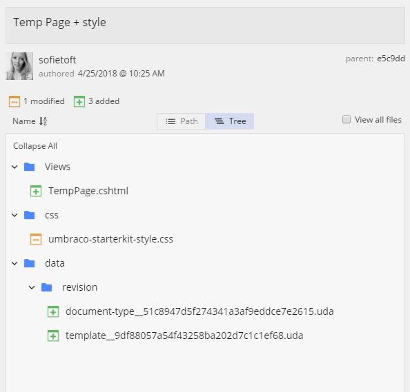

# Apply hotfix by manually moving files

In this article you'll find a step-by-step guide on how to apply a hotfix to a Live environment by manually moving the changes, updated or new files from one local clone to another.

In this guide I will be using **Visual Studio Code** and **GitKraken**.

## The Scenario

I have an Umbraco Cloud project with two environment, Development and Live. I have been working on building the site on a local clone of the Development environment, and now I want to send some but not all changes to the Live environment.

Three commits has been pushed from my local clone to the Development environment. Out of these three commits, I only need some of the changes on the Live environment.

## Apply selected changes to the Live environment

Here are the steps to follow in order to apply selected changes to the Live environment without deploying directly from Development to Live.

### Move the files

1. Clone down the Live environment
    * The _clone URL_ for the Live environment can be found in the Umbraco Cloud Portal:

    

2. Locate the files from the cloned Development environment that you want to move to Live
    * Check the commits in the Git history for the Development environment to verify which files you need

    

    * The _new files_ can simply be moved from the Development folder to the Live folder
    * The same goes for _changed files_. You can also edit the files, and only move the code snippets you need on the Live environment.

3. Copy and paste the new and / or updated files from you Development folder to your Live folder
4. You can now _Stage_ and _Commit_ these changes to the repository for the Live environment in Git

One of the benefits of having the Live environment cloned down, is that you can test the new changes locally before sending it to the Live environment.

### Test changes locally

5. Run the Live environment through IIS
6. Open _CMD_ and nagivate to the `/data/revision` folder where you have your local clone of the Live environment
7. Create a _deploy_ marker by typing the following: `echo > deploy` - learn more about this command in the [Power Tools]() articles
8. The changes will now be reflected in the backoffice of your local clone of the Live environment

Once you've checked that everything works locally, you are ready to push to the Live environment

### Push to Live

9. Push the committed changes to the Live environment using Git
10. **Note** that when changes are pushing directly to a Live environment the changes are not automatically extracted into the site
11. Access KUDU on the Live environment
12. Navigate to `site/wwwroot/data` in the _CMD Console_
13. Create a _deploy_ marker by typing the following: `echo > deploy`
14. Once this is complete, you will see the changes reflected on the Live environment

