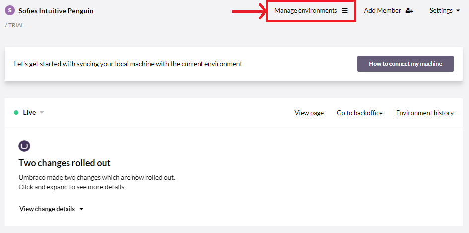
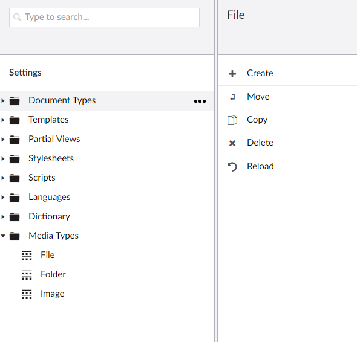

# Merge with your Umbraco Cloud project

In this part you are going to setup your Umbraco Cloud project, clone it down to your local machine and start merging the files from your own project into the new Cloud project.

## Setup your Umbraco Cloud project
Before the migration process can start, you will need to have an Umbraco Cloud project you can migrate your own project into.

1. The best way to get started with Umbraco Cloud is to start a trial. You can do this, by visiting [umbraco.com](http://umbraco.com).
2. When your project is starting choose to start with a *clean slate* - you need to have an empty Cloud project for the migration to be succesful.
3. We recommend that you setup your project with at least two environments.

Before you clone down the Umbraco Cloud project to your local machine, login to the backoffices of your Umbraco Cloud environments and delete the default Media types (*File*, *Folder* and *Image*) from the *Settings* section. You need to do the same for the default Membertype, *Member*, found in the *Member* section. If you have two or more environments, it's important that you remember to do this, on all the environments.

## Clone down your Umbraco Cloud project

Now it's time to clone down your Umbraco Cloud project to your local machine. You can read more about how this is done, in the ['Working Locally'](https://our.umbraco.org/documentation/Umbraco-Cloud/Set-Up/Working-Locally/) chapter.

Run the site locally and verify your own project and the cloned Umbraco Cloud project are using the same Umbraco version. After you've verified this, shut down the site, and it's now time to start merging the two projects.

## Move / Merge
1. Copy all folders from your own project files to the Umbraco Cloud project files
    * Excluding the following:
        * `/Config`
        * `/App_Data/umbraco.sdf`
    * Make sure you do not overwrite any Umbraco Cloud specific files in the following folders:
        * `/bin`
        * `/data/backoffice/users` - *only relevant if you are migrating a Cloud project*
        * `/Umbraco`
        * `/Umbraco_client`
2. Merge the config files. Pay special attention to the following files:
    * `/web.config` - in the `web.config` file for the Umbraco Cloud project you will see some new configuration related to Umbraco Deploy, Licenses and Forms. Make sure you do not overwrite these when you merge the files.
    * `/Config/courier.config`
    * `/Config/dashboard.config` - make sure to keep the *Deploy dashboard*!
    * `/Config/UmbracoDeploy.config` - *only relevant if you are migrating a Cloud project*
3. If you are using SQL CE
    * Make sure the SQL CE database from your own project replaces the one provided with your Umbraco Cloud project.
    * You can find it in `App_Data/umbraco.sdf`
4. If you are using a local SQL server make sure to update the connection string in the `web.config` for the Umbraco Cloud project.

Phew! That was a lot of merging and moving around, but don't worry! You are almost done with this part of the migration.
The last thing to do before moving on, is to make sure your Umbraco Cloud user will be added to the new database you've just merged into the project. 
* Go to the `data/backoffice/users` folder in your Umbraco Cloud project files
* Rename your user file by removing the leading underscore

That's it! Now you are ready to move on to the next part.

[Previous chapter: Prepare your site for migration](part-1.md) -- [Up next: Generating metadata](part-3.md)