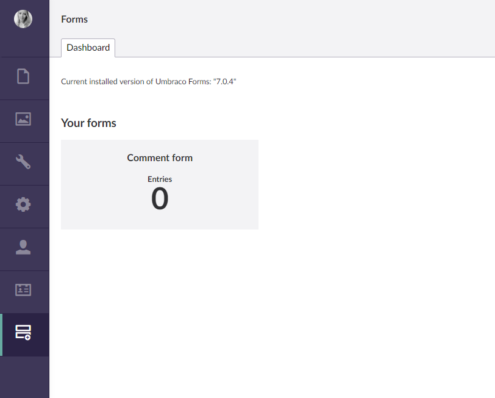

# Umbraco Forms on Cloud

In this article you can learn about how Umbraco Forms are handled on Umbraco Cloud and read about the workflow and best practices.

Umbraco Forms is a package that is included with your Umbraco Cloud project. It gives you a nice integrated UI where you can create forms for your website. The package is built specifically for Umbraco and is maintained by Umbraco HQ.

Read more about the product in the [Umbraco Forms section](../../../Add-ons/UmbracoForms).

## How are Forms handled on Cloud?

Umbraco Forms are handled as content and media. This means that you can transfer your Forms between environments using the same workflow you use for content and media.

:::note
**Did you create your Cloud project before June 18th 2019?**

Then you need to configure your project to handle Umbraco Forms data as content.
This is done by adding the following to `UmbracoDeploy.settings.config`

```xml
<?xml version="1.0" encoding="utf-8"?>
<settings xmlns="urn:umbracodeploy-settings">
   <forms transferFormsAsContent="true" />
</settings>
```

:::

Entries submitted are not transferred to the next environment, as they are *environment specific*. If you need to move entries from one environment to another, you need to run an export/import script on the databases.

## Recommended workflow

You can work with Forms on the environment of your choice. 

When you need to test or use your forms on another environment you can

* transfer the forms to the next environment using **Queue for transfer** or
* **Restore** the forms on an environment lower in the workflow

For more information on how to handle content transfer / restores on Umbraco Cloud, checkout the following articles:

* [Transfer content, media and Forms](../Content-Transfer)
* [Restoring content](../Restoring-content)

## Upgrades

Umbraco Forms is part of the [auto-upgrades on Umbraco Cloud](../../Upgrades). Whenever a new patch is ready for release, we will automatically apply it to your Cloud project. There will be a message in the Umbraco Cloud Portal at least 5 days before we roll out new versions.

To avoid that the auto-upgrades overwrite any of your custom settings, we strongly encourage that you use [config transforms](../../Set-Up/Config-Transforms) when you need custom configuration, and [Themes](../../../Add-ons/UmbracoForms/Developer/Themes) when you need to customize your forms.

## Common issues with Forms on Cloud

### The Forms tree is missing

Some times you might experience that you loose the tree in the Forms section in the backoffice after a deployment.



In order to get the tree back, all you need to do is **restart the environment** from the Umbraco Cloud Portal.
