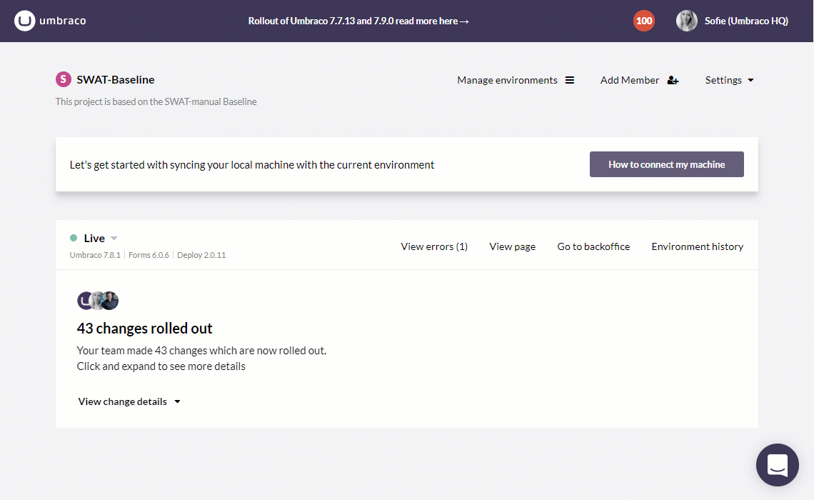

# Baselines
A Baseline Child project is very similar to a Fork (forked repository) on Github in that we create a clone of an existing project while maintaining a connection between the two projects. The connection exists between the _Live_ environment of the existing project, the **Baseline project**, and the _Development_ or Live environment - of the newly created project, the **Child project**.

Any project can act as a Baseline project.

The basic idea is that you have a project that contains all your standard Umbraco packages/components, maybe even configured with some default Document Types, which you want to use as a baseline for future projects. When you've made changes to your Baseline project you can then push these changes out to all the Child projects with a click of a button.

For some more in-depth information have a look at the [High-level Overview](High-level-overview/) article.

Below you'll find a guide on how to create and setup Baseline Child projects.

## Creating a Child project

Using the “Create Project” option from the Umbraco Cloud Portal, choose either the Starter or the Professional plan for your new project. 

After choosing a name for your new project, you will have the option to create the project based on an already existing project - any of your projects can be used as a Baseline project! 

When you click create you’ll be redirected to the project page for the new Child project, which shows the creation progress. It might take several minutes for the project to spin up and before your environments are ready. 

When your environments are ready your will see a *green* light next to the environment name.

**Note:** Depending on the size of the project you've chosen as a Baseline project, it might take several minutes before the Child project is ready. 

### Restore content from the Baseline project

When you've created the Child project you can choose to restore content from your Baseline project:

* 'Right-click* the top of the Content tree in the Umbraco backoffice
* Choose *Restore*
* The *Baseline project* should already be selected as the environment to restore from
* Click **Restore from Baseline**
* Once the restore is complete, *reload* the content tree to see the content!

## [Merge Conflicts](Baseline-Merge-Conflicts/)
As with any git repository-based development it is not uncommon to have merge conflicts as the various repositories begin to differ. Read this article for more on the merge strategy we use and how to approach resolving these conflicts.

## [Pushing upgrades to a Child Project](Upgrading-Child-Projects/)
In this article you'll find a guide on how to upgrade your Child project with changes from your Baseline project.

## [Handling configuration files](Configuration-files/)
When you are working with Baseline Child projects you might sometimes want to have individual configuration for each project - this can be handled using config transforms.

