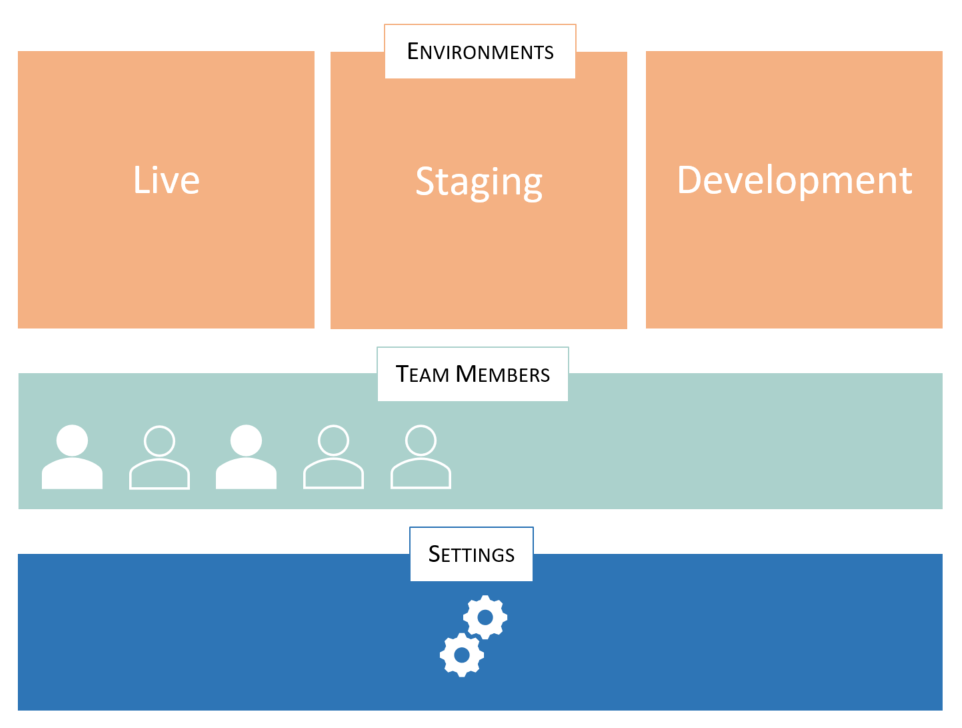

# Get to know your Umbraco Cloud project

Umbraco Cloud projects are made of three major components: environments, team members and a settings section.

## Environments

The number of environments on your project is dependent on which plan you are on:

* With the **Starter plan**, you get a single _Live_ environment and have the option to add additional environments - a _Development_ and a _Staging_ environment
* With the **Professional plan**, you will get a _Development_ AND a _Live_ environment - as with the Starter Plan you can add/remove environments as needed

When you have multiple environments on your Umbraco Cloud project the *Development* environment will be the *first* environment in the workflow. What this means, is that this is the environment you are going to work with when building the structure of your website. This is also the environment you clone down when you want to work with your project locally.

The environment next in line in the workflow is the *Staging* environment. Having this environment enables you to give your team members different workspaces - the developers can work with code in the Development environment while the content editors can work with content in the Staging environment. All of this without affecting the actual public site.

Both the Development and the Staging environments are protected with **basic authentication**. This means that you have to log in to see the frontend of these environments. Alternatively, you can [whitelist IP's](../../Set-up/project-settings/#manage-ip-whitelist) to allow access to the environments.

The final environment is the *Live* environment. This is your live site - the site that's visible to the public. When you are in trial mode the Live environment will be protected by basic authentication - this will, of course, be removed, as soon as you set up a subscription for the project.

For a more technical overview of your Cloud environments read the [Environments](../Environments) article and for more information about the workflow on Umbraco Cloud see the [Deployments](../../Deployment) article.

## Team Members

Another major component of your Umbraco Cloud project are the team members. When you add team members to a project, they will automatically be added as backoffice users on all the environments as well. Team members can be added as *Admins*, *Writers* or *Readers*. Read the [Team Members](../../Set-up/Team-members) article to learn more about these roles.

## Settings

Last but not least is the *Settings*, where you can manage and configure your project to fit your needs. Learn more about the different settings in the [Project Settings](../../Set-up/project-settings) article.
