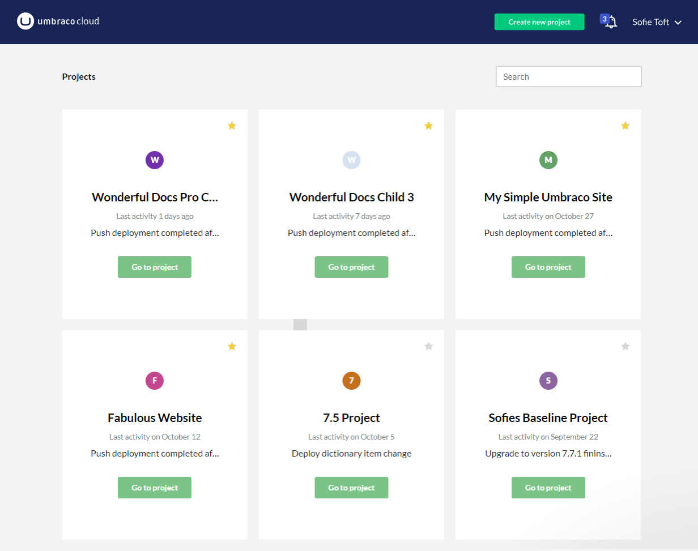
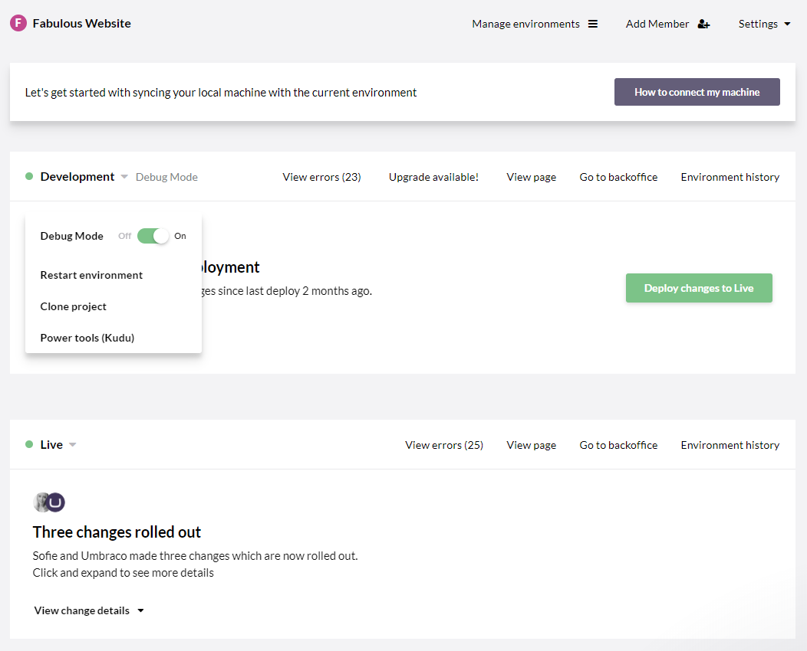
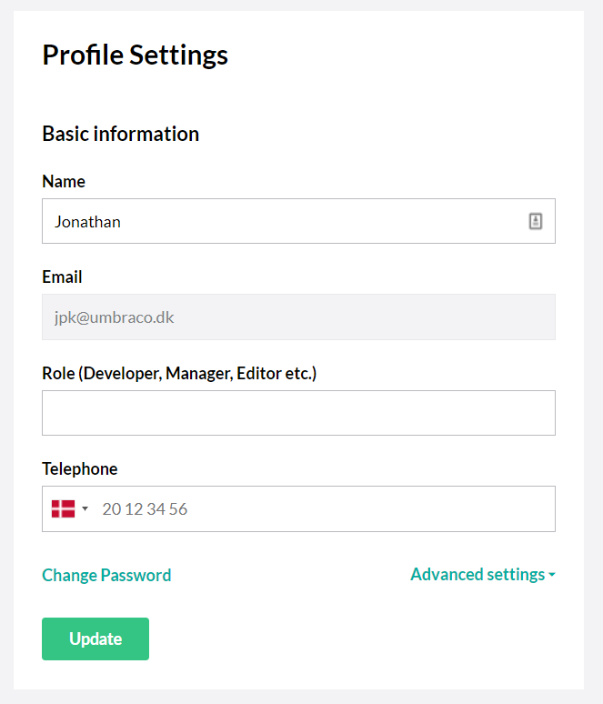
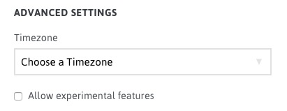

# The Umbraco Cloud Portal

To make working with your Umbraco Cloud projects as simple as possible we've build the Umbraco Cloud Portal, where you can view and manage all your projects having only to remember one set of login credentials.

This is also where you get to make your Umbraco project your own. Umbraco is built using web standards - things like HTML, CSS, and JavaScript. 
You’ll find the HTML that makes up the Templates for your site in the Umbraco backoffice _Settings_ section, under the Templates tree. 
This is plain-old-HTML, so feel free to change or replace what’s there. 
The same goes for your project’s CSS (it’s in the Stylesheets tree) and the JavaScript (yup, in the Scripts tree). 

## Manage your projects

When you login to the Umbraco Cloud Portal you will be presented with a view of all the Umbraco Cloud projects you've created or has been added to as a team member. 

You can easily browse through the projects by using the search field. For quick access you can *favorite* the projects you are currently working, to make them appear as the first projects in the view.

By default the projects are ordered by latest updates - projects you've worked on recently will be showed on top and the ones you've haven't worked with in a while are in the bottom.  

In the top-right corner of the projects view you'll find an option to create more projects. Simply choose the plan you want and a project will be ready for you within a few minutes. 

## Project Management

Managing your individual projects has been made even simpler with Umbraco Cloud. 

In the project view you will have a quick overview of the environments in your project

* Environment status
* Links to **backoffice**, **frontend** (View page) and the environment history
* Get URL for cloning down to your local machine
* Option to restart environments
* Access to Power Tools

Aside from these features, it's also from the project view that changes are deployed from one Cloud environment to another - find out more in the [Cloud-to-Cloud](/Deployment/cloud-to-cloud) article.

From [Settings](../../Set-up/project-settings) - in the top-right corner - you'll a lot more options to configure your project.

## Your Umbraco Cloud profile

### Name

The name that will be displayed on Umbraco Cloud

### Email

This email address is used for logging in to Umbraco Cloud and will receive email notifications from the Umbraco Cloud Portal.

### Change password

Change the password for your Umbraco Cloud account.

### Advanced settings

#### Timezones

From your profile settings you can set your timezone. This applies to the display of status messages in the Umbraco Cloud portal and makes it easier to determine the actual time a particular status was created.

#### Experimental Features

You can enable the availability of experimental features for your projects. This includes features that may not be functionally complete and are not supported by Umbraco HQ. We recommend enabling this only if you fully understand the feature you will be using or are strictly using the project as a test.

## The chat

In the bottom-right corner of the Umbraco Cloud Portal you'll find a chat-bubble. This is where you will be able to reach out to the Umbraco HQ Support Warriors should you encounter any issues while working with your Umbraco Cloud project.

Note that with the Starter plan you are only entitled to support regarding specific Cloud issues. Are you on a Professional plan you will also be entitled to support regarding issues with the CMS.

Read about the [Umbraco Cloud plans](https://umbraco.com/pricing/) to learn more about this.