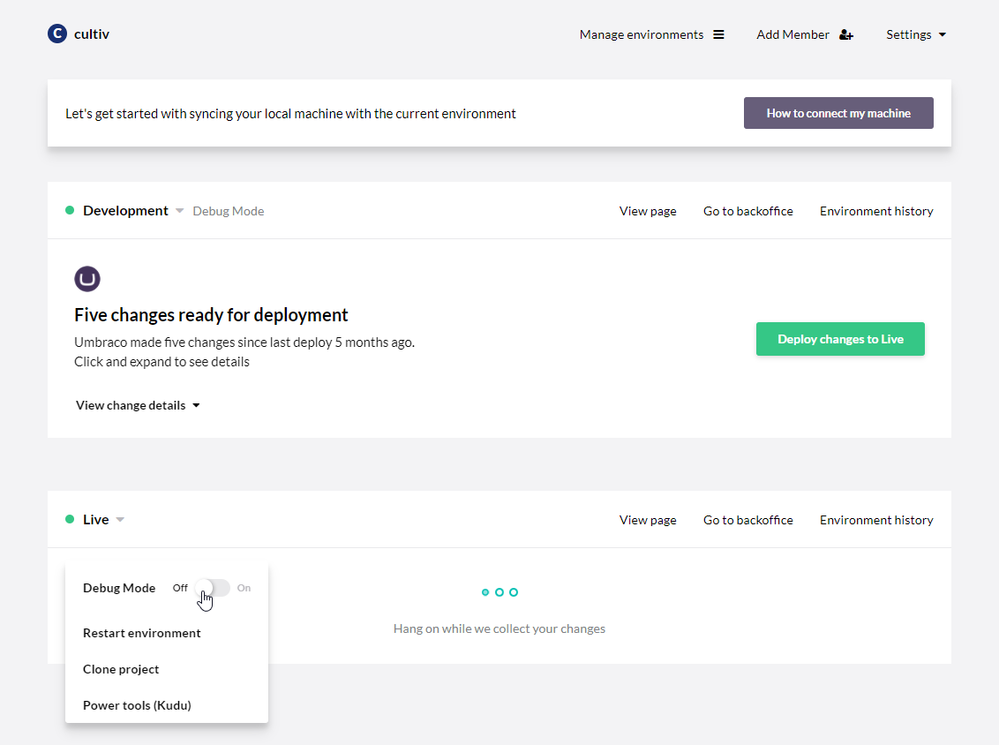

# Config transforms
Sometimes you just need your configuration files to be a little bit different after you deploy. It's possible to transform your config files for each environment in your project.

<iframe width="800" height="450" src="https://www.youtube.com/embed/YkF2FotjWDk" frameborder="0" allow="autoplay; encrypted-media" allowfullscreen></iframe>

## Convention
To transform any file that ends with `.config`, you can add a file with the extension `.{environment}.xdt.config` in the same folder.   
The `{environment}` part needs to be replaced with the target environment, for which there's currently 2 possibilities for each project:

1. `development`
2. `live` 

**Note:** Some sites have a 3rd option: `staging`. 

## Example
If you wanted to do a transform on your `web.config` file in the root of your site, you can create two files in the root of your site:

1. `web.development.xdt.config`
2. `web.live.xdt.config`

Then, whenever you deploy from local to development, the transforms in `web.development.xdt.config` will be applied. And of course when you deploy from development to live, the `web.live.xdt.config` transform will be applied.

**Note:** if you only want to transform the file on the live environment then you don't create the `development.xdt.config`.

## Test your config transforms
Before applying the config transform files to your environments we recommend that you run a test using this tool: [Webconfig Transformation Tester](https://webconfigtransformationtester.apphb.com/)

Using the tool will let you test whether the config transform file transforms your config files correctly. The tool can be used for all config files.

## All config files
For each deploy, we'll search for all of the `.{environment}.xdt.config` files in your site and apply transforms, so you can also transform (for example) `~/config/Dashboard.config` by creating a `~/config/Dashboard.live.xdt.config` file. Just make sure the transform file follows the naming convention and it exists in the same folder as the config file you want to transform.

## Baseline config transforms
It is possible to apply config transforms for specific child sites from a baseline. For more info see [Baseline Configuration Files documentation](https://our.umbraco.com/documentation/Umbraco-Cloud/Getting-Started/Baselines/Configuration-files/)

## Including transforms in Umbraco packages
For package developers it can be useful to add a config transform that needs to happen on each environment, for example if you're making a package called uPaintItBlack where you want to set an AppSetting in web.config. The AppSetting in `development` should be _a red door_ so you set the AppSetting value to `"red"`. On `staging` it should be _a green sea_ so you set the AppSetting to `"green"` (or to _a deeper `"blue"`_). Of course on `live` you've painted it black so you set it to `"black"`. 

In that case you can make 3 transform files, the filename needs to start with something that's specific to your plugin, it can be any word, for example `RollingStones` or `uPaintItBlack`:

- `~/uPaintItBlack.web.development.xdt.config`
- `~/uPaintItBlack.web.staging.xdt.config`
- `~/uPaintItBlack.web.live.xdt.config`

Again, these type of prefixed files can be placed next to any other file so if you also need to transform `~/config/Dashboard.config` specifically for your plugin then you can create `~/config/uPaintItBlack.Dashboard.{environment}.xdt.config`

## Useful links
- [Config transform syntax](https://msdn.microsoft.com/en-us/library/dd465326)
- [Test your config transforms online](https://webconfigtransformationtester.apphb.com/)

## Forced transforms

Whenever you deploy changes to any of your environments we force some config transforms to help make sure optimal settings are set for your website. 

### Web.config forced transforms

These are the transforms we do on the root `web.config` file regardless of the custom transforms you might have specified above, we enforce these transforms always.

On live environments only:

- We set `debug="false"` on the `compilation` node in `system.web` 
- We set `mode="RemoteOnly"` on the `customErrors` node in `system.web`

On all other environments:

- We set `debug="true"` on the `compilation` node in `system.web` 
- We set `mode="Off"` on the `customErrors` node in `system.web`
- We set `waitChangeNotification="3" maxWaitChangeNotification="10"` on the `httpRuntime` node in `system.web` 
- We set `numRecompilesBeforeAppRestart="50"`  on the `compilation` node in `system.web` 
- We set the smtp `host=""` if the host was set to `127.0.0.1`

Note that for the `compilation debug` and the `customErrors mode` there is a toggle in the Umbraco Cloud portal to temporarily toggle the opposite setting. This will change the debug/customErrors mode until the next deploy to this environment on each deploy the forced transforms will be performed again.

