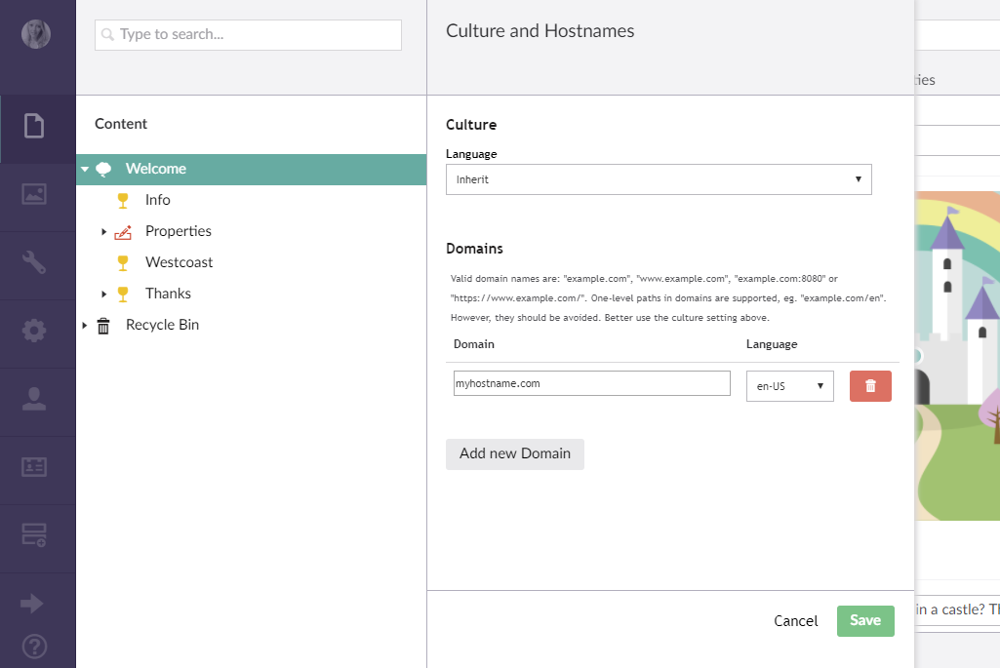

# Managing hostnames

When you create an Umbraco Cloud project we create the project URLs based on the name you give your project. 

Let's say you have a project named `Snoopy`. These will be the default domains:

* Umbraco Cloud Portal: *www.s1.umbraco.io/project/snoopy*
* Live site: *snoopy.s1.umbraco.io*
* Development environment: *dev-snoopy.s1.umbraco.io*
* Staging environment: *stage-snoopy.s1.umbraco.io*

To access the backoffice, simply add `/umbraco` to the end of the Live, Development or Staging domain.

## Domains

Under *Settings* in the Umbraco Cloud Portal, you'll find **Manage Hostnames**. This is where you go when you want to bind domains to your Cloud environments.

You can bind any hostname to your project environments. Keeping in mind, of course, that the hostname will need to have a DNS entry so that it resolves to the Umbraco Cloud service.

You can bind a total of 15 hostnames to each Umbraco Cloud environments.

Once you add a domain to one of your environments make sure to update the hostname DNS entry to resolve to the umbraco.io service. We recommend setting an ALIAS record for your root domain (e.g. mysite.s1.umbraco.io), rather than an A record for the umbraco.io service IP address - 23.100.15.180. Check with your DNS host or domain registrar for details on how to configure this for your domain. 

You will also have to specify the hostname for each root node if you are using a multisite setup.

* Go to the Umbraco Backoffice
* *Right-click* the root content node
* Choose **Culture and Hostnames**
* Add your hostname
* Hit *Save*

Once you've assigned a domain to your Umbraco Cloud environment, you may want to hide the default umbraco.io URL (e.g. *snoopy.s1.umbraco.io*). We've created a rewrite rule for this purpose - find it in the [Rewrites on Cloud](Rewrites-on-Cloud/#hiding-the-default-umbraco-io-url) article. 

## [Umbraco Latch](Umbraco-Latch)

All hostnames added to an Umbraco Cloud project will automatically be protected by **Umbraco Latch**: A TLS certificate will be assigned to your hostnames.

## [Upload certificates manually](Security-Certificates)

You can manually add your own certificate to your Umbraco Cloud project and bind it to one of the hostnames you've added.

## [Rewrites on Umbraco Cloud](Rewrites-on-Cloud)

Learn more about best practices for working with rewrite rules on Umbraco Cloud projects.
