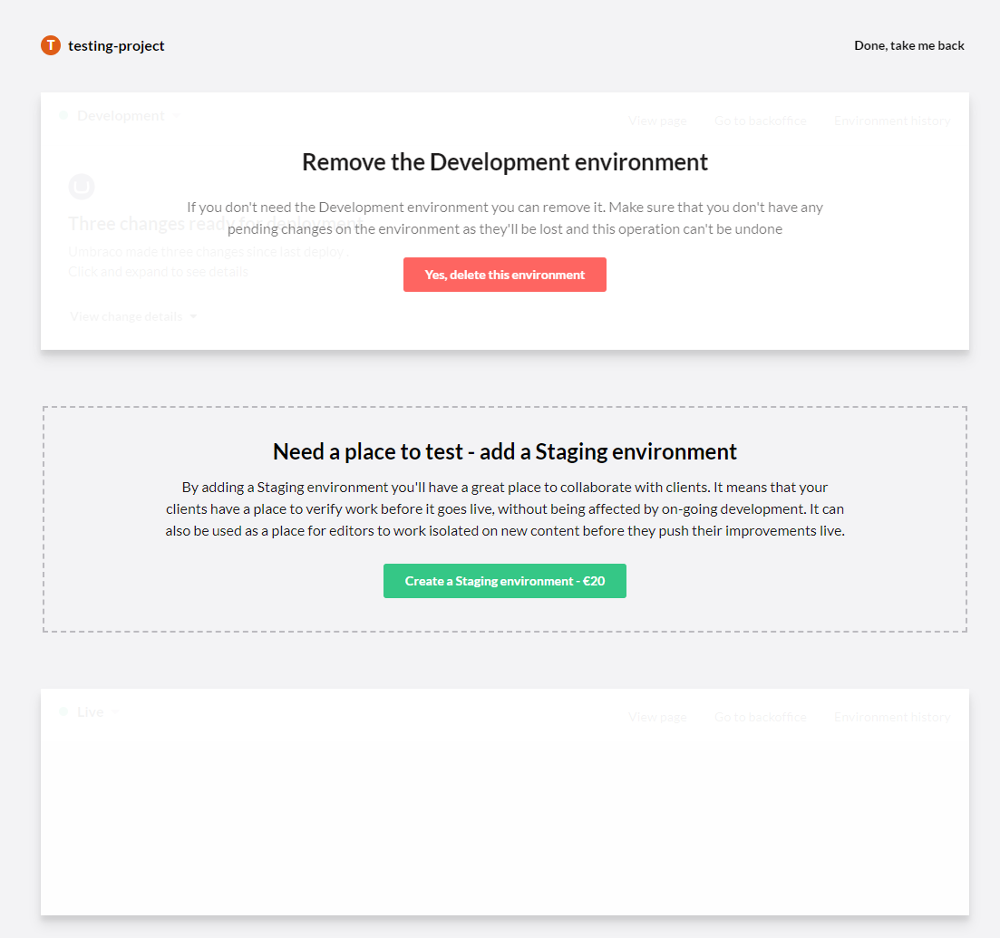

# Manage environments

When working with an Umbraco Cloud project you can add and remove extra environments. If you are on a Pro plan you can add and remove environments whenever you like, for a Starter plan it costs extra for each environment.

## Types of environments

There are three different types of environments:
- Live
- Development
- Staging

The Live environment will always be there for a site, it is the only one you can't delete. This environment is accesible for outsiders unlike the development and staging environments.

If you choose to have live and one more environments the second one will be the development. When it is added it will be a complete copy of live - *Note: This means if you have an error you really can't fix on development, removing and adding it again will "reset" it to be a copy of live*. - it will also automatically be configured with Deploy to be part of the deployment chain.
Adding a third environment - Staging - works in exactly the same way, except it will be in the middle of the deployment chain, and if you try to remove environments again this will be the first one you can remove.

## Adding or removing environments

__Important:__ *Before* adding an environment you should consider if you have any changes locally that are not on live yet. If you do you should make sure to push it as adding another environment will also push it into the deployment chain.

__Important:__ *After* adding an environment - if that environment was a development environment you should do a fresh clone of the site, the local version you have will be set up to push directly to live, a fresh clone will push to development.

You can find the interface for adding and removing environments from your project page, it is located here:

On that page you will simply be able to add or remove an environment, if you wish to remove one you will be prompted to type in the environment alias, so either 'development' or 'staging'.

Once you have added or removed the environment it will take a couple of minutes for the Cloud to set it all up, and then you will be ready to use it.