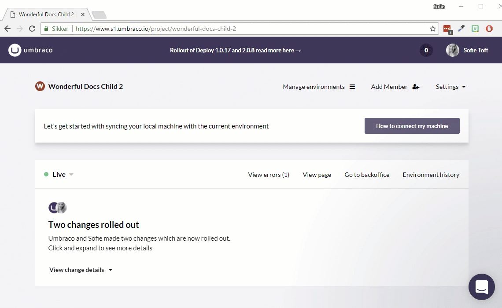

# Power tools (Kudu)

Kudu is an open source engine behind git deployments to Azure. It gives us basic access to the file system trough command line or powershell all from the comfort of a web browser. It also powers the way we deploy to Umbraco Cloud sites.

## How to access Kudu

Two things are required for you to be able to access Kudu:

1. Your profile needs **admin rights** on the project
2. You must **allow experimental features** on your profile (read more about this below)

Kudu is available for each environment on your Umbraco Cloud project. You can find the link by clicking the environment name in the Umbraco Cloud portal.

When you are prompted to login, use your Umbraco Cloud credentials.

### Allow experimental features

You will need to allow for experimental features on your Umbraco Cloud profile before you can see the Power Tools option.

1. Find your profile by clicking your name / image in the top-right of the Umbraco Cloud Portal
2. Expand "*Advanced settings*"
3. Make sure "*Allow experimental features*" is ticked
4. Update your profile

## What can you do from Kudu?

The power tools can be used for various things, and we are often referring to the tools in our troubleshooting guides.

### Run an extraction 

When you deploy from one environment to another on your Umbraco Cloud project, the Deploy engine is running an extraction. What this means, is that the files from the Git repository are merged into the files used on the site.

Run an extraction following these steps:

1. Access Kudu
2. Navigate to **CMD** under the **Debug console** menu
3. In the file structure, navigate to `site/wwwroot/data`
4. The `/data` folder contains:
    * `backoffice` folder containing files for the backoffice users
    * `revision` folder containing all your projects UDA files
    * *deploy-marker* indicating the state of the latest extraction (`deploy-complete` or `deploy-failed`)
    * `deploy.log` containing logs from the latest extraction
5. While in this folder, type the following command in the CMD console: `echo > deploy` - this will initiate an extraction on the environment
6. While the extraction is running, the *deploy-marker* will change name to `deploy-progress`
7. The extraction will end in one of two possible outcomes:
    1. `deploy-complete`: The extraction succeeded and your environment is in good shape!
    2. `deploy-failed`: The extraction failed - open the file, to see the error message (the same error message will be shown on your environment in the Umbraco Cloud Portal)

**NOTE**: Sometimes you might encounter a deploy-marker called `deploy`. This usually means that an extraction cannot run, and you need to restart your environment for the extraction to be able to run.

### Generate UDA files

Sometimes our guides requires you to generate UDA files for your projects metadata. Everytime you create something in the backoffice on your Umbraco Cloud project a UDA files will be generated.

Generating UDA files manually ensures that you have everything you need in order to deploy succesfully from one environment to another.

UDA files are generated for the following types:

* Data types
* Data type containers
* Dictionary items
* Document types
* Document type container
* Languages
* Macros
* Media types
* Member types
* Relation types
* Templates

Follow these steps to generate UDA files:

1. Access Kudu
2. Navigate to **CMD** under the **Debug console** menu
3. In the file structure, navigate to `site/wwwroot/data`
4. Type the following command in the CMD console: `echo > deploy-export`
5. The Deploy engine will generate UDA files for all the types in your project
6. When it's done you'll end up with a `deploy-complete` marker
7. Final step is to run an extraction, making sure you can get a `deploy-complete` marker - see **Run an extraction** section above

Generating UDA files manually might sometimes end up giving you collision errors on your environments due to duplicates. This can be resolved by following our [Structure Error](../../Troubleshooting/Structure-Error) documentation.

## Important notes

Kudu is **not** a tool meant for adding and removing files on your project. This should always be done via Git([Local to Cloud](../../Deployment/Local-to-Cloud)) and the Deploy engine([Cloud to Cloud](../../Deployment/Cloud-to-Cloud)).

We recommend that you **only** use Kudu when you are following one of our guides.